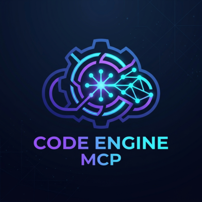
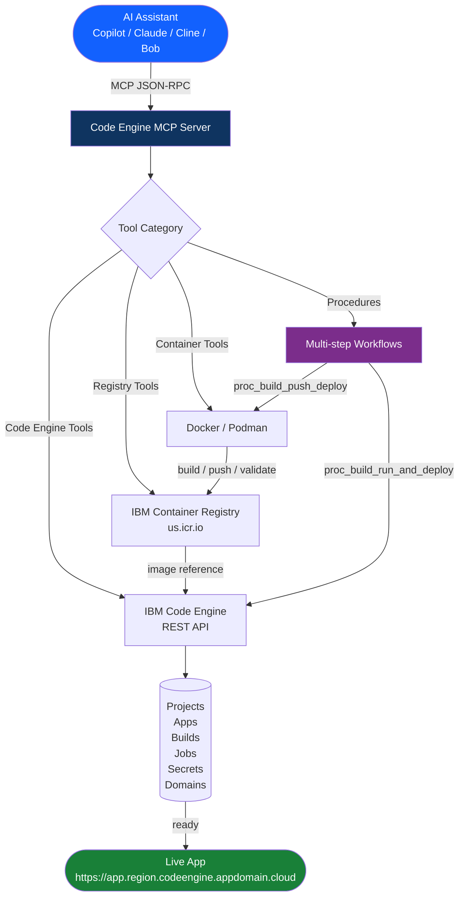
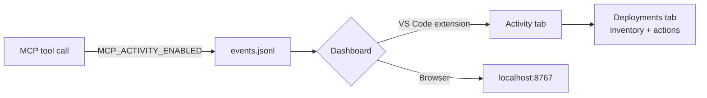

<!--
SEO: IBM Code Engine MCP Server | Deploy containers to IBM Cloud Code Engine | MCP · AI Agents · DevOps
Keywords: code-engine, code-engine-mcp, ibm-code-engine, ibm-cloud, ibm-container-registry, icr, serverless, container-deployment, mcp, mcp-server, model-context-protocol, docker, podman, typescript, vscode-extension, npm-package, npx, stdio
Also: deploy to code engine, ibm ce mcp, ai deploy containers, copilot mcp server, cursor mcp ibm cloud, claude mcp deployment, github copilot ibm cloud, model context protocol deployment, watsonx orchestrate mcp, code engine ai agent
-->

# IBM Code Engine MCP Server



**MCP server for IBM Code Engine — build, push, and deploy containers from Cursor, Copilot, Claude, and Cline using natural language.**

> **Current release: v1.4.2** — MCP Activity Dashboard, live activity logging, Deployments inventory tab, provenance visualizer updates.

**Search terms:** `code-engine-mcp` · `ibm-code-engine` · `ibm-cloud` · `ibm-container-registry` · `mcp-server` · `model-context-protocol` · `cursor` · `github-copilot` · `claude-desktop` · `cline` · `docker` · `podman` · `serverless` · `container-deployment` · `typescript` · `npx` · `ai-agents` · `devops` · `cloud-native` · `watsonx-orchestrate`

---

**Author:** Markus van Kempen | [markus.van.kempen@gmail.com](mailto:markus.van.kempen@gmail.com) · [markusvankempen.github.io](https://markusvankempen.github.io/)
*No bug too small, no syntax too weird.*

---

[](https://github.com/markusvankempen/code-engine-mcp-server)
[](./CHANGELOG.md#142---2026-07-02)
[](https://cloud.ibm.com/codeengine/overview)
[](#prerequisites)
[](./LICENSE)
[](https://marketplace.visualstudio.com/items?itemName=MarkusvanKempen.code-engine-mcp)
[](https://open-vsx.org/extension/markusvankempen/code-engine-mcp)
[](https://www.npmjs.com/package/code-engine-mcp-server)

## How It Works




## ✨ What You Get

- Container workflow tools for Docker or Podman
- IBM Container Registry (ICR) tools — list namespaces, list images, delete images
- IBM Code Engine project and application management tools
- MCP-ready setup for GitHub Copilot, Cline, Bob, Claude Desktop, and the optional VS Code extension in `vscode-extension/`
- **MCP Activity Dashboard** — live timeline of tool calls, session grouping, deploy outcome highlights, and a Deployments inventory tab (extension or dev repo)
- **Live activity logging** — optional JSONL event stream for every MCP tool call (`MCP_ACTIVITY_*` env vars)
- A simple local development and troubleshooting workflow

## 🚀 Quick Start

```bash
# 1) Install dependencies
npm install

# 2) Build the server
npm run build

# 3) Run once to verify
node build/index.js
```

Then configure your MCP client using one of the examples in the Configuration section below.

## 🤖 The Agentic Experience (No Docker/Code Engine Lingo Needed)

The true power of this MCP server is that **you don't need to know Docker or Code Engine commands**. You can simply state your goal, and the LLM will discover the environment, run the pipeline, and fix issues autonomously. 

Here is an example interaction from a real session:

**User:**
> "I have an app in the `developer-splash` folder. Deploy it to my Code Engine project."

**Assistant's Autonomous Thought Process:**
1. *Discovery:* "Let me check what projects and namespaces exist... Found project `markus-app-v2-toronto` and namespace `mvk-code-engine`."
2. *Prerequisites:* "No pull secret in this project yet. I'll get the API key from the `.env` file and create the secret `icr-pull-secret`."
3. *Execution:* "Now I'll run the full pipeline: build → push → deploy → wait."
4. *Validation:* "It's deployed but stuck at 'deploying'. Let me check the logs... The container is running but the readiness probe is failing."
5. *Self-Correction:* "Ah, the `sed` pattern in the Dockerfile didn't match nginx alpine's default config format for port 80. I'll fix the Dockerfile with a regex-safe `sed` and rebuild."
6. *Completion:* "App is live! 🎉 Status: ready."

**Assistant Response to User:**
> "Your app is deployed and live at: `https://developer-splash.29m5mrru3s3n.ca-tor.codeengine.appdomain.cloud`. I had to fix a minor port configuration issue in your Dockerfile, but it is successfully running now!"

With this MCP server, the AI acts as an expert DevOps engineer pairing with you.

## 📊 MCP Activity Dashboard (v1.4.0)

See what your AI assistant is doing in real time — tool calls, idle gaps between steps, deploy outcomes, and live app URLs.



### Enable activity logging

Add to your MCP client env (Cursor `.cursor/mcp.json`, VS Code `mcp.json`, etc.):

```json
"MCP_ACTIVITY_ENABLED": "true",
"MCP_ACTIVITY_EVENTS_PATH": "/absolute/path/to/code-engine-mcp-server/dashboard/activity/live/events.jsonl",
"MCP_ACTIVITY_SESSION_ID": "session:my-chat-001",
"MCP_ACTIVITY_CHAT_LABEL": "Deploy Star Wars splash"
```

Restart the MCP server after changing env. Events append to `events.jsonl` on every tool start/finish — including input summaries, pipeline sub-steps (`proc_build_push_deploy`), result highlights, and optional HTTP smoke-test labels.

See [.env.example](.env.example) for all `MCP_ACTIVITY_*` variables.

### Open the dashboard

| Method | How |
|--------|-----|
| **VS Code extension** | Command Palette → **IBM Code Engine MCP: Open MCP Activity Dashboard** |
| **Browser (dev repo)** | `npm run dashboard` → http://localhost:8767/ |
| **Live refresh** | On by default in the browser; toggle in-panel or set `codeEngineMcp.activityLiveRefresh` (extension) |

The **Activity** tab shows a session timeline with tool duration, idle gaps, and a task-outcome banner (status, image, live URL). The **Deployments** tab lists projects and apps from Code Engine and supports get-details, redeploy, and delete via MCP tools.

**Example chat prompt:**

> *"I have a Star Wars splash page in examples/starwars-splash. Deploy it to Code Engine using only MCP tools — build for linux/amd64, push to my ICR namespace, and deploy to my Code Engine project. Show me the live URL when ready."*

Open the Activity Dashboard while the assistant runs to watch `proc_build_push_deploy` progress step by step.

## Deploy Your First App

This walks through deploying the included [Star Wars splash page example](./examples/starwars-splash/) — a static nginx container — entirely through the MCP server.

> **Apple Silicon users:** always build with `--platform linux/amd64`. Code Engine runs amd64 only.

### Step 1 — Build and push the image

```bash
cd examples/starwars-splash
podman build --platform linux/amd64 -t us.icr.io/<your-namespace>/starwars-splash:v1.0.0 .
podman push us.icr.io/<your-namespace>/starwars-splash:v1.0.0
```

Or ask your assistant:
```
Build examples/starwars-splash as us.icr.io/my-namespace/starwars-splash:v1.0.0 for linux/amd64 and push it
```

**MCP response — `build_container_image`:**
```json
{
  "success": true,
  "command": "podman build --platform linux/amd64 -t us.icr.io/my-namespace/starwars-splash:v1.0.0 ...",
  "build_output": "STEP 1/5: FROM nginx:alpine\nSTEP 2/5: COPY index.html /usr/share/nginx/html/index.html\nSTEP 3/5: RUN sed -i 's/listen  80;/listen 8080;/g' /etc/nginx/conf.d/default.conf\nSTEP 4/5: EXPOSE 8080\nSTEP 5/5: CMD [\"nginx\", \"-g\", \"daemon off;\"]\nSuccessfully tagged us.icr.io/my-namespace/starwars-splash:v1.0.0"
}
```

> **Note:** Container runtimes (Podman/Docker) write build progress to stderr. The `build_output` field combines stdout and stderr so you see the full build log.

**MCP response — `push_container_image`:**
```json
{
  "success": true,
  "command": "podman push us.icr.io/my-namespace/starwars-splash:v1.0.0",
  "output": "Getting image source signatures\nCopying blobs...\nWriting manifest to image destination"
}
```

### Step 2 — Create a registry pull secret

Ask your assistant (once per project):
```
Create a registry secret called icr-pull-secret in project <project-id> for us.icr.io using my IBM Cloud API key
```

Or use the `ce_create_secret` tool directly:
```json
{
  "project_id": "<your-project-id>",
  "name": "icr-pull-secret",
  "format": "registry",
  "data": {
    "username": "iamapikey",
    "password": "<your-ibm-cloud-api-key>",
    "server": "us.icr.io",
    "email": "user@example.com"
  }
}
```

**MCP response — `ce_create_secret`:**
```json
{
  "name": "icr-pull-secret",
  "format": "registry",
  "resource_type": "secret_registry_v2",
  "created_at": "2026-05-08T22:10:00Z",
  "project_id": "<your-project-id>"
}
```

### Step 3 — Deploy the application

Ask your assistant:
```
Deploy us.icr.io/my-namespace/starwars-splash:v1.0.0 to Code Engine project <project-id>
as app "starwars-splash" using pull secret icr-pull-secret, min 1 instance
```

Or use the `ce_create_application` tool:
```json
{
  "project_id": "<your-project-id>",
  "name": "starwars-splash",
  "image": "us.icr.io/<your-namespace>/starwars-splash:v1.0.0",
  "image_secret": "icr-pull-secret",
  "scale_min_instances": 1,
  "scale_max_instances": 3
}
```

**MCP response — `ce_create_application`:**
```json
{
  "name": "starwars-splash",
  "resource_type": "app_v2",
  "status": "deploying",
  "image_reference": "us.icr.io/my-namespace/starwars-splash:v1.0.0",
  "image_secret": "icr-pull-secret",
  "image_port": 8080,
  "scale_min_instances": 1,
  "scale_max_instances": 3,
  "scale_cpu_limit": "1",
  "scale_memory_limit": "4G",
  "endpoint": "https://starwars-splash.<subdomain>.us-south.codeengine.appdomain.cloud",
  "status_details": {
    "latest_created_revision": "starwars-splash-00001",
    "latest_ready_revision": null
  }
}
```

### Step 4 — Check deployment status

```
Get details for the starwars-splash app in project <project-id>
```

This calls `ce_get_application` and returns the public URL once the app reaches `ready` status.

```
List the running instances of starwars-splash in project <project-id>
```

This calls `ce_list_app_instances` (or `ce_get_app_instance` for a specific instance) and shows:
- Instance name and revision
- Container status (`running` / `pending` / `failed`)
- Restart count
- Started-at timestamp
- CPU and memory allocation

**MCP response — `ce_get_application` (once ready):**
```json
{
  "name": "starwars-splash",
  "status": "ready",
  "image_reference": "us.icr.io/my-namespace/starwars-splash:v1.0.0",
  "image_port": 8080,
  "scale_min_instances": 1,
  "scale_max_instances": 3,
  "scale_cpu_limit": "0.5",
  "scale_memory_limit": "1G",
  "region": "us-south",
  "endpoint": "https://starwars-splash.<subdomain>.us-south.codeengine.appdomain.cloud",
  "status_details": {
    "latest_created_revision": "starwars-splash-00001",
    "latest_ready_revision": "starwars-splash-00001"
  }
}
```

### Step 5 — Map a custom domain (optional)

To serve the app at your own domain (e.g. `myapp.example.com`) you need a TLS certificate. The IBM Code Engine REST API always requires a real certificate — IBM's Console "Platform managed" option is not available via the API.

**5a — Get a Let's Encrypt certificate (certbot)**

```bash
# Install once
brew install certbot

# Request cert — certbot will print a DNS TXT challenge value
mkdir -p ~/certbot/{config,work,logs}
/opt/homebrew/bin/certbot certonly --manual --preferred-challenges dns \
  -d <your-domain> --agree-tos --no-eff-email --email you@example.com \
  --config-dir ~/certbot/config --work-dir ~/certbot/work --logs-dir ~/certbot/logs
```

Certbot will pause and ask you to add a TXT record:
```
Add TXT record: _acme-challenge.<your-domain> = <challenge-value>
```
Verify propagation, then press Enter. Certbot writes:
- `~/certbot/config/live/<your-domain>/fullchain.pem`
- `~/certbot/config/live/<your-domain>/privkey.pem`

**5b — Create the TLS secret in Code Engine**

Ask your assistant:
```
Create a TLS secret called starwars-tls in project <project-id>
using cert ~/certbot/config/live/myapp.example.com/fullchain.pem
and key ~/certbot/config/live/myapp.example.com/privkey.pem
```

This calls `ce_create_tls_secret_from_pem` — reads the PEM files from disk and stores them as a Code Engine `tls` secret.

**MCP response — `ce_create_tls_secret_from_pem`:**
```json
{
  "name": "my-tls",
  "format": "tls",
  "resource_type": "secret_tls_v2",
  "created_at": "2026-05-08T22:30:00Z",
  "project_id": "<your-project-id>"
}
```

**5c — Create the domain mapping**

Ask your assistant:
```
Map domain myapp.example.com to app my-app
in project <project-id> using TLS secret my-tls
```

This calls `ce_create_domain_mapping` and returns the `cname_target`.

**MCP response — `ce_create_domain_mapping`:**
```json
{
  "name": "myapp.example.com",
  "status": "ready",
  "cname_target": "custom.<subdomain>.us-south.codeengine.appdomain.cloud",
  "component": {
    "resource_type": "app_v2",
    "name": "my-app"
  },
  "tls_secret": "my-tls",
  "region": "us-south"
}
```

**5d — Update your CNAME**

In your DNS provider, set:
```
myapp.example.com CNAME custom.<subdomain>.us-south.codeengine.appdomain.cloud
```

Use the `cname_target` value returned in 5c (it uses the `custom.` prefix, not the app name).

Once DNS propagates, `https://<your-domain>` serves the app with a valid TLS certificate.

> **Certificate renewal:** Let's Encrypt certs expire after 90 days. Re-run certbot to get updated PEM files, then ask Copilot to run `ce_renew_tls_secret_from_pem` — it patches the existing secret in-place so your domain mapping continues working without any changes.

### Full one-shot prompt

```
I have a Star Wars splash page in examples/starwars-splash.
Build it for linux/amd64 as us.icr.io/my-namespace/starwars-splash:v1.0.0,
push it, then deploy it to Code Engine project <project-id> with pull secret icr-pull-secret.
Tell me the public URL and confirm the instance is running.
```

---

## 🔒 Security & Transport Model

The Code Engine MCP Bridge implements a **Stateless Security Model** and supports the modern **Streamable HTTP** transport standard.

### **Authentication**
All requests must be authenticated. Credentials are not stored on the server; they must be provided by the client in every request:
- **Primary (Recommended)**: `Authorization: Bearer <IBMCLOUD_API_KEY>` header.
- **Legacy**: `?apiKey=<key>` query parameter.

### **Transport Endpoints**
| Protocol | Method | Endpoint | Description |
| :--- | :--- | :--- | :--- |
| **Streamable HTTP** | `POST` | `/sse` | Modern MCP transport. Returns the session endpoint. |
| **Standard SSE** | `GET` | `/sse` | Legacy EventSource transport. |
| **Messaging** | `POST` | `/message` | Send JSON-RPC messages (requires `sessionId` query param). |

---

## 🌐 Host Any MCP Server on Code Engine

You can use **this** MCP server to deploy **another** MCP server to Code Engine — no CLI, no Dockerfile, no YAML. The key ingredient is [`supergateway`](https://github.com/supercorp-ai/supergateway): a tiny bridge that wraps any STDIO-based MCP server as an HTTP + SSE endpoint, making it accessible to any remote client.

> Credit: [Jeremias Werner & Enrico Regge — IBM Cloud Code Engine](https://community.ibm.com/community/user/blogs/jeremias-werner/2025/04/30/code-engine-mcp-server)

```
Your AI Assistant
    │  MCP JSON-RPC (STDIO, local)
    ▼
code-engine-mcp-server  ──► ce_create_application
                                     │
                                     ▼
                         Code Engine App
                         image: docker.io/supercorp/supergateway
                         args:  --stdio "npx -y <any-mcp-server>"
                                --outputTransport sse
                                     │  HTTPS + SSE  (public URL)
                                     ▼
                         Any remote MCP client
                         (Claude Desktop, Cursor, VS Code, …)
```

Any STDIO MCP server becomes a remotely accessible, auto-scaling cloud service — with no custom infrastructure.

This example deploys [`@tokenizin/mcp-npx-fetch`](https://www.npmjs.com/package/@tokenizin/mcp-npx-fetch), an MCP server that lets an AI assistant fetch content from public URLs.

The example files live in [examples/mcp-server-supergateway/](./examples/mcp-server-supergateway/).

### Step 1 — Deploy the hosted MCP server

Ask your assistant:
```
Deploy a hosted MCP fetch server to my Code Engine project <project-id>.
Use image docker.io/supercorp/supergateway on port 8000.
Startup args: --stdio "npx -y @tokenizin/mcp-npx-fetch" --outputTransport sse
Name it "mcp-fetch-server". No pull secret needed.
```

This calls `ce_create_application`:
```json
{
  "project_id": "<your-project-id>",
  "name": "mcp-fetch-server",
  "image": "docker.io/supercorp/supergateway",
  "port": 8000,
  "run_args": ["--stdio", "npx -y @tokenizin/mcp-npx-fetch", "--outputTransport", "sse"]
}
```

**MCP response — `ce_create_application`:**
```json
{
  "name": "mcp-fetch-server",
  "resource_type": "app_v2",
  "status": "deploying",
  "image_reference": "docker.io/supercorp/supergateway",
  "image_port": 8000,
  "scale_min_instances": 0,
  "scale_max_instances": 10,
  "endpoint": "https://mcp-fetch-server.<subdomain>.<region>.codeengine.appdomain.cloud",
  "status_details": {
    "latest_created_revision": "mcp-fetch-server-00001",
    "latest_ready_revision": null
  }
}
```

> No pull secret is needed — `docker.io/supercorp/supergateway` is a public image. Code Engine scales to zero when idle; you pay only for actual requests.

### Step 2 — Wait for the app to be ready

Ask your assistant:
```
Wait for mcp-fetch-server in project <project-id> to be ready
```

This calls `ce_wait_for_app_ready`:
```json
{
  "project_id": "<your-project-id>",
  "app_name": "mcp-fetch-server",
  "timeout_seconds": 120
}
```

**MCP response — `ce_wait_for_app_ready`:**
```json
{
  "app_name": "mcp-fetch-server",
  "status": "ready",
  "endpoint": "https://mcp-fetch-server.<subdomain>.<region>.codeengine.appdomain.cloud",
  "elapsed_seconds": 34,
  "poll_history": [
    { "attempt": 1, "status": "deploying", "elapsed_seconds": 10 },
    { "attempt": 2, "status": "deploying", "elapsed_seconds": 20 },
    { "attempt": 3, "status": "ready",     "elapsed_seconds": 34 }
  ]
}
```

### Step 3 — Verify the running instance

Ask your assistant:
```
List the running instances of mcp-fetch-server in project <project-id>
```

This calls `ce_list_app_instances`:

**MCP response — `ce_list_app_instances`:**
```json
{
  "instances": [
    {
      "name": "mcp-fetch-server-00001-deployment-abc123",
      "revision": "mcp-fetch-server-00001",
      "status": "running",
      "restart_count": 0,
      "started_at": "2026-05-09T12:01:44Z"
    }
  ]
}
```

### Step 4 — Connect your MCP client

Use [`mcp-remote`](https://www.npmjs.com/package/mcp-remote) to bridge the HTTP+SSE endpoint back to STDIO for local clients.

**VS Code `mcp.json`:**
```json
{
  "servers": {
    "fetch": {
      "command": "npx",
      "args": [
        "mcp-remote",
        "https://mcp-fetch-server.<subdomain>.<region>.codeengine.appdomain.cloud/sse"
      ]
    }
  }
}
```

**Claude Desktop `claude_desktop_config.json`:**
```json
{
  "mcpServers": {
    "fetch": {
      "command": "npx",
      "args": [
        "mcp-remote",
        "https://mcp-fetch-server.<subdomain>.<region>.codeengine.appdomain.cloud/sse"
      ]
    }
  }
}
```

### Step 5 — Test the endpoint

Verify the server is live and streaming:
```bash
curl -N https://mcp-fetch-server.<subdomain>.<region>.codeengine.appdomain.cloud/sse
```

Or open it in the [MCP Inspector](https://github.com/modelcontextprotocol/inspector):
```bash
npx @modelcontextprotocol/inspector
# Connect via SSE → paste the Code Engine URL
```

Once connected, you will see the `fetch` tool listed and can invoke it directly from the inspector.

### Full one-shot prompt

```
Deploy a hosted MCP fetch server to my Code Engine project <project-id>.
Use image docker.io/supercorp/supergateway on port 8000 with no pull secret.
run_args: --stdio "npx -y @tokenizin/mcp-npx-fetch" --outputTransport sse
Name it "mcp-fetch-server", wait for it to be ready, and give me the /sse URL
so I can add it to my mcp.json.
```

See [examples/mcp-server-supergateway/](./examples/mcp-server-supergateway/) for the ready-to-use client config file.

### Deploy any other STDIO MCP server

The same pattern works for any `npx`-runnable MCP server — just swap the `--stdio` argument:

| MCP Server | `--stdio` argument |
|---|---|
| Fetch | `npx -y @tokenizin/mcp-npx-fetch` |
| Filesystem | `npx -y @modelcontextprotocol/server-filesystem /data` |
| Brave Search | `npx -y @modelcontextprotocol/server-brave-search` |
| Your own server | `node /app/server.js` |

---

## Documentation

- [Setup Instructions](./docs/SETUP_INSTRUCTIONS.md)
- [MCP Inspector Troubleshooting](./docs/MCP_INSPECTOR_TROUBLESHOOTING.md)
- [VS Code MCP extension](./vscode-extension/README.md) — Activity Dashboard, Receipt Visualizer, setup & diagnostics
- [Code Engine API Reference](./docs/CODE_ENGINE_API_REFERENCE.md)
- [API Call Scenarios](./docs/API_CALL_SCENARIOS.md)
- [Client README](./docs/CLIENT_README.md)
- [Cline MCP Config Example](./docs/CLINE_CONFIG_EXAMPLE.json)
- [Code of Conduct](./docs/CODE_OF_CONDUCT.md)
- [Contributing Guide](./docs/CONTRIBUTING.md)
- [Maintainers](./docs/MAINTAINERS.md)

## 🗂️ Project Structure

```text
code-engine-mcp-server/
├── build/                            # Compiled JavaScript output (dev repo)
├── docs/                             # API references, client guides, community files
│   ├── API_CALL_SCENARIOS.md
│   ├── CODE_ENGINE_API_REFERENCE.md
│   ├── MCP_INSPECTOR_TROUBLESHOOTING.md
│   ├── SETUP_INSTRUCTIONS.md
│   ├── CODE_OF_CONDUCT.md
│   ├── CONTRIBUTING.md
│   └── MAINTAINERS.md
├── examples/
│   ├── developer-splash/             # nginx static container example
│   ├── starwars-splash/              # nginx Star Wars crawl example
│   └── mcp-server-supergateway/      # Host any MCP server on Code Engine via supergateway
├── dashboard/                        # MCP Activity Dashboard (dev repo) — npm run dashboard
│   ├── index.html                    # Activity + Deployments UI
│   ├── serve-dashboard.mjs           # Local server on port 8767
│   └── activity/live/events.jsonl    # Live tool-call log (gitignored runtime file)
├── internal/                         # Internal release notes
├── src/                              # Main TypeScript source code
├── CHANGELOG.md                      # Release history
├── LICENSE                           # Project license
├── README.md                         # Project overview and usage
├── mcp.example.json                  # Example MCP client configuration
├── vscode-extension/                 # Optional VS Code extension
├── package.json                      # npm package metadata and scripts
├── server.json                       # MCP Registry metadata
└── tsconfig.json                     # TypeScript configuration
```

## 🧩 Features

### Container Runtime Tools (Docker/Podman)
- ✅ Detect container runtime (Docker/Podman)
- ✅ Build container images (with platform targeting for amd64)
- ✅ Push images to registries
- ✅ List local images
- ✅ Test containers locally
- ✅ Get container logs
- ✅ Stop and remove containers
- ✅ List all containers
- ✅ Validate Dockerfile for Code Engine compatibility (`ce_validate_dockerfile`) — checks architecture, port, nginx sed patterns, USER, CMD

### IBM Container Registry (ICR)
- ✅ List ICR namespaces
- ✅ List images with optional namespace filter
- ✅ Delete images by tag

### IBM Code Engine Tools
- ✅ List, create, and delete projects
- ✅ Deploy applications with image pull secrets
- ✅ Update applications (image, scaling, env)
- ✅ List applications and get public URLs
- ✅ Get per-instance status (running, restarts, started-at)
- ✅ Get application logs per instance
- ✅ Build and job management
- ✅ Secrets and ConfigMaps
- ✅ Custom domain mappings (create, list, get, delete)
- ✅ TLS secrets from Let's Encrypt / certbot PEM files (`ce_create_tls_secret_from_pem`)
- ✅ TLS cert renewal in-place without disrupting domain mappings (`ce_renew_tls_secret_from_pem`)
- ✅ Update any secret in-place (`ce_update_secret`)
- ✅ Refresh ICR pull secret with current API key credentials (`ce_refresh_icr_pull_secret`) — fixes `no_revision_ready` failures caused by stale registry credentials without needing the CLI
- ✅ Wait for app deployment or build run to complete (`ce_wait_for_app_ready`, `ce_wait_for_build_run`)
- ✅ IAM token info and diagnostics (`iam_get_token_info`)
- ✅ Create ICR namespaces via REST API (`icr_create_namespace`)

### Procedures
- ✅ `proc_build_push_deploy` — full container pipeline in one prompt (build → push → deploy → wait)
- ✅ `proc_setup_custom_domain` — TLS cert + domain mapping in one step, returns CNAME target
- ✅ `proc_build_run_and_deploy` — CE source build → wait → deploy app → wait → return URL

### Developer Experience (v1.4.0)
- ✅ **MCP Activity Dashboard** — session timeline, idle-gap visualization, deploy outcome banner, Deployments inventory tab
- ✅ **Live activity logging** — JSONL event stream with input summaries, pipeline sub-steps, and HTTP probe highlights
- ✅ **VS Code extension commands** — Open MCP Activity Dashboard, Open Optional Receipt Visualizer

## ⚙️ Configuration

### Getting an IBM Cloud API key

All Code Engine and ICR operations require an IBM Cloud API key. Get one at:
**[IBM Cloud IAM → API keys](https://cloud.ibm.com/iam/apikeys)** → **Create an IBM Cloud API key**.

Store the key somewhere safe (password manager). You will paste it into one of the configuration paths below.

---

### Path A — VS Code extension (recommended)

The [IBM Code Engine MCP extension](https://marketplace.visualstudio.com/items?itemName=MarkusvanKempen.code-engine-mcp) handles everything: server startup, API key storage, and MCP registration — no manual `mcp.json` editing required.

**Install from the Marketplace:**

| IDE / Platform | Install link |
|---|---|
| VS Code | [marketplace.visualstudio.com](https://marketplace.visualstudio.com/items?itemName=MarkusvanKempen.code-engine-mcp) |
| Cursor / Theia / Gitpod / Codium | [open-vsx.org](https://open-vsx.org/extension/markusvankempen/code-engine-mcp) |
| From a local `.vsix` | **Command Palette** → **Extensions: Install from VSIX…** |

**Set your API key (required before any tool works):**

1. Open the **IBM Code Engine MCP** sidebar panel (cloud icon in the Activity Bar)
2. Paste your IBM Cloud API key and click **Save**  
   _(The key is stored in VS Code global settings — encrypted by the OS keychain, never in a plaintext file)_
3. Optionally change the region (default: `us-south`) in the same panel
4. Click **Configure MCP** — this writes the server entry to the global `mcp.json` and restarts VS Code's MCP server list
5. Click **Run Diagnostics** to confirm everything is wired up:
   - ✅ Node.js found on PATH
   - ✅ API key configured
   - ✅ MCP server registered
   - ✅ Tool list discovered

After step 4 you can open GitHub Copilot Chat and immediately ask:
> *"List all my Code Engine projects"*

> **Tip:** If Copilot can't see the tools after installing, run **Command Palette → Reload Window** once.

More detail: [vscode-extension/README.md](./vscode-extension/README.md).

---

### Path B — Pure MCP config (no extension)

Use this path with **any** MCP-capable client: GitHub Copilot without the extension, Cline, Bob, Claude Desktop, Cursor, etc.

#### Where to put the API key (choose one approach)

**Option 1 — Shell environment variable (most secure)**

Copy the provided template and fill in your key:

```bash
cp .env.example .env          # copy template (already in .gitignore)
# edit .env → set IBMCLOUD_API_KEY=your-key
source .env                   # load into current shell session
```

Or add the export permanently to your shell profile so every new terminal has it:

```bash
# ~/.zshrc or ~/.bash_profile
export IBMCLOUD_API_KEY="your-ibm-cloud-api-key-here"
```

See [.env.example](.env.example) for all available variables (`IBMCLOUD_REGION`, `CONTAINER_RUNTIME`, `DEBUG`).

Then reference the variable in the MCP config without embedding the value:

```json
{
  "servers": {
    "code-engine": {
      "type": "stdio",
      "command": "npx",
      "args": ["-y", "code-engine-mcp-server@latest"],
      "env": {
        "IBMCLOUD_API_KEY": "${env:IBMCLOUD_API_KEY}",
        "IBMCLOUD_REGION": "us-south"
      }
    }
  }
}
```

> `${env:VARIABLE}` is VS Code's input substitution syntax — it reads the value from your shell environment at startup so your API key is never stored in the file.

**Option 2 — VS Code input variable (prompted on connect)**

VS Code can prompt you for the API key when it starts the server — great for shared machines:

```json
{
  "inputs": [
    {
      "id": "ibmcloud-api-key",
      "type": "promptString",
      "description": "IBM Cloud API key",
      "password": true
    }
  ],
  "servers": {
    "code-engine": {
      "type": "stdio",
      "command": "npx",
      "args": ["-y", "code-engine-mcp-server@latest"],
      "env": {
        "IBMCLOUD_API_KEY": "${input:ibmcloud-api-key}",
        "IBMCLOUD_REGION": "us-south"
      }
    }
  }
}
```

**Option 3 — Inline value (simplest, least secure)**

Paste the key directly. **Never commit this file to git.**

```json
{
  "servers": {
    "code-engine": {
      "type": "stdio",
      "command": "npx",
      "args": ["-y", "code-engine-mcp-server@latest"],
      "env": {
        "IBMCLOUD_API_KEY": "your-ibm-cloud-api-key-here",
        "IBMCLOUD_REGION": "us-south"
      }
    }
  }
}
```

> **Security:** Add the config file to `.gitignore`. For workspace configs, use `${env:...}` or `${input:...}` instead of inline values.

---

#### 1) GitHub Copilot (VS Code) — workspace `mcp.json`

Create `.vscode/mcp.json` in your workspace root (or copy `mcp.example.json`):

```bash
cp mcp.example.json .vscode/mcp.json
echo '.vscode/mcp.json' >> .gitignore
```

Paste one of the API key options above. Then restart the server:
**Cmd+Shift+P** → **MCP: Restart Server** → `code-engine`.

Alternatively, use the **global** MCP config at `~/Library/Application Support/Code/User/mcp.json` (macOS) so the server is available in every workspace without a per-project file.

---

#### 2) Cline (VS Code Extension)

1. Open VS Code Settings (`Cmd+,`)
2. Search for **Cline: MCP Settings** → **Edit in settings.json**
3. Add:

```json
{
  "cline.mcpServers": {
    "code-engine": {
      "command": "npx",
      "args": ["-y", "code-engine-mcp-server@latest"],
      "env": {
        "IBMCLOUD_API_KEY": "your-api-key-here",
        "IBMCLOUD_REGION": "us-south"
      }
    }
  }
}
```

---

#### 3) Bob (VS Code Extension)

Bob uses the same `cline.mcpServers` configuration format:

1. Open VS Code Settings (`Cmd+,`)
2. Search for **Cline: MCP Settings** → **Edit in settings.json**
3. Add:

```json
{
  "cline.mcpServers": {
    "code-engine": {
      "command": "npx",
      "args": ["-y", "code-engine-mcp-server@latest"],
      "env": {
        "IBMCLOUD_API_KEY": "your-api-key-here",
        "IBMCLOUD_REGION": "us-south"
      }
    }
  }
}
```

---

### Path C — Remote Deployment (Stateless Proxy)

You can run the Code Engine MCP server as a **stateless proxy** on IBM Code Engine itself. In this mode, the server **does not store any credentials**. Instead, it extracts the `IBMCLOUD_API_KEY` from each incoming request.

#### 1. Security Model
The server accepts credentials via:
- **Authorization Header**: `Authorization: Bearer <your-ibm-cloud-api-key>`
- **Query Parameter**: `?apiKey=<your-ibm-cloud-api-key>`

#### 2. Client Configuration
To connect to a remote instance (e.g., `https://ce-mcp-remote.../sse`), use [`mcp-remote`](https://www.npmjs.com/package/mcp-remote) which handles the SSE-to-STDIO bridging and automatically forwards your local `IBMCLOUD_API_KEY` environment variable.

**`mcp.json` / `claude_desktop_config.json`:**
```json
{
  "mcpServers": {
    "remote-code-engine": {
      "command": "npx",
      "args": [
        "-y",
        "mcp-remote",
        "https://your-remote-server.appdomain.cloud/sse"
      ],
      "env": {
        "IBMCLOUD_API_KEY": "${env:IBMCLOUD_API_KEY}"
      }
    }
  }
}
```

#### 3. Diagnostic Page
Remote deployments include a built-in diagnostic page at the root URL (e.g., `https://ce-mcp-remote.../`) providing real-time stats, tool counts, and connection health.

---

> Prefer `${env:IBMCLOUD_API_KEY}` if your shell exports the key, so it never appears in `settings.json`.

---

#### 3) Claude Desktop

Edit `~/Library/Application Support/Claude/claude_desktop_config.json`:

```json
{
  "mcpServers": {
    "code-engine": {
      "command": "npx",
      "args": ["-y", "code-engine-mcp-server@latest"],
      "env": {
        "IBMCLOUD_API_KEY": "your-api-key-here",
        "IBMCLOUD_REGION": "us-south"
      }
    }
  }
}
```

> Restart Claude Desktop after saving. The server starts on demand when Claude needs a tool.

## Install & Registry Links

| Platform | Link |
|---|---|
| **npm** (MCP server package) | [code-engine-mcp-server](https://www.npmjs.com/package/code-engine-mcp-server) |
| **VS Code Marketplace** (extension) | [MarkusvanKempen.code-engine-mcp](https://marketplace.visualstudio.com/items?itemName=MarkusvanKempen.code-engine-mcp) |
| **Open VSX Registry** (Theia / Gitpod / Cursor) | [markusvankempen.code-engine-mcp](https://open-vsx.org/extension/markusvankempen/code-engine-mcp) |
| **MCP Registry** | [io.github.markusvankempen/code-engine-mcp-server](https://registry.modelcontextprotocol.io/v0.1/servers?search=io.github.markusvankempen%2Fcode-engine-mcp-server) |

The **VS Code extension** is the easiest starting point — it handles server startup, API key storage, and MCP registration automatically. Use the **npm package** directly if you prefer a manual MCP config (Cline, Claude Desktop, Cursor, or any other client).

## 💬 Example Prompts

### Detect Container Runtime

Ask your assistant:
```
Can you detect which container runtime I have installed?
```

### Build a Container Image

Ask your assistant:
```
Build a container image from ./Dockerfile with the name myapp:latest
```

### Test Container Locally

Ask your assistant:
```
Test the myapp:latest image locally on port 8080
```

### Push to Registry

Ask your assistant:
```
Push myapp:latest to icr.io/my-namespace/myapp:latest
```

### List Code Engine Projects

Ask your assistant:
```
List all my Code Engine projects
```

### Complete Workflow

Ask your assistant:
```
I have a Node.js app in ./my-app with a Dockerfile. Can you:
1. Build it as myapp:v1.0.0
2. Test it locally on port 3000
3. Push it to icr.io/my-namespace/myapp:v1.0.0
4. Deploy it to my Code Engine project "production"
5. Show me the application URL
```

### Custom Domain

Ask your assistant:
```
Create a TLS secret called my-tls in project <project-id>
using cert ~/certbot/config/live/example.com/fullchain.pem
and key ~/certbot/config/live/example.com/privkey.pem.
Then map domain example.com to app my-app using that secret.
Tell me what CNAME value to set in DNS.
```

## 🛠️ Available Tools

63 tools total: 9 container tools + 4 ICR tools + 46 Code Engine tools + 1 IAM tool + 3 procedures.

> **Procedures** bundle multiple tools into a single call. Use them for common end-to-end workflows.

### Container Tools (8)

| Tool | Description | Key Parameters |
|------|-------------|----------------|
| `detect_container_runtime` | Detect Docker or Podman | — |
| `list_local_images` | List local container images | `runtime` |
| `list_local_containers` | List local containers | `runtime`, `all` |
| `build_container_image` | Build a container image | `dockerfile_path`, `image_name`, `context_path` |
| `push_container_image` | Push image to registry | `image_name`, `runtime` |
| `test_container_locally` | Run container for local testing | `image_name`, `port_mapping`, `env_vars` |
| `get_container_logs` | Get logs from a running container | `container_id`, `runtime` |
| `stop_local_container` | Stop and remove a container | `container_id`, `runtime` |
| `ce_validate_dockerfile` | Validate a Dockerfile for Code Engine compatibility (architecture, port, nginx sed patterns, USER, CMD) | `dockerfile_path`, `context_path`, `expected_port` |

### IBM Container Registry Tools (4)

| Tool | Description | Key Parameters |
|------|-------------|----------------|
| `icr_list_namespaces` | List ICR namespaces in your account | `region` |
| `icr_list_images` | List images in ICR (optionally filtered by namespace) | `namespace`, `region` |
| `icr_delete_image` | Delete an image by full tag | `image`, `region` |
| `icr_create_namespace` | Create a new ICR namespace | `namespace`, `region` |

### Code Engine: Projects (4)

| Tool | Description | Key Parameters |
|------|-------------|----------------|
| `ce_list_projects` | List all projects in a region | — |
| `ce_get_project` | Get project details | `project_id` |
| `ce_create_project` | Create a new project | `name`, `resource_group_id` |
| `ce_delete_project` | Delete a project | `project_id` |

### Code Engine: Applications (9)

| Tool | Description | Key Parameters |
|------|-------------|----------------|
| `ce_list_applications` | List applications in a project | `project_id` |
| `ce_get_application` | Get application details and public URL | `project_id`, `app_name` |
| `ce_create_application` | Deploy a new application | `project_id`, `name`, `image`, `image_secret`, `port`, `env_vars`, `run_args`, `run_commands` |
| `ce_update_application` | Update image, scaling, env, pull secret, run args | `project_id`, `app_name`, `image`, `image_secret`, `scale_*`, `run_args`, `run_commands` |
| `ce_delete_application` | Delete an application | `project_id`, `app_name` |
| `ce_list_app_instances` | List all running instances with status | `project_id`, `app_name` |
| `ce_get_app_instance` | Get status details for a specific instance | `project_id`, `app_name`, `instance_name` |
| `ce_get_app_logs` | Get logs for an app instance | `project_id`, `app_name`, `instance_name` |
| `ce_wait_for_app_ready` | Poll until app status is ready or timeout; returns `poll_history` | `project_id`, `app_name`, `timeout_seconds` |

### Code Engine: Builds (9)

| Tool | Description | Key Parameters |
|------|-------------|----------------|
| `ce_list_builds` | List build configurations | `project_id` |
| `ce_get_build` | Get build configuration details | `project_id`, `build_name` |
| `ce_create_build` | Create a build configuration | `project_id`, `name`, `output_image`, `output_secret` |
| `ce_delete_build` | Delete a build configuration | `project_id`, `build_name` |
| `ce_list_build_runs` | List build runs | `project_id` |
| `ce_get_build_run` | Get build run status | `project_id`, `build_run_name` |
| `ce_create_build_run` | Start a build run | `project_id`, `build_name` |
| `ce_delete_build_run` | Delete a build run | `project_id`, `build_run_name` |
| `ce_wait_for_build_run` | Poll until build run succeeds or fails; returns `poll_history` | `project_id`, `build_run_name`, `timeout_seconds` |

### Code Engine: Jobs (8)

| Tool | Description | Key Parameters |
|------|-------------|----------------|
| `ce_list_jobs` | List job definitions | `project_id` |
| `ce_get_job` | Get job definition details | `project_id`, `job_name` |
| `ce_create_job` | Create a job definition | `project_id`, `name`, `image` |
| `ce_delete_job` | Delete a job definition | `project_id`, `job_name` |
| `ce_list_job_runs` | List job runs | `project_id`, `job_name` (optional) |
| `ce_get_job_run` | Get job run status | `project_id`, `job_run_name` |
| `ce_create_job_run` | Submit a job run | `project_id`, `job_name` |
| `ce_delete_job_run` | Delete a job run | `project_id`, `job_run_name` |

### Code Engine: Secrets (8)

| Tool | Description | Key Parameters |
|------|-------------|----------------|
| `ce_list_secrets` | List secrets (names + keys only) | `project_id` |
| `ce_get_secret` | Get secret metadata (no values) | `project_id`, `secret_name` |
| `ce_create_secret` | Create a secret | `project_id`, `name`, `format`, `data` |
| `ce_update_secret` | Update an existing secret in-place (PATCH) | `project_id`, `secret_name`, `data` |
| `ce_delete_secret` | Delete a secret | `project_id`, `secret_name` |
| `ce_refresh_icr_pull_secret` | Delete and recreate an ICR registry pull secret using the server's own API key — fixes stale-credential failures without needing the CLI | `project_id`, `secret_name` (default: `icr-pull-secret`), `icr_host` |
| `ce_create_tls_secret_from_pem` | Create a TLS secret from PEM files | `project_id`, `secret_name`, `cert_pem_path`, `key_pem_path` |
| `ce_renew_tls_secret_from_pem` | Renew an existing TLS secret from updated PEM files | `project_id`, `secret_name`, `cert_pem_path`, `key_pem_path` |

### Code Engine: ConfigMaps (4)

| Tool | Description | Key Parameters |
|------|-------------|----------------|
| `ce_list_config_maps` | List configmaps | `project_id` |
| `ce_get_config_map` | Get configmap details | `project_id`, `config_map_name` |
| `ce_create_config_map` | Create a configmap | `project_id`, `name`, `data` |
| `ce_delete_config_map` | Delete a configmap | `project_id`, `config_map_name` |

### Code Engine: Domain Mappings (4)

| Tool | Description | Key Parameters |
|------|-------------|----------------|
| `ce_list_domain_mappings` | List all custom domain mappings | `project_id` |
| `ce_get_domain_mapping` | Get status and CNAME target for a mapping | `project_id`, `domain_name` |
| `ce_create_domain_mapping` | Map a custom domain to an app | `project_id`, `domain_name`, `app_name`, `tls_secret` |
| `ce_delete_domain_mapping` | Delete a custom domain mapping | `project_id`, `domain_name` |

### IBM Cloud IAM (1)

| Tool | Description | Key Parameters |
|------|-------------|----------------|
| `iam_get_token_info` | Inspect the current IAM token — account, expiry, validity | — |

### Procedures — Multi-Step Workflows (3)

| Tool | What it does | Key Parameters |
|------|-------------|----------------|
| `proc_build_push_deploy` | Build container for linux/amd64 → push → create/update CE app → wait for ready → return URL + `poll_history` | `context_path`, `project_id_or_name`, `app_name`, `image_secret`, `icr_namespace`, `image_tag` (default `latest`), `icr_host` (default `us.icr.io`), `port`, `timeout_seconds` |
| `proc_setup_custom_domain` | Read PEM files → create TLS secret → create domain mapping → return CNAME target | `project_id_or_name`, `app_name`, `domain_name`, `tls_secret_name`, `cert_pem_path`, `key_pem_path` |
| `proc_build_run_and_deploy` | Start CE build run → wait for success → create/update app → wait for ready → return URL + `build_poll_history` + `app_poll_history` | `project_id_or_name`, `build_name`, `app_name`, `image_secret`, `port`, `build_timeout_seconds`, `deploy_timeout_seconds` |

## 🔐 Environment Variables

- `IBMCLOUD_API_KEY`: IBM Cloud API key (required for Code Engine operations)
- `IBMCLOUD_REGION`: Default IBM Cloud region (optional, defaults to us-south)
- `CONTAINER_RUNTIME`: Force specific runtime (docker or podman)
- `DEBUG`: Enable debug logging

> **Optional — Activity Dashboard (v1.4.0, off by default):** `MCP_ACTIVITY_*` variables log tool calls to JSONL for the live dashboard. See [MCP Activity Dashboard](#-mcp-activity-dashboard-v140) and [.env.example](.env.example).

> **Optional addon:** `PROVENANCE_*` variables enable signed receipts (off by default). See [Optional addon: Provenance](#optional-addon-provenance) at the end of this README.

## 📋 Prerequisites

- Node.js v18 or higher
- Docker or Podman installed (for container build/push tools)
- IBM Cloud API key (for all Code Engine and ICR operations)

> The MCP server communicates directly with the IBM Cloud REST API and ICR API. No IBM Cloud CLI or Code Engine plugin is required.

## 👩‍💻 Development

```bash
# Run in development mode
npm run dev

# Build
npm run build

# Test manually
node build/index.js
```

## 🧪 Troubleshooting

### Server Not Connecting

1. Verify the path in configuration is absolute
2. Check Node.js is in PATH: `node --version`
3. Verify build output exists: `ls build/index.js`
4. Test manually: `node build/index.js`

### Docker/Podman Commands Failing

1. Verify installation: `docker --version` or `podman --version`
2. Check Docker daemon is running
3. Verify permissions (add user to docker group if needed)

### Code Engine Commands Failing

1. Verify your API key is set: check `IBMCLOUD_API_KEY` in your MCP client config
2. Confirm the region is correct (default `us-south`); set `IBMCLOUD_REGION` if needed
3. Verify the project ID is valid: use `ce_list_projects` to find it
4. Check for expired tokens — the server re-fetches IAM tokens automatically; if errors persist, regenerate your API key at [IBM Cloud IAM → API keys](https://cloud.ibm.com/iam/apikeys)

## 🛡️ Security

- Never commit API keys to version control
- Use environment variables for sensitive data
- Consider using IBM Cloud IAM for authentication
- Restrict MCP server permissions as needed

## 📄 License

[Apache License 2.0](./LICENSE) · [opensource.org/licenses/Apache-2.0](https://opensource.org/licenses/Apache-2.0)

## 🤝 Contributing

Contributions are welcome! Please open an issue or submit a pull request (see [Contributing Guide](./docs/CONTRIBUTING.md)).

## 🙋 Support

For issues and questions:
- Check [Setup Instructions](./docs/SETUP_INSTRUCTIONS.md) and [Code Engine API Reference](./docs/CODE_ENGINE_API_REFERENCE.md)
- Open an issue in this repository with reproduction steps and logs

---

## Optional: MCP Activity Dashboard

> **Core observability for MCP workflows.** Unlike provenance (signed receipts), activity logging is lightweight and off by default. Enable it when you want a live view of what the assistant is doing.

| Surface | Command / URL |
|---------|---------------|
| VS Code / Cursor extension | **IBM Code Engine MCP: Open MCP Activity Dashboard** |
| Browser (dev repo) | `npm run dashboard` → http://localhost:8767/ |
| Event log file | `dashboard/activity/live/events.jsonl` |

**Minimal MCP env:**

```json
"MCP_ACTIVITY_ENABLED": "true"
```

The server creates the events file automatically. Use `MCP_ACTIVITY_SESSION_ID` and `MCP_ACTIVITY_CHAT_LABEL` to label sessions in the dashboard dropdown.

**Troubleshooting:** If the dashboard shows no new sessions, confirm `MCP_ACTIVITY_ENABLED=true` in the MCP server env (not just chat context), restart the MCP server, and click **Show all activity** if you previously cleared the view.

---

## Optional addon: Provenance

> **Not part of core MCP functionality.** The Code Engine MCP server deploys, builds, and manages apps without provenance. The [provenance addon](./provenance-addon/) is an experimental optional layer that emits signed receipts for selected tool actions (default: **off**).

| Doc | Purpose |
|-----|---------|
| [provenance-addon/README.md](./provenance-addon/README.md) | What receipts prove (and do not prove) |
| [PROVENANCE-CHAT-COMMANDS.md](./provenance-addon/PROVENANCE-CHAT-COMMANDS.md) | Chat prompts when you choose to enable it |
| [PROVENANCE-E2E-FLOW.md](./provenance-addon/PROVENANCE-E2E-FLOW.md) | Technical E2E flow |
| [examples/startrek-splash/README.md](./examples/startrek-splash/README.md#documented-example-flow-verified-deploy) | Documented MCP deploy + optional receipts |

Enable in `code-engine-mcp-server/.env` (`PROVENANCE_ENABLED=true`), restart MCP. With provenance on, `proc_build_push_deploy` returns `provenance_receipts` in its JSON response.

**Example chat prompt (addon):**

```
Using only Code Engine MCP tools, deploy examples/startrek-splash.
Provenance on — show provenance_receipts, verify with verify-receipt.mjs, and give me the live URL.
```

---

## Topics & keywords

`code-engine` · `code-engine-mcp` · `code-engine-mcp-server` · `ibm-code-engine` · `ibm-cloud` · `ibm-container-registry` · `icr` · `serverless` · `knative` · `container-deployment` · `cloud-native` · `mcp` · `mcp-server` · `model-context-protocol` · `stdio` · `npx` · `cursor` · `vscode` · `openvscode` · `claude-desktop` · `github-copilot` · `cline` · `bob-ide` · `ai-agent` · `ai-agents` · `tool-calling` · `llm-tools` · `automation` · `typescript` · `nodejs` · `docker` · `podman` · `kubernetes` · `containers` · `deploy` · `devops` · `ci-cd` · `watsonx-orchestrate` · `ibm`

---

**Author:** Markus van Kempen
**Email:** [markus.van.kempen@gmail.com](mailto:markus.van.kempen@gmail.com) · [mvk@ca.ibm.com](mailto:mvk@ca.ibm.com)
**Website:** [markusvankempen.github.io](https://markusvankempen.github.io/)
*No bug too small, no syntax too weird.*