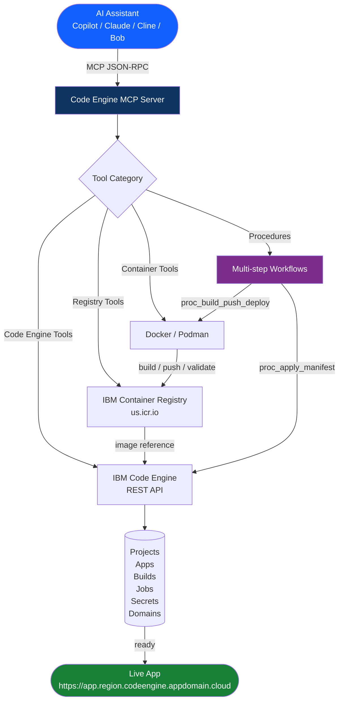
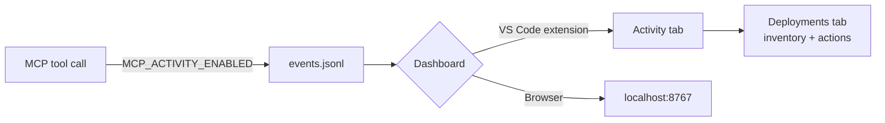

<!--
SEO: IBM Code Engine MCP Server | Deploy containers to IBM Cloud Code Engine | MCP · AI Agents · DevOps
Keywords: code-engine, code-engine-mcp, ibm-code-engine, ibm-cloud, ibm-container-registry, icr, serverless, container-deployment, mcp, mcp-server, model-context-protocol, docker, podman, typescript, vscode-extension, npm-package, npx, stdio
Also: deploy to code engine, ibm ce mcp, ai deploy containers, copilot mcp server, cursor mcp ibm cloud, claude mcp deployment, github copilot ibm cloud, model context protocol deployment, watsonx orchestrate mcp, code engine ai agent
-->

# IBM Code Engine MCP Server


**MCP server for IBM Code Engine — build, push, and deploy containers from Cursor, Copilot, Claude, and Cline using natural language.**

> **Current release: v1.7.8** — **28 tools** instead of 112 (one tool per resource with an `action` field, same capability, old names still work), a **shared local HTTP server** for the VS Code extension, a **web admin UI** with a *Remote client* tab (test tools, logging, users and API keys, events), **MCP Remote Config** inside VS Code, and a check that the server you point at really is a code-engine MCP server. See [CHANGELOG.md](CHANGELOG.md) and the [tool reference](docs/TOOLS.md).

**Search terms:** `code-engine-mcp` · `ibm-code-engine` · `ibm-cloud` · `ibm-container-registry` · `mcp-server` · `model-context-protocol` · `cursor` · `github-copilot` · `claude-desktop` · `cline` · `docker` · `podman` · `serverless` · `container-deployment` · `typescript` · `npx` · `ai-agents` · `devops` · `cloud-native` · `watsonx-orchestrate`

---

**Author:** Markus van Kempen | [markus.van.kempen@gmail.com](mailto:markus.van.kempen@gmail.com) · [markusvankempen.github.io](https://markusvankempen.github.io/)
*No bug too small, no syntax too weird.*

---

[](https://github.com/markusvankempen/code-engine-mcp-server)
[](https://github.com/markusvankempen/code-engine-mcp-server/blob/main/CHANGELOG.md)
[](https://cloud.ibm.com/codeengine/overview)
[](#prerequisites)
[](https://github.com/markusvankempen/code-engine-mcp-server/blob/main/LICENSE)
[](https://marketplace.visualstudio.com/items?itemName=MarkusvanKempen.code-engine-mcp)
[](https://open-vsx.org/extension/markusvankempen/code-engine-mcp)
[](https://www.npmjs.com/package/code-engine-mcp-server)

## How It Works


```mermaid
flowchart TD
    A([AI Assistant\nCopilot / Claude / Cline / Bob]) -->|MCP JSON-RPC| B[Code Engine MCP Server]

    B --> C{Tool Category}

    C -->|Container Tools| D[Docker / Podman]
    C -->|Registry Tools| E[IBM Container Registry\nus.icr.io]
    C -->|Code Engine Tools| F[IBM Code Engine\nREST API]
    C -->|Procedures| G[Multi-step Workflows]

    D -->|build / push / validate| E
    E -->|image reference| F

    G -->|proc_build_push_deploy| D
    G -->|proc_apply_manifest| F

    F --> H[(Projects\nApps\nBuilds\nJobs\nSecrets\nDomains)]

    H -->|ready| I([Live App\nhttps://app.region.codeengine.appdomain.cloud])

    style A fill:#1261FE,color:#fff
    style B fill:#0f3460,color:#fff
    style G fill:#7b2d8b,color:#fff
    style I fill:#198038,color:#fff
```


## ✨ What You Get

- **28 tools, one per resource.** `ce_app`, `ce_job`, `ce_secret`, … each take an `action` (`list`, `get`, `create`, `delete`, …). Every earlier capability is still there; see the [tool reference](docs/TOOLS.md).
- Container workflow tools for Docker or Podman (`local_container`, `dockerfile`)
- IBM Container Registry (`icr`) and the whole Code Engine surface: projects, apps, jobs, builds, secrets, config maps, domains, bindings, functions, fleets
- Multi-step procedures: build, push and deploy in one call (`proc_build_push_deploy`), custom domains, declarative manifests
- **One server, many clients.** Run it over stdio, or as an HTTP server that your IDE, assistants, the web UI and the VS Code extension all share
- **Web admin UI** (`/admin`): overview, activity, users, API keys, runtime settings, and a *Remote client* tab that tests the tools and configures the server (logging, users and keys, events)
- MCP-ready setup for GitHub Copilot, Cursor, Cline, Bob, Windsurf, Antigravity, Claude Desktop, and the VS Code extension in `vscode-extension/` (including *MCP Remote Config*)
- **MCP Activity Dashboard** — live timeline of tool calls, session grouping, deploy outcome highlights, and a Deployments inventory tab
- **Live activity logging** — optional JSONL event stream for every MCP tool call (`MCP_ACTIVITY_*` env vars)

## 🚀 Quick Start

```bash
# 1) Install dependencies
npm install

# 2) Build the server
npm run build

# 3) Run once to verify
node build/index.js
```

Then configure your MCP client using one of the examples in the Configuration section below.

## 🤖 The Agentic Experience (No Docker/Code Engine Lingo Needed)

The true power of this MCP server is that **you don't need to know Docker or Code Engine commands**. You can simply state your goal, and the LLM will discover the environment, run the pipeline, and fix issues autonomously. 

Here is an example interaction from a real session:

**User:**
> "I have an app in the `developer-splash` folder. Deploy it to my Code Engine project."

**Assistant's Autonomous Thought Process:**
1. *Discovery:* "Let me check what projects and namespaces exist... Found project `my-project` and namespace `my-namespace`."
2. *Prerequisites:* "No pull secret in this project yet. I'll get the API key from the `.env` file and create the secret `icr-pull-secret`."
3. *Execution:* "Now I'll run the full pipeline: build → push → deploy → wait."
4. *Validation:* "It's deployed but stuck at 'deploying'. Let me check the logs... The container is running but the readiness probe is failing."
5. *Self-Correction:* "Ah, the `sed` pattern in the Dockerfile didn't match nginx alpine's default config format for port 80. I'll fix the Dockerfile with a regex-safe `sed` and rebuild."
6. *Completion:* "App is live! 🎉 Status: ready."

**Assistant Response to User:**
> "Your app is deployed and live at: `https://developer-splash.<subdomain>.<region>.codeengine.appdomain.cloud`. I had to fix a minor port configuration issue in your Dockerfile, but it is successfully running now!"

With this MCP server, the AI acts as an expert DevOps engineer pairing with you.

## 📊 MCP Activity Dashboard (v1.4.0)

See what your AI assistant is doing in real time — tool calls, idle gaps between steps, deploy outcomes, and live app URLs.


```mermaid
flowchart LR
    A[MCP tool call] -->|MCP_ACTIVITY_ENABLED| B[events.jsonl]
    B --> C{Dashboard}
    C -->|VS Code extension| D[Activity tab]
    C -->|Browser| E[localhost:8767]
    D --> F[Deployments tab\ninventory + actions]
```

### Activity logging (on by default)

Since v1.6.0 the server logs every tool start/finish to `~/.code-engine-mcp/activity/events.jsonl` — input summaries, pipeline sub-steps (`proc_build_push_deploy`), result highlights, and optional HTTP smoke-test labels. API keys, passwords, TLS keys, env var values, and secret payloads are redacted. The file rotates at 5 MB.

Optional env in your MCP client config:

```json
"MCP_ACTIVITY_ENABLED": "false",
"MCP_ACTIVITY_EVENTS_PATH": "/custom/path/events.jsonl",
"MCP_ACTIVITY_SESSION_ID": "session:my-chat-001",
"MCP_ACTIVITY_CHAT_LABEL": "Deploy Star Wars splash"
```

In the VS Code extension, turn logging off with `codeEngineMcp.activityEnabled`. Restart the MCP server after changing env.

See [.env.example](.env.example) for all `MCP_ACTIVITY_*` variables.

### Open the dashboard

| Method | How |
|--------|-----|
| **VS Code extension** | Command Palette → **IBM Code Engine MCP: Open MCP Activity Dashboard** |
| **Browser (dev repo)** | `npm run dashboard` → http://localhost:8767/ |
| **Live refresh** | On by default in the browser; toggle in-panel or set `codeEngineMcp.activityLiveRefresh` (extension) |

The **Activity** tab shows a session timeline with tool duration, idle gaps, and a task-outcome banner (status, image, live URL). The **Deployments** tab lists projects and apps from Code Engine and supports get-details, redeploy, and delete via MCP tools.

**Example chat prompt:**

> *"I have a Star Wars splash page in examples/starwars-splash. Deploy it to Code Engine using only MCP tools — build for linux/amd64, push to my ICR namespace, and deploy to my Code Engine project. Show me the live URL when ready."*

Open the Activity Dashboard while the assistant runs to watch `proc_build_push_deploy` progress step by step.

## Deploy Your First App

This walks through deploying the included [Star Wars splash page example](https://github.com/markusvankempen/code-engine-mcp-server/tree/main/examples/starwars-splash) — a static nginx container — entirely through the MCP server.

> **Apple Silicon users:** always build with `--platform linux/amd64`. Code Engine runs amd64 only.

### Step 1 — Build and push the image

```bash
cd examples/starwars-splash
podman build --platform linux/amd64 -t us.icr.io/<your-namespace>/starwars-splash:v1.0.0 .
podman push us.icr.io/<your-namespace>/starwars-splash:v1.0.0
```

Or ask your assistant:
```
Build examples/starwars-splash as us.icr.io/my-namespace/starwars-splash:v1.0.0 for linux/amd64 and push it
```

**MCP response — `build_container_image`:**
```json
{
  "success": true,
  "command": "podman build --platform linux/amd64 -t us.icr.io/my-namespace/starwars-splash:v1.0.0 ...",
  "build_output": "STEP 1/5: FROM nginx:alpine\nSTEP 2/5: COPY index.html /usr/share/nginx/html/index.html\nSTEP 3/5: RUN sed -i 's/listen  80;/listen 8080;/g' /etc/nginx/conf.d/default.conf\nSTEP 4/5: EXPOSE 8080\nSTEP 5/5: CMD [\"nginx\", \"-g\", \"daemon off;\"]\nSuccessfully tagged us.icr.io/my-namespace/starwars-splash:v1.0.0"
}
```

> **Note:** Container runtimes (Podman/Docker) write build progress to stderr. The `build_output` field combines stdout and stderr so you see the full build log.

**MCP response — `push_container_image`:**
```json
{
  "success": true,
  "command": "podman push us.icr.io/my-namespace/starwars-splash:v1.0.0",
  "output": "Getting image source signatures\nCopying blobs...\nWriting manifest to image destination"
}
```

### Step 2 — Create a registry pull secret

Ask your assistant (once per project):
```
Create a registry secret called icr-pull-secret in project <project-id> for us.icr.io using my IBM Cloud API key
```

Or use the `ce_create_secret` tool directly:
```json
{
  "project_id": "<your-project-id>",
  "name": "icr-pull-secret",
  "format": "registry",
  "data": {
    "username": "iamapikey",
    "password": "<your-ibm-cloud-api-key>",
    "server": "us.icr.io",
    "email": "user@example.com"
  }
}
```

**MCP response — `ce_create_secret`:**
```json
{
  "name": "icr-pull-secret",
  "format": "registry",
  "resource_type": "secret_registry_v2",
  "created_at": "2026-05-08T22:10:00Z",
  "project_id": "<your-project-id>"
}
```

### Step 3 — Deploy the application

Ask your assistant:
```
Deploy us.icr.io/my-namespace/starwars-splash:v1.0.0 to Code Engine project <project-id>
as app "starwars-splash" using pull secret icr-pull-secret, min 1 instance
```

Or use the `ce_create_application` tool:
```json
{
  "project_id": "<your-project-id>",
  "name": "starwars-splash",
  "image": "us.icr.io/<your-namespace>/starwars-splash:v1.0.0",
  "image_secret": "icr-pull-secret",
  "scale_min_instances": 1,
  "scale_max_instances": 3
}
```

**MCP response — `ce_create_application`:**
```json
{
  "name": "starwars-splash",
  "resource_type": "app_v2",
  "status": "deploying",
  "image_reference": "us.icr.io/my-namespace/starwars-splash:v1.0.0",
  "image_secret": "icr-pull-secret",
  "image_port": 8080,
  "scale_min_instances": 1,
  "scale_max_instances": 3,
  "scale_cpu_limit": "1",
  "scale_memory_limit": "4G",
  "endpoint": "https://starwars-splash.<subdomain>.us-south.codeengine.appdomain.cloud",
  "status_details": {
    "latest_created_revision": "starwars-splash-00001",
    "latest_ready_revision": null
  }
}
```

### Step 4 — Check deployment status

```
Get details for the starwars-splash app in project <project-id>
```

This calls `ce_get_application` and returns the public URL once the app reaches `ready` status.

```
List the running instances of starwars-splash in project <project-id>
```

This calls `ce_list_app_instances` (pass `instance_name` for one instance; `ce_get_app_instance` still works) and shows:
- Instance name and revision
- Container status (`running` / `pending` / `failed`)
- Restart count
- Started-at timestamp
- CPU and memory allocation

**MCP response — `ce_get_application` (once ready):**
```json
{
  "name": "starwars-splash",
  "status": "ready",
  "image_reference": "us.icr.io/my-namespace/starwars-splash:v1.0.0",
  "image_port": 8080,
  "scale_min_instances": 1,
  "scale_max_instances": 3,
  "scale_cpu_limit": "0.5",
  "scale_memory_limit": "1G",
  "region": "us-south",
  "endpoint": "https://starwars-splash.<subdomain>.us-south.codeengine.appdomain.cloud",
  "status_details": {
    "latest_created_revision": "starwars-splash-00001",
    "latest_ready_revision": "starwars-splash-00001"
  }
}
```

### Step 5 — Map a custom domain (optional)

To serve the app at your own domain (e.g. `myapp.example.com`) you need a TLS certificate. The IBM Code Engine REST API always requires a real certificate — IBM's Console "Platform managed" option is not available via the API.

**5a — Get a Let's Encrypt certificate (certbot)**

```bash
# Install once
brew install certbot

# Request cert — certbot will print a DNS TXT challenge value
mkdir -p ~/certbot/{config,work,logs}
/opt/homebrew/bin/certbot certonly --manual --preferred-challenges dns \
  -d <your-domain> --agree-tos --no-eff-email --email you@example.com \
  --config-dir ~/certbot/config --work-dir ~/certbot/work --logs-dir ~/certbot/logs
```

Certbot will pause and ask you to add a TXT record:
```
Add TXT record: _acme-challenge.<your-domain> = <challenge-value>
```
Verify propagation, then press Enter. Certbot writes:
- `~/certbot/config/live/<your-domain>/fullchain.pem`
- `~/certbot/config/live/<your-domain>/privkey.pem`

**5b — Create the TLS secret in Code Engine**

Ask your assistant:
```
Create a TLS secret called starwars-tls in project <project-id>
using cert ~/certbot/config/live/myapp.example.com/fullchain.pem
and key ~/certbot/config/live/myapp.example.com/privkey.pem
```

This calls `ce_create_tls_secret_from_pem` — reads the PEM files from disk and stores them as a Code Engine `tls` secret.

**MCP response — `ce_create_tls_secret_from_pem`:**
```json
{
  "name": "my-tls",
  "format": "tls",
  "resource_type": "secret_tls_v2",
  "created_at": "2026-05-08T22:30:00Z",
  "project_id": "<your-project-id>"
}
```

**5c — Create the domain mapping**

Ask your assistant:
```
Map domain myapp.example.com to app my-app
in project <project-id> using TLS secret my-tls
```

This calls `ce_create_domain_mapping` and returns the `cname_target`.

**MCP response — `ce_create_domain_mapping`:**
```json
{
  "name": "myapp.example.com",
  "status": "ready",
  "cname_target": "custom.<subdomain>.us-south.codeengine.appdomain.cloud",
  "component": {
    "resource_type": "app_v2",
    "name": "my-app"
  },
  "tls_secret": "my-tls",
  "region": "us-south"
}
```

**5d — Update your CNAME**

In your DNS provider, set:
```
myapp.example.com CNAME custom.<subdomain>.us-south.codeengine.appdomain.cloud
```

Use the `cname_target` value returned in 5c (it uses the `custom.` prefix, not the app name).

Once DNS propagates, `https://<your-domain>` serves the app with a valid TLS certificate.

> **Certificate renewal:** Let's Encrypt certs expire after 90 days. Re-run certbot to get updated PEM files, then ask Copilot to run `ce_create_tls_secret_from_pem` with `mode` `renew` — it patches the existing secret in-place so your domain mapping continues working without any changes. `ce_renew_tls_secret_from_pem` still works if called directly.

### Full one-shot prompt

```
I have a Star Wars splash page in examples/starwars-splash.
Build it for linux/amd64 as us.icr.io/my-namespace/starwars-splash:v1.0.0,
push it, then deploy it to Code Engine project <project-id> with pull secret icr-pull-secret.
Tell me the public URL and confirm the instance is running.
```

---

## 🔒 Security & Transport Model

### Two kinds of credential

- **IBM Cloud API key** (`IBMCLOUD_API_KEY`): how the server talks to IBM Cloud. It stays on the server process. Callers never receive it.
- **MCP caller credentials**: who may call a tool on this server. They are never sent to IBM Cloud.
  - the web admin session (`/admin`, built-in user `admin` with `ADMIN_PASSWORD`),
  - a user, sent as `Authorization: Basic user:password` (`server_users`),
  - an MCP API key, sent as `Authorization: Bearer cemcp_…` (`server_api_keys`; the secret is shown once).

  Each credential has the scopes `read`, `write`, `admin`. Over stdio there are no headers; set `MCP_API_KEY`, or `MCP_USERNAME` and `MCP_PASSWORD`, in the server environment. Details: [Tool scope and authentication](docs/TOOL_ACCESS.md).

### Transports

| Mode | How to start | Endpoints |
| :--- | :--- | :--- |
| **stdio** (default) | the MCP client spawns `node build/index.js` | none; the client owns stdin and stdout |
| **HTTP** | `MCP_MODE=http PORT=8787 HOST=127.0.0.1 node build/index.js` | `POST/GET/DELETE /mcp` (Streamable HTTP), `GET /sse` and `POST /messages` (legacy SSE), `/health`, `/admin`, `/test`, `/tools`, `/log`, `/docs` |

**One server is better than several.** A stdio server is started by each client, so every IDE window gets its own process with its own memory. Its audit trace, rate limits, sessions and runtime settings are not visible to the web UI of another process. Run one HTTP server and point every client at it when you want the trace, logging, users, keys and settings to line up. The VS Code extension does exactly that by default.

### Local server hardening

- Bind to `127.0.0.1` unless the server is meant to be remote. On a public bind (`HOST=0.0.0.0`, a container) the built-in `admin` is disabled until `ADMIN_PASSWORD` is set.
- `MCP_LOCAL_ONLY=true` makes the server answer only requests whose `Host` is `localhost`, `127.0.0.1` or `[::1]`, so a web page that rebinds its own name to `127.0.0.1` cannot reach it. The VS Code extension sets it for the server it starts. Leave it off behind a reverse proxy.
- The admin cookie is `HttpOnly` and `SameSite=Strict`; five failed sign-ins lock an address out for ten minutes; the settings export leaves secrets out.

---

## 🌐 Host Any MCP Server on Code Engine

You can use **this** MCP server to deploy **another** MCP server to Code Engine — no CLI, no Dockerfile, no YAML. The key ingredient is [`supergateway`](https://github.com/supercorp-ai/supergateway): a tiny bridge that wraps any STDIO-based MCP server as an HTTP + SSE endpoint, making it accessible to any remote client.

> Credit: [Jeremias Werner & Enrico Regge — IBM Cloud Code Engine](https://community.ibm.com/community/user/blogs/jeremias-werner/2025/04/30/code-engine-mcp-server)

```
Your AI Assistant
    │  MCP JSON-RPC (STDIO, local)
    ▼
code-engine-mcp-server  ──► ce_create_application
                                     │
                                     ▼
                         Code Engine App
                         image: docker.io/supercorp/supergateway
                         args:  --stdio "npx -y <any-mcp-server>"
                                --outputTransport sse
                                     │  HTTPS + SSE  (public URL)
                                     ▼
                         Any remote MCP client
                         (Claude Desktop, Cursor, VS Code, …)
```

Any STDIO MCP server becomes a remotely accessible, auto-scaling cloud service — with no custom infrastructure.

This example deploys [`@tokenizin/mcp-npx-fetch`](https://www.npmjs.com/package/@tokenizin/mcp-npx-fetch), an MCP server that lets an AI assistant fetch content from public URLs.

The example files live in [examples/mcp-server-supergateway/](https://github.com/markusvankempen/code-engine-mcp-server/tree/main/examples/mcp-server-supergateway).

### Step 1 — Deploy the hosted MCP server

Ask your assistant:
```
Deploy a hosted MCP fetch server to my Code Engine project <project-id>.
Use image docker.io/supercorp/supergateway on port 8000.
Startup args: --stdio "npx -y @tokenizin/mcp-npx-fetch" --outputTransport sse
Name it "mcp-fetch-server". No pull secret needed.
```

This calls `ce_create_application`:
```json
{
  "project_id": "<your-project-id>",
  "name": "mcp-fetch-server",
  "image": "docker.io/supercorp/supergateway",
  "port": 8000,
  "run_args": ["--stdio", "npx -y @tokenizin/mcp-npx-fetch", "--outputTransport", "sse"]
}
```

**MCP response — `ce_create_application`:**
```json
{
  "name": "mcp-fetch-server",
  "resource_type": "app_v2",
  "status": "deploying",
  "image_reference": "docker.io/supercorp/supergateway",
  "image_port": 8000,
  "scale_min_instances": 0,
  "scale_max_instances": 10,
  "endpoint": "https://mcp-fetch-server.<subdomain>.<region>.codeengine.appdomain.cloud",
  "status_details": {
    "latest_created_revision": "mcp-fetch-server-00001",
    "latest_ready_revision": null
  }
}
```

> No pull secret is needed — `docker.io/supercorp/supergateway` is a public image. Code Engine scales to zero when idle; you pay only for actual requests.

### Step 2 — Wait for the app to be ready

Ask your assistant:
```
Wait for mcp-fetch-server in project <project-id> to be ready
```

This calls `ce_wait_for_app_ready`:
```json
{
  "project_id": "<your-project-id>",
  "app_name": "mcp-fetch-server",
  "timeout_seconds": 120
}
```

**MCP response — `ce_wait_for_app_ready`:**
```json
{
  "app_name": "mcp-fetch-server",
  "status": "ready",
  "endpoint": "https://mcp-fetch-server.<subdomain>.<region>.codeengine.appdomain.cloud",
  "elapsed_seconds": 34,
  "poll_history": [
    { "attempt": 1, "status": "deploying", "elapsed_seconds": 10 },
    { "attempt": 2, "status": "deploying", "elapsed_seconds": 20 },
    { "attempt": 3, "status": "ready",     "elapsed_seconds": 34 }
  ]
}
```

### Step 3 — Verify the running instance

Ask your assistant:
```
List the running instances of mcp-fetch-server in project <project-id>
```

This calls `ce_list_app_instances`:

**MCP response — `ce_list_app_instances`:**
```json
{
  "instances": [
    {
      "name": "mcp-fetch-server-00001-deployment-abc123",
      "revision": "mcp-fetch-server-00001",
      "status": "running",
      "restart_count": 0,
      "started_at": "2026-05-09T12:01:44Z"
    }
  ]
}
```

### Step 4 — Connect your MCP client

Use [`mcp-remote`](https://www.npmjs.com/package/mcp-remote) to bridge the HTTP+SSE endpoint back to STDIO for local clients.

**VS Code `mcp.json`:**
```json
{
  "servers": {
    "fetch": {
      "command": "npx",
      "args": [
        "mcp-remote",
        "https://mcp-fetch-server.<subdomain>.<region>.codeengine.appdomain.cloud/sse"
      ]
    }
  }
}
```

**Claude Desktop `claude_desktop_config.json`:**
```json
{
  "mcpServers": {
    "fetch": {
      "command": "npx",
      "args": [
        "mcp-remote",
        "https://mcp-fetch-server.<subdomain>.<region>.codeengine.appdomain.cloud/sse"
      ]
    }
  }
}
```

### Step 5 — Test the endpoint

Verify the server is live and streaming:
```bash
curl -N https://mcp-fetch-server.<subdomain>.<region>.codeengine.appdomain.cloud/sse
```

Or open it in the [MCP Inspector](https://github.com/modelcontextprotocol/inspector):
```bash
npx @modelcontextprotocol/inspector
# Connect via SSE → paste the Code Engine URL
```

Once connected, you will see the `fetch` tool listed and can invoke it directly from the inspector.

### Full one-shot prompt

```
Deploy a hosted MCP fetch server to my Code Engine project <project-id>.
Use image docker.io/supercorp/supergateway on port 8000 with no pull secret.
run_args: --stdio "npx -y @tokenizin/mcp-npx-fetch" --outputTransport sse
Name it "mcp-fetch-server", wait for it to be ready, and give me the /sse URL
so I can add it to my mcp.json.
```

See [examples/mcp-server-supergateway/](https://github.com/markusvankempen/code-engine-mcp-server/tree/main/examples/mcp-server-supergateway) for the ready-to-use client config file.

### Deploy any other STDIO MCP server

The same pattern works for any `npx`-runnable MCP server — just swap the `--stdio` argument:

| MCP Server | `--stdio` argument |
|---|---|
| Fetch | `npx -y @tokenizin/mcp-npx-fetch` |
| Filesystem | `npx -y @modelcontextprotocol/server-filesystem /data` |
| Brave Search | `npx -y @modelcontextprotocol/server-brave-search` |
| Your own server | `node /app/server.js` |

---

## Documentation

- [Setup Instructions](https://github.com/markusvankempen/code-engine-mcp-server/blob/main/docs/SETUP_INSTRUCTIONS.md)
- [Tool reference (28 tools, every action)](https://github.com/markusvankempen/code-engine-mcp-server/blob/main/docs/TOOLS.md)
- [Connect to a remote or shared server](https://github.com/markusvankempen/code-engine-mcp-server/blob/main/docs/REMOTE_MCP_CONNECTION.md)
- [Tool scope and authentication](https://github.com/markusvankempen/code-engine-mcp-server/blob/main/docs/TOOL_ACCESS.md) — what read-only, write, and destructive mean, and when a call needs an admin sign-in
- [MCP Inspector Troubleshooting](https://github.com/markusvankempen/code-engine-mcp-server/blob/main/docs/MCP_INSPECTOR_TROUBLESHOOTING.md)
- [VS Code MCP extension](https://github.com/markusvankempen/code-engine-mcp-server/blob/main/vscode-extension/README.md) — Activity Dashboard, Receipt Visualizer, setup & diagnostics
- [IBM Code Engine API (IBM Cloud)](https://cloud.ibm.com/apidocs/codeengine/v2)
- [Client README](https://github.com/markusvankempen/code-engine-mcp-server/blob/main/docs/CLIENT_README.md)
- [Cline MCP Config Example](https://github.com/markusvankempen/code-engine-mcp-server/blob/main/docs/CLINE_CONFIG_EXAMPLE.json)
- [Code of Conduct](https://github.com/markusvankempen/code-engine-mcp-server/blob/main/docs/CODE_OF_CONDUCT.md)
- [Contributing Guide](https://github.com/markusvankempen/code-engine-mcp-server/blob/main/docs/CONTRIBUTING.md)
- [Maintainers](https://github.com/markusvankempen/code-engine-mcp-server/blob/main/docs/MAINTAINERS.md)

## 🗂️ Project Structure

```text
code-engine-mcp-server/
├── build/                            # Compiled JavaScript output (dev repo)
├── docs/                             # API references, client guides, community files
│   ├── API_CALL_SCENARIOS.md
│   ├── CODE_ENGINE_API_REFERENCE.md
│   ├── MCP_INSPECTOR_TROUBLESHOOTING.md
│   ├── SETUP_INSTRUCTIONS.md
│   ├── TOOL_ACCESS.md
│   ├── CODE_OF_CONDUCT.md
│   ├── CONTRIBUTING.md
│   └── MAINTAINERS.md
├── examples/
│   ├── developer-splash/             # nginx static container example
│   ├── starwars-splash/              # nginx Star Wars crawl example
│   ├── startrek-splash/              # nginx Star Trek splash example
│   ├── deploy-mcp-server-to-code-engine/  # Deploy this MCP server onto Code Engine
│   └── mcp-server-supergateway/      # Host any MCP server on Code Engine via supergateway
├── dashboard/                        # MCP Activity Dashboard (dev repo) — npm run dashboard
│   ├── index.html                    # Activity + Deployments UI
│   ├── serve-dashboard.mjs           # Local server on port 8767
│   └── activity/live/events.jsonl    # Live tool-call log (gitignored runtime file)
├── internal/                         # Internal release notes
├── src/                              # Main TypeScript source code
├── CHANGELOG.md                      # Release history
├── LICENSE                           # Project license
├── README.md                         # Project overview and usage
├── mcp.example.json                  # Example MCP client configuration
├── vscode-extension/                 # Optional VS Code extension
├── package.json                      # npm package metadata and scripts
├── server.json                       # MCP Registry metadata
└── tsconfig.json                     # TypeScript configuration
```

## 🧩 Features

### Tools (28)

- **Local containers:** detect Docker or Podman, build, tag, push, run, inspect, clean up (`local_container`); check or create a Dockerfile (`dockerfile`)
- **IBM Container Registry:** namespaces and images (`icr`)
- **Code Engine:** projects (status, quotas, egress IPs), apps (create, update, wait, restart, roll back, sync `.env`, find idle apps), app diagnostics (instances, logs, events, revisions), jobs and job runs, builds and build runs, secrets (generic, registry, TLS, with in-place update and ICR pull-secret refresh), config maps, domain mappings, service bindings, functions, fleets
- **Procedures:** `proc_build_push_deploy`, `proc_setup_custom_domain`, `proc_apply_manifest`
- **Discovery:** `describe_server`, `list_schemas`, `get_schema`
- **This server:** `server_settings`, `server_access`, `server_users`, `server_api_keys`, `server_log`
- **Workspace:** `write_or_modify_file`

Every tool has an `outputSchema`, every result a `next` hint, and wrong calls explain what to fix. See [Available Tools](#️-available-tools) and the [tool reference](docs/TOOLS.md).

### Web admin UI and operations

- Sign in at `/admin`: **Overview**, **Remote client** (call any tool from a schema-driven form, switch the activity log and audit trace on, create users and MCP API keys, listen for events), **Activity**, **Events**, **Users**, **API keys**, **Runtime**
- Tool scope and authentication per tool, rate limit, protocol switches, settings and log export (no secrets)

### VS Code extension

- Setup and diagnostics sidebar, **Configure MCP** for every IDE, **MCP Remote Config** panel, Activity Dashboard, Receipt Visualizer
- Choice of *Shared HTTP server* (default) or *stdio*, or a remote server URL, with a check that the server is a code-engine MCP server
- Details: [vscode-extension/README.md](vscode-extension/README.md)

### Developer Experience

- **MCP Activity Dashboard** — session timeline, idle-gap visualization, deploy outcome banner, Deployments inventory tab
- **Live activity logging** — JSONL event stream with input summaries, pipeline sub-steps, and HTTP probe highlights

## ⚙️ Configuration

### Getting an IBM Cloud API key

All Code Engine and ICR operations require an IBM Cloud API key. Get one at:
**[IBM Cloud IAM → API keys](https://cloud.ibm.com/iam/apikeys)** → **Create an IBM Cloud API key**.

Store the key somewhere safe (password manager). You will paste it into one of the configuration paths below.

---

### Path A — VS Code extension (recommended)

The [IBM Code Engine MCP extension](https://marketplace.visualstudio.com/items?itemName=MarkusvanKempen.code-engine-mcp) handles everything: server startup, API key storage, and MCP registration — no manual `mcp.json` editing required.

**Install from the Marketplace:**

| IDE / Platform | Install link |
|---|---|
| VS Code | [marketplace.visualstudio.com](https://marketplace.visualstudio.com/items?itemName=MarkusvanKempen.code-engine-mcp) |
| Cursor / Theia / Gitpod / Codium | [open-vsx.org](https://open-vsx.org/extension/markusvankempen/code-engine-mcp) |
| From a local `.vsix` | **Command Palette** → **Extensions: Install from VSIX…** |

**Set your API key (required before any tool works):**

1. Open the **IBM Code Engine MCP** sidebar panel (cloud icon in the Activity Bar)
2. Paste your IBM Cloud API key and click **Save**  
   _(The key is stored in VS Code SecretStorage, never in a plaintext file)_
3. Optionally change the region (default: `us-south`) in the same panel
4. Under **Server connection → This computer** pick how the server runs:
   - **Shared HTTP server** (default): the extension starts one server on `127.0.0.1:8787` and chat, the IDE MCP list, the web UI and **MCP Remote Config** all use it. Sign in to the web UI as `admin` / `admin` (change it with the setting `codeEngineMcp.localAdminPassword`).
   - **stdio**: each IDE window starts its own process.
   - or **Remote server**: the URL of a shared server on any host.
5. Click **Configure MCP** — this writes the `code-engine` entry (the same connection the extension uses) into VS Code, Cursor, Bob, Windsurf, Cline, Antigravity, and Claude Desktop configs. Other servers in those files are kept.
6. Click **Run Diagnostics** to confirm everything is wired up:
   - ✅ Node.js found on PATH
   - ✅ API key configured
   - ✅ MCP server registered
   - ✅ Tool list discovered (the heading shows the count, for example `Discovered Tools (28)`)

After step 5 you can open GitHub Copilot Chat and immediately ask:
> *"List all my Code Engine projects"*

> **Tip:** If Copilot can't see the tools after installing, run **Command Palette → Reload Window** once.

More detail: [vscode-extension/README.md](https://github.com/markusvankempen/code-engine-mcp-server/blob/main/vscode-extension/README.md).

---

### Path B — Pure MCP config (no extension)

Use this path with **any** MCP-capable client: GitHub Copilot without the extension, Cline, Bob, Claude Desktop, Cursor, etc.

#### Where to put the API key (choose one approach)

**Option 1 — Shell environment variable (most secure)**

Copy the provided template and fill in your key:

```bash
cp .env.example .env          # copy template (already in .gitignore)
# edit .env → set IBMCLOUD_API_KEY=your-key
source .env                   # load into current shell session
```

Or add the export permanently to your shell profile so every new terminal has it:

```bash
# ~/.zshrc or ~/.bash_profile
export IBMCLOUD_API_KEY="your-ibm-cloud-api-key-here"
```

See [.env.example](.env.example) for all available variables (`IBMCLOUD_REGION`, `CONTAINER_RUNTIME`, `DEBUG`).

Then reference the variable in the MCP config without embedding the value:

```json
{
  "servers": {
    "code-engine": {
      "type": "stdio",
      "command": "npx",
      "args": ["-y", "code-engine-mcp-server@latest"],
      "env": {
        "IBMCLOUD_API_KEY": "${env:IBMCLOUD_API_KEY}",
        "IBMCLOUD_REGION": "us-south"
      }
    }
  }
}
```

> `${env:VARIABLE}` is VS Code's input substitution syntax — it reads the value from your shell environment at startup so your API key is never stored in the file.

**Option 2 — VS Code input variable (prompted on connect)**

VS Code can prompt you for the API key when it starts the server — great for shared machines:

```json
{
  "inputs": [
    {
      "id": "ibmcloud-api-key",
      "type": "promptString",
      "description": "IBM Cloud API key",
      "password": true
    }
  ],
  "servers": {
    "code-engine": {
      "type": "stdio",
      "command": "npx",
      "args": ["-y", "code-engine-mcp-server@latest"],
      "env": {
        "IBMCLOUD_API_KEY": "${input:ibmcloud-api-key}",
        "IBMCLOUD_REGION": "us-south"
      }
    }
  }
}
```

**Option 3 — Inline value (simplest, least secure)**

Paste the key directly. **Never commit this file to git.**

```json
{
  "servers": {
    "code-engine": {
      "type": "stdio",
      "command": "npx",
      "args": ["-y", "code-engine-mcp-server@latest"],
      "env": {
        "IBMCLOUD_API_KEY": "your-ibm-cloud-api-key-here",
        "IBMCLOUD_REGION": "us-south"
      }
    }
  }
}
```

> **Security:** Add the config file to `.gitignore`. For workspace configs, use `${env:...}` or `${input:...}` instead of inline values.

---

#### 1) GitHub Copilot (VS Code) — workspace `mcp.json`

Create `.vscode/mcp.json` in your workspace root (or copy `mcp.example.json`):

```bash
cp mcp.example.json .vscode/mcp.json
echo '.vscode/mcp.json' >> .gitignore
```

Paste one of the API key options above. Then restart the server:
**Cmd+Shift+P** → **MCP: Restart Server** → `code-engine`.

Alternatively, use the **global** MCP config at `~/Library/Application Support/Code/User/mcp.json` (macOS) so the server is available in every workspace without a per-project file.

---

#### 2) Cline (VS Code Extension)

1. Open VS Code Settings (`Cmd+,`)
2. Search for **Cline: MCP Settings** → **Edit in settings.json**
3. Add:

```json
{
  "cline.mcpServers": {
    "code-engine": {
      "command": "npx",
      "args": ["-y", "code-engine-mcp-server@latest"],
      "env": {
        "IBMCLOUD_API_KEY": "your-api-key-here",
        "IBMCLOUD_REGION": "us-south"
      }
    }
  }
}
```

---

#### 3) Bob (VS Code Extension)

Bob uses the same `cline.mcpServers` configuration format:

1. Open VS Code Settings (`Cmd+,`)
2. Search for **Cline: MCP Settings** → **Edit in settings.json**
3. Add:

```json
{
  "cline.mcpServers": {
    "code-engine": {
      "command": "npx",
      "args": ["-y", "code-engine-mcp-server@latest"],
      "env": {
        "IBMCLOUD_API_KEY": "your-api-key-here",
        "IBMCLOUD_REGION": "us-south"
      }
    }
  }
}
```

---

### Path C — Shared HTTP server (local or remote)

Run the server once in HTTP mode and let every client connect to it. The same steps work on your laptop and on IBM Code Engine, Render, Fly.io, a VM or any container host. The server is a plain Node HTTP app.

#### 1. Start it

```bash
IBMCLOUD_API_KEY=<key> MCP_MODE=http PORT=8787 HOST=127.0.0.1 \
ADMIN_PASSWORD=<choose one> npx -y code-engine-mcp-server
```

On a public host use `HOST=0.0.0.0` and always set `ADMIN_PASSWORD` (the built-in `admin` is disabled without it). Put TLS in front of it.

#### 2. Security model

- The IBM Cloud API key lives on the server (environment variable, or stored with `server_settings` `secrets`). **Callers never send or receive it.**
- Callers authenticate to the server with a user (`Authorization: Basic …`), an MCP API key (`Authorization: Bearer cemcp_…`) or the admin session cookie. Issue them in `/admin` or with `server_users` and `server_api_keys`.
- Scopes `read`, `write`, `admin` and the auth mode (open, writes, all) decide what each caller may do: [docs/TOOL_ACCESS.md](docs/TOOL_ACCESS.md).

#### 3. Client configuration

**VS Code, Cursor, Windsurf and others that speak Streamable HTTP** (`mcp.json`):

```json
{
  "servers": {
    "code-engine": {
      "type": "http",
      "url": "https://your-server.example/mcp",
      "headers": { "Authorization": "Bearer cemcp_…" }
    }
  }
}
```

Clients that only speak stdio can use [`mcp-remote`](https://www.npmjs.com/package/mcp-remote):

```json
{
  "mcpServers": {
    "code-engine-remote": {
      "command": "npx",
      "args": ["-y", "mcp-remote", "https://your-server.example/mcp",
               "--header", "Authorization: Bearer ${CODE_ENGINE_MCP_API_KEY}"],
      "env": { "CODE_ENGINE_MCP_API_KEY": "cemcp_…" }
    }
  }
}
```

The VS Code extension writes these entries for you (**Setup → Server connection**, then **Configure MCP**). See [docs/REMOTE_MCP_CONNECTION.md](docs/REMOTE_MCP_CONNECTION.md) for every IDE.

#### 4. Check it

`GET /health` answers without credentials (`?format=json` for scripts; the JSON names the service `code-engine-mcp-server`). Open `/admin` to see tool counts, the call log and settings.

---

> Prefer `${env:IBMCLOUD_API_KEY}` if your shell exports the key, so it never appears in `settings.json`.

---

#### 3) Claude Desktop

Edit `~/Library/Application Support/Claude/claude_desktop_config.json`:

```json
{
  "mcpServers": {
    "code-engine": {
      "command": "npx",
      "args": ["-y", "code-engine-mcp-server@latest"],
      "env": {
        "IBMCLOUD_API_KEY": "your-api-key-here",
        "IBMCLOUD_REGION": "us-south"
      }
    }
  }
}
```

> Restart Claude Desktop after saving. The server starts on demand when Claude needs a tool.

## Install & Registry Links

| Platform | Link |
|---|---|
| **npm** (MCP server package) | [code-engine-mcp-server](https://www.npmjs.com/package/code-engine-mcp-server) |
| **VS Code Marketplace** (extension) | [MarkusvanKempen.code-engine-mcp](https://marketplace.visualstudio.com/items?itemName=MarkusvanKempen.code-engine-mcp) |
| **Open VSX Registry** (Theia / Gitpod / Cursor) | [markusvankempen.code-engine-mcp](https://open-vsx.org/extension/markusvankempen/code-engine-mcp) |
| **MCP Registry** | [io.github.markusvankempen/code-engine-mcp-server](https://registry.modelcontextprotocol.io/v0.1/servers?search=io.github.markusvankempen%2Fcode-engine-mcp-server) |

The **VS Code extension** is the easiest starting point — it handles server startup, API key storage, and MCP registration automatically. Use the **npm package** directly if you prefer a manual MCP config (Cline, Claude Desktop, Cursor, or any other client).

## 💬 Example Prompts

### Detect Container Runtime

Ask your assistant:
```
Can you detect which container runtime I have installed?
```

### Build a Container Image

Ask your assistant:
```
Build a container image from ./Dockerfile with the name myapp:latest
```

### Test Container Locally

Ask your assistant:
```
Test the myapp:latest image locally on port 8080
```

### Push to Registry

Ask your assistant:
```
Push myapp:latest to icr.io/my-namespace/myapp:latest
```

### List Code Engine Projects

Ask your assistant:
```
List all my Code Engine projects
```

### Complete Workflow

Ask your assistant:
```
I have a Node.js app in ./my-app with a Dockerfile. Can you:
1. Build it as myapp:v1.0.0
2. Test it locally on port 3000
3. Push it to icr.io/my-namespace/myapp:v1.0.0
4. Deploy it to my Code Engine project "production"
5. Show me the application URL
```

### Custom Domain

Ask your assistant:
```
Create a TLS secret called my-tls in project <project-id>
using cert ~/certbot/config/live/example.com/fullchain.pem
and key ~/certbot/config/live/example.com/privkey.pem.
Then map domain example.com to app my-app using that secret.
Tell me what CNAME value to set in DNS.
```

## 🛠️ Available Tools

The server publishes **28 tools**. Resource tools (`ce_app`, `ce_job`, `ce_secret`, …) take an `action` field, so one tool covers list, get, create, update, delete and the other operations of that resource. The earlier 112 single-purpose tool names (`ce_list_applications`, `ce_create_job`, …) still work when called by name; they are just hidden from `tools/list` to keep the model's tool menu short.

Call `describe_server` first when unsure, and `get_schema` with a tool name for the exact fields of each action. The full list of actions and their required fields is in the **[tool reference](docs/TOOLS.md)**.

```json
{ "name": "ce_app", "arguments": { "action": "list", "project_id": "<project-id>" } }
```

Regions used for project discovery: `us-south`, `us-east`, `eu-de`, `eu-gb`, `eu-es`, `jp-tok`, `jp-osa`, `au-syd`, `ca-tor`, `br-sao`.

> **Procedures** (`proc_*`) bundle several steps into one call, for example build, push, wait for the image and deploy.

| Tool | Kind | What it is for |
|---|---|---|
| [`describe_server`](docs/TOOLS.md#describe_server) | read-only | Discovery tool: server version, IBM Cloud API key status, supported CE regions, and the published tool catalog |
| [`list_schemas`](docs/TOOLS.md#list_schemas) | read-only | List every schema id: the data schemas (server, settings, log, error) and one per tool name |
| [`get_schema`](docs/TOOLS.md#get_schema) | read-only | Get one schema from list_schemas |
| [`local_container`](docs/TOOLS.md#local_container) | can delete or stop | Docker or Podman on this machine: detect the runtime, build, tag, push, run, inspect, and clean up images and containers |
| [`dockerfile`](docs/TOOLS.md#dockerfile) | writes | Check or create a Dockerfile for Code Engine (linux/amd64, port 8080, non-root) |
| [`icr`](docs/TOOLS.md#icr) | can delete or stop | IBM Container Registry: namespaces and the images in them |
| [`ce_project`](docs/TOOLS.md#ce_project) | can delete or stop | Code Engine projects |
| [`ce_app`](docs/TOOLS.md#ce_app) | can delete or stop | Code Engine applications (always-on or scale-to-zero HTTP services) |
| [`ce_app_inspect`](docs/TOOLS.md#ce_app_inspect) | read-only | Read-only diagnostics for one Code Engine app: running instances, logs, Kubernetes events (why it will not start), and revisions (what to roll back to) |
| [`ce_job`](docs/TOOLS.md#ce_job) | can delete or stop | Code Engine job definitions (batch work that runs to completion) |
| [`ce_job_run`](docs/TOOLS.md#ce_job_run) | can delete or stop | Runs of Code Engine jobs |
| [`ce_build`](docs/TOOLS.md#ce_build) | can delete or stop | Code Engine build configurations: build a container image in IBM Cloud from Git (no local Docker needed) |
| [`ce_build_run`](docs/TOOLS.md#ce_build_run) | writes | Runs of Code Engine builds |
| [`ce_secret`](docs/TOOLS.md#ce_secret) | can delete or stop | Code Engine secrets: generic key/value, registry pull credentials, TLS, SSH |
| [`ce_config_map`](docs/TOOLS.md#ce_config_map) | can delete or stop | Code Engine config maps: non-secret key/value settings for apps and jobs |
| [`ce_domain_mapping`](docs/TOOLS.md#ce_domain_mapping) | can delete or stop | Custom domains for Code Engine apps |
| [`ce_binding`](docs/TOOLS.md#ce_binding) | can delete or stop | Service bindings: connect an IBM Cloud service instance (through its service_access secret) to a Code Engine app or job |
| [`ce_function`](docs/TOOLS.md#ce_function) | can delete or stop | Code Engine serverless functions (code, not container images) |
| [`ce_fleet`](docs/TOOLS.md#ce_fleet) | can delete or stop | Code Engine fleets: large pools of workers that process a queue of tasks |
| [`proc_build_push_deploy`](docs/TOOLS.md#proc_build_push_deploy) | writes | PROCEDURE: Full container pipeline in one step — auto-detects Podman or Docker, builds for linux/amd64, pushes to IBM Container Registry (ICR), creates or updates a Code Engine application, waits for ready, and returns the public URL |
| [`proc_setup_custom_domain`](docs/TOOLS.md#proc_setup_custom_domain) | writes | PROCEDURE: Custom domain setup in one step — reads TLS certificate PEM files from disk (e.g |
| [`proc_apply_manifest`](docs/TOOLS.md#proc_apply_manifest) | writes | Apply a declarative JSON deployment manifest (ce-deploy.json) to Code Engine |
| [`write_or_modify_file`](docs/TOOLS.md#write_or_modify_file) | writes | Write or update a text file in the workspace |
| [`server_settings`](docs/TOOLS.md#server_settings) | writes | This MCP server's saved settings |
| [`server_access`](docs/TOOLS.md#server_access) | writes | Who and what can reach this MCP server |
| [`server_users`](docs/TOOLS.md#server_users) | can delete or stop | Admin |
| [`server_api_keys`](docs/TOOLS.md#server_api_keys) | can delete or stop | Admin |
| [`server_log`](docs/TOOLS.md#server_log) | writes | This MCP server's own call log and outbound event subscription |

**Kind:** *read-only* tools only look; *writes* creates or changes something; *can delete or stop* means at least one action removes or stops something, so an assistant should confirm those.

## 🔐 Environment Variables

**IBM Cloud**

- `IBMCLOUD_API_KEY`: IBM Cloud API key (required for Code Engine and registry operations)
- `IBMCLOUD_REGION`: default IBM Cloud region (optional, default `us-south`)
- `CONTAINER_RUNTIME`: force `docker` or `podman`

**HTTP mode and web UI**

| Variable | Default | Purpose |
|---|---|---|
| `MCP_MODE` | stdio | set to `http` to serve `/mcp`, `/sse` and the web UI |
| `PORT` | 8787 | listen port |
| `HOST` | 127.0.0.1 | bind address; `0.0.0.0` makes it public |
| `ADMIN_USER` | `admin` | built-in admin name |
| `ADMIN_PASSWORD` | `admin` locally | admin password; required on a public bind |
| `MCP_LOCAL_ONLY` | off | `true`: answer only requests addressed to `localhost`, `127.0.0.1`, `[::1]` |
| `CORS_ORIGINS` | none | extra allowed CORS origins, comma separated |
| `RATE_LIMIT_ENABLED`, `RATE_LIMIT`, `RATE_LIMIT_WINDOW_SECONDS` | on, 60, 60 | calls per caller per window |
| `USER_STORE_PATH`, `TOOL_POLICY_PATH`, `DASHBOARD_CONFIG_PATH` | `~/.code-engine-mcp/…` | where users and keys, tool policy and settings are saved |

**Caller identity over stdio**

- `MCP_API_KEY`, or `MCP_USERNAME` and `MCP_PASSWORD`: the credential the stdio process acts as (stdio has no headers)

> **Activity Dashboard (on by default since v1.6.0):** tool calls are logged to `~/.code-engine-mcp/activity/events.jsonl`; set `MCP_ACTIVITY_ENABLED=false` to turn it off. See [MCP Activity Dashboard](#-mcp-activity-dashboard-v140) and [.env.example](.env.example).

> **Optional addon:** `PROVENANCE_*` variables enable signed receipts (off by default). See [Optional addon: Provenance](#optional-addon-provenance) at the end of this README.

## 📋 Prerequisites

- Node.js v18 or higher
- Docker or Podman installed (for container build/push tools)
- IBM Cloud API key (for all Code Engine and ICR operations)

> The MCP server communicates directly with the IBM Cloud REST API and ICR API. No IBM Cloud CLI or Code Engine plugin is required.

## 👩‍💻 Development

```bash
# Install, build, and test (mise loads Node from mise.toml)
mise run install
mise run test-all          # server unit tests, every tool smoke call, extension tests
mise run test-extension    # extension typecheck + IDE config tests

# Run in development mode
npm run dev
```

## 🧪 Troubleshooting

### Server Not Connecting

1. Verify the path in configuration is absolute
2. Check Node.js is in PATH: `node --version`
3. Verify build output exists: `ls build/index.js`
4. Test manually: `node build/index.js`

### Docker/Podman Commands Failing

1. Verify installation: `docker --version` or `podman --version`
2. Check Docker daemon is running
3. Verify permissions (add user to docker group if needed)

### Code Engine Commands Failing

1. Verify your API key is set: check `IBMCLOUD_API_KEY` in your MCP client config
2. Confirm the region is correct (default `us-south`; `eu-es` is included). Set `IBMCLOUD_REGION` if needed
3. Verify the project ID is valid: use `ce_list_projects` to find it
4. Check for expired tokens — the server re-fetches IAM tokens automatically; if errors persist, regenerate your API key at [IBM Cloud IAM → API keys](https://cloud.ibm.com/iam/apikeys)

## 🛡️ Security

- Never commit API keys to version control
- Use environment variables for sensitive data
- Consider using IBM Cloud IAM for authentication
- Restrict MCP server permissions as needed

## 📄 License

[Apache License 2.0](https://github.com/markusvankempen/code-engine-mcp-server/blob/main/LICENSE) · [opensource.org/licenses/Apache-2.0](https://opensource.org/licenses/Apache-2.0)

## 🤝 Contributing

Contributions are welcome! Please open an issue or submit a pull request (see [Contributing Guide](https://github.com/markusvankempen/code-engine-mcp-server/blob/main/docs/CONTRIBUTING.md)).

## 🙋 Support

For issues and questions:
- Check [Setup Instructions](https://github.com/markusvankempen/code-engine-mcp-server/blob/main/docs/SETUP_INSTRUCTIONS.md) and [MCP Inspector Troubleshooting](https://github.com/markusvankempen/code-engine-mcp-server/blob/main/docs/MCP_INSPECTOR_TROUBLESHOOTING.md)
- Open an [issue](https://github.com/markusvankempen/code-engine-mcp-server/issues) with reproduction steps and logs

---

## Optional: MCP Activity Dashboard

> **Core observability for MCP workflows.** Unlike provenance (signed receipts), activity logging is lightweight and on by default (secrets redacted). Set `MCP_ACTIVITY_ENABLED=false` to turn it off.

| Surface | Command / URL |
|---------|---------------|
| VS Code / Cursor extension | **IBM Code Engine MCP: Open MCP Activity Dashboard** |
| Browser (dev repo) | `npm run dashboard` → http://localhost:8767/ |
| Event log file | `~/.code-engine-mcp/activity/events.jsonl` |

No env is required. The server creates the events file on the first tool call. Use `MCP_ACTIVITY_SESSION_ID` and `MCP_ACTIVITY_CHAT_LABEL` to label sessions in the dashboard dropdown.

**Troubleshooting:** If the dashboard shows no new sessions, check that `MCP_ACTIVITY_ENABLED` is not `false` in the MCP server env and that `MCP_ACTIVITY_EVENTS_PATH` (if set) matches the file the dashboard reads. Restart the MCP server, and click **Show all activity** if you previously cleared the view.

---

## Optional addon: Provenance

> **Not part of core MCP functionality.** The Code Engine MCP server deploys, builds, and manages apps without provenance. The [provenance addon](https://github.com/markusvankempen/code-engine-mcp-server/tree/main/provenance-addon) is an experimental optional layer that emits signed receipts for selected tool actions (default: **off**).

| Doc | Purpose |
|-----|---------|
| [provenance-addon/README.md](https://github.com/markusvankempen/code-engine-mcp-server/blob/main/provenance-addon/README.md) | What receipts prove (and do not prove) |
| [PROVENANCE-CHAT-COMMANDS.md](https://github.com/markusvankempen/code-engine-mcp-server/blob/main/provenance-addon/PROVENANCE-CHAT-COMMANDS.md) | Chat prompts when you choose to enable it |
| [PROVENANCE-E2E-FLOW.md](https://github.com/markusvankempen/code-engine-mcp-server/blob/main/provenance-addon/PROVENANCE-E2E-FLOW.md) | Technical E2E flow |
| [examples/startrek-splash/README.md](https://github.com/markusvankempen/code-engine-mcp-server/blob/main/examples/startrek-splash/README.md#documented-example-flow-verified-deploy) | Documented MCP deploy + optional receipts |

Enable in `code-engine-mcp-server/.env` (`PROVENANCE_ENABLED=true`), restart MCP. With provenance on, `proc_build_push_deploy` returns `provenance_receipts` in its JSON response.

**Example chat prompt (addon):**

```
Using only Code Engine MCP tools, deploy examples/startrek-splash.
Provenance on — show provenance_receipts, verify with verify-receipt.mjs, and give me the live URL.
```

---

## Topics & keywords

`code-engine` · `code-engine-mcp` · `code-engine-mcp-server` · `ibm-code-engine` · `ibm-cloud` · `ibm-container-registry` · `icr` · `serverless` · `knative` · `container-deployment` · `cloud-native` · `mcp` · `mcp-server` · `model-context-protocol` · `stdio` · `npx` · `cursor` · `vscode` · `openvscode` · `claude-desktop` · `github-copilot` · `cline` · `bob-ide` · `ai-agent` · `ai-agents` · `tool-calling` · `llm-tools` · `automation` · `typescript` · `nodejs` · `docker` · `podman` · `kubernetes` · `containers` · `deploy` · `devops` · `ci-cd` · `watsonx-orchestrate` · `ibm`

---

**Author:** Markus van Kempen
**Email:** [markus.van.kempen@gmail.com](mailto:markus.van.kempen@gmail.com) · [mvk@ca.ibm.com](mailto:mvk@ca.ibm.com)
**Website:** [markusvankempen.github.io](https://markusvankempen.github.io/)
*No bug too small, no syntax too weird.*