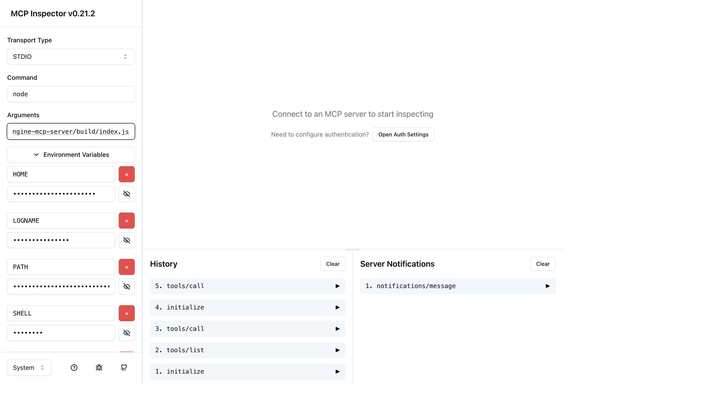
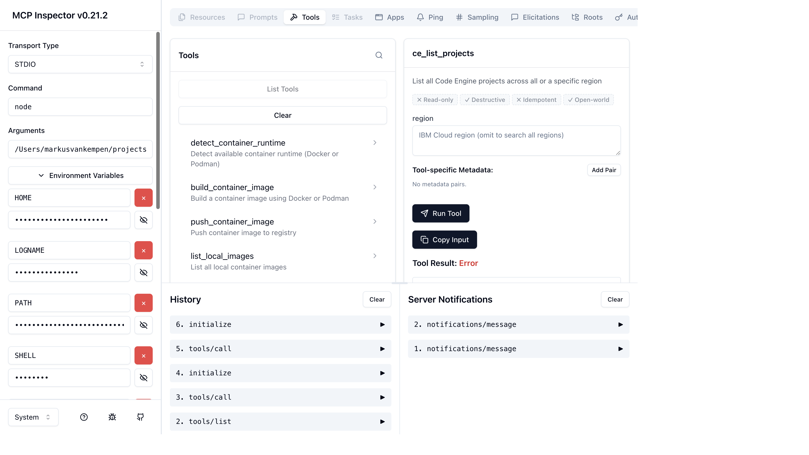
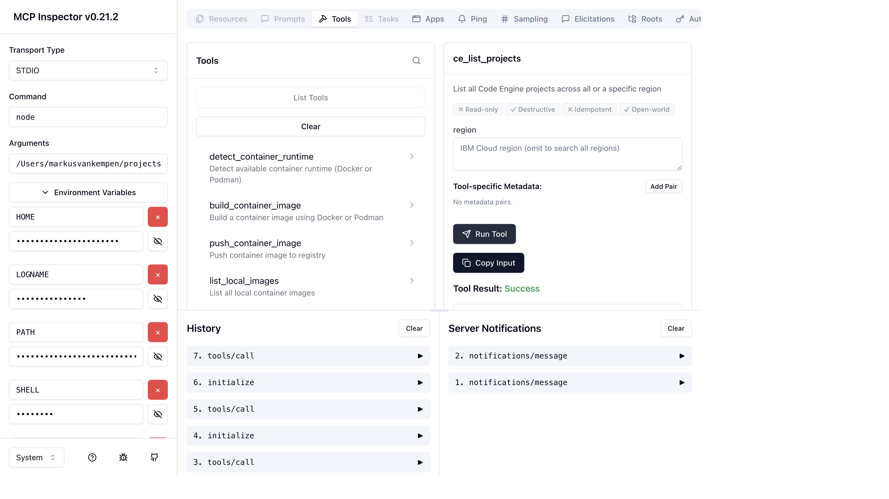
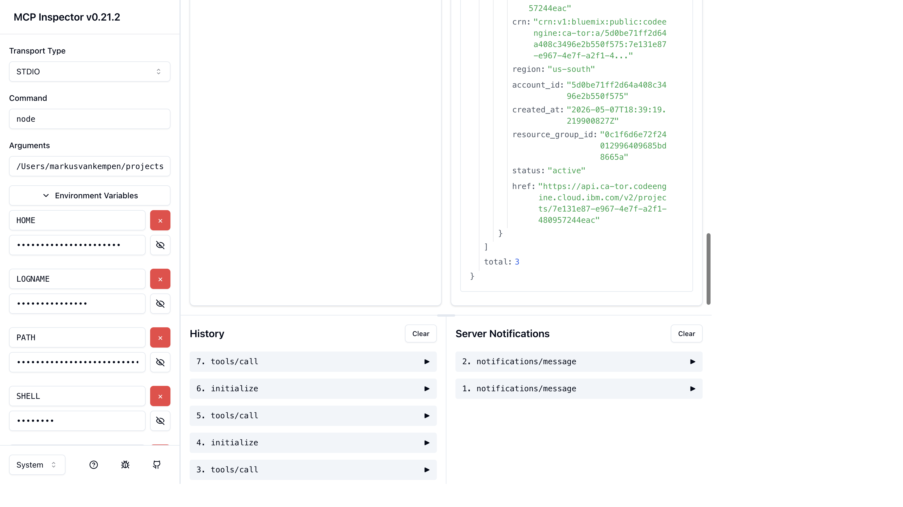

# Troubleshooting with the MCP Inspector

The [MCP Inspector](https://github.com/modelcontextprotocol/inspector) is an interactive browser UI that lets you connect directly to any MCP server, browse its tools, run them manually, and inspect the raw JSON-RPC traffic. This is the fastest way to verify your `code-engine-mcp-server` is working correctly — without needing a full AI assistant session.

---

## Prerequisites

| Requirement | Notes |
|-------------|-------|
| Node.js ≥ 18 | Required to run the server and the inspector |
| Built server | Run `npm run build` in the repo root |
| IBM Cloud API key | Set in your environment or passed directly to the inspector |

---

## Step 1 — Build the server

```bash
cd /path/to/code-engine-mcp-server
npm install && npm run build
```

Verify the entry point exists:

```bash
ls -lh build/index.js
```

---

## Step 2 — Launch the MCP Inspector

The inspector runs the MCP server as a child process (STDIO transport), so **no manual server startup is needed**.

```bash
npx @modelcontextprotocol/inspector \
  node build/index.js
```

The inspector prints two URLs:

```
MCP Inspector is up and running at http://localhost:6274 🚀
```

Open the URL it prints. If it adds a `?MCP_PROXY_AUTH_TOKEN=...` query parameter, use the full URL including that token — it is required to connect to the proxy.

> If port 6274 or 6277 is already in use from a stale run, kill the old process first:
> ```bash
> lsof -ti :6274,:6277 | xargs kill -9
> ```

---

## Step 3 — Connect with your API key

The server requires `IBMCLOUD_API_KEY` (and optionally `IBMCLOUD_REGION`). Pass them as environment variables in the inspector's **Environment Variables** panel before connecting:

| Key | Example value |
|-----|---------------|
| `IBMCLOUD_API_KEY` | `YOUR_IBM_CLOUD_API_KEY` |
| `IBMCLOUD_REGION` | `us-south` |

Or set them in your shell before launching the inspector:

```bash
export IBMCLOUD_API_KEY=your-key
export IBMCLOUD_REGION=us-south

npx @modelcontextprotocol/inspector node build/index.js
```

The inspector UI looks like this with the STDIO transport configured and `IBMCLOUD_API_KEY` / `IBMCLOUD_REGION` entered:



Once variables are set, click **Connect**. The status indicator turns green and the server name (`code-engine-mcp-server`) appears with the tools list populated:



---

## Step 4 — List all tools

1. Click the **Tools** tab.
2. Click **List Tools**.

You should see all ~62 tools grouped by category:

| Category prefix | Example tools |
|-----------------|--------------|
| `ce_` | `ce_list_projects`, `ce_create_application`, `ce_get_app_logs` |
| `docker_` | `docker_build_image`, `docker_push_image` |
| `icr_` | `icr_list_namespaces`, `icr_list_images` |
| `proc_` | `proc_build_push_deploy`, `proc_build_run_and_deploy` |

If the list is empty or an error appears, check [Common errors](#common-errors) below.

---

## Step 5 — Run a tool manually

### 5a — List your Code Engine projects

Select `ce_list_projects` from the tools list and click **Run Tool** (no parameters needed).

The result panel shows **Tool Result: Success** in green:



Scrolling down shows the full JSON response with your real projects:



Expected response shape:
```json
{
  "projects": [
    {
      "id": "YOUR_CE_PROJECT_ID",
      "name": "markus-app-v2-toronto",
      "region": "ca-tor",
      "status": "active"
    }
  ],
  "total": 3
}
```

### 5b — Get app logs

Select `ce_get_app_logs` and fill in:

| Parameter | Value |
|-----------|-------|
| `project_id` | your project ID from step 5a |
| `app_name` | an app deployed in that project |
| `tail_lines` | `50` (optional, default 100) |

Click **Run Tool**. The tool fetches logs via the Kubernetes proxy API (same mechanism as `ibmcloud ce app logs`).

### 5c — List app instances

Select `ce_list_app_instances`:

| Parameter | Value |
|-----------|-------|
| `project_id` | your project ID |
| `app_name` | an app name |

This confirms running pods and their current state.

---

## Step 6 — Inspect the raw JSON-RPC traffic

The **History** panel on the left shows every request and response in order:

| # | Method | Purpose |
|---|--------|---------|
| 1 | `initialize` | Handshake — server returns its name, version, capabilities |
| 2 | `notifications/initialized` | Client acknowledges capabilities |
| 3 | `tools/list` | Client fetches all available tools |
| 4 | `tools/call` | Client invokes a specific tool |

Click any history entry to see the full JSON payload. This is useful for copying exact tool inputs/outputs into bug reports.

> **Why does raw `curl` give "Method not found"?**
> A bare `curl` to the server's STDIO stream sends data without going through the `initialize` handshake first. The server correctly rejects it. The inspector handles the full handshake automatically.

---

## Common errors

### `IBMCLOUD_API_KEY` not set

**Symptom:** Tools return `401 Unauthorized` or `Missing API key` errors.

**Fix:** Set the environment variable before launching the inspector, or add it in the inspector's Environment Variables panel and reconnect.

---

### `ECONNREFUSED` / server won't start

**Symptom:** Inspector shows "Connection failed" immediately after clicking Connect.

**Fix:**
1. Confirm the build exists: `ls build/index.js`
2. Test the server directly: `node build/index.js` — it should print nothing and wait (STDIO mode).
3. Check Node.js version: `node --version` (must be ≥ 18).

---

### Port already in use

**Symptom:** Inspector fails to start with `EADDRINUSE :6274` or `:6277`.

**Fix:**
```bash
lsof -ti :6274,:6277 | xargs kill -9
```

Then rerun `npx @modelcontextprotocol/inspector node build/index.js`.

---

### Tools list is empty

**Symptom:** `tools/list` returns `[]` or the Tools tab shows nothing.

**Fix:** The server may have exited during startup (e.g. missing dependency). Run `node build/index.js` directly and check stderr for stack traces.

---

### `ce_get_app_logs` returns no pods

**Symptom:** Response says no pods found for the app.

**Possible causes:**
- The app has scaled to zero (Code Engine scales idle apps down). Send a request to the app URL first to wake it up, then retry.
- The `app_name` doesn't match exactly — it's case-sensitive.
- The `project_id` is wrong — use `ce_list_projects` to confirm.

---

## Tips

- Use the inspector's **Copy value** button on any result to paste exact JSON into a GitHub issue.
- The **History** panel persists across tool calls in the same session — useful for comparing before/after behaviour when debugging.
- To test a freshly built change, kill the inspector, run `npm run build`, and relaunch.
- All `ce_` tools that need a `project_id` can discover it first with `ce_list_projects` — the same workflow your AI assistant uses.
