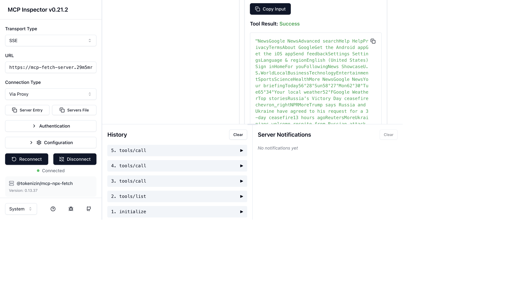
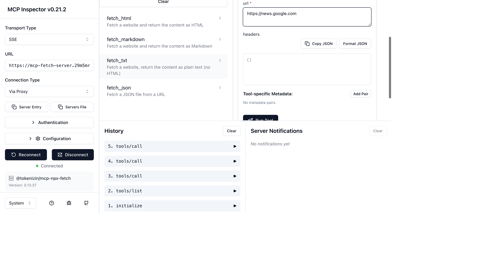
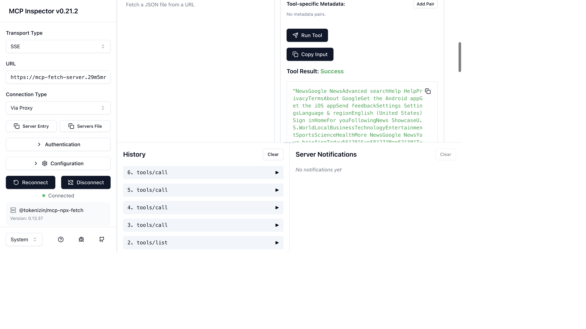

# MCP Server on Code Engine — supergateway Example

Deploy any STDIO-based MCP server to IBM Code Engine as a publicly accessible HTTPS + SSE service — with no custom Dockerfile, no YAML, and no CLI.

This example uses [`supergateway`](https://github.com/supercorp-ai/supergateway) (a public Docker image) to wrap [`@tokenizin/mcp-npx-fetch`](https://www.npmjs.com/package/@tokenizin/mcp-npx-fetch) — an MCP server that lets an AI assistant fetch content from public URLs.

> Credit: [Jeremias Werner & Enrico Regge — IBM Cloud Code Engine](https://community.ibm.com/community/user/blogs/jeremias-werner/2025/04/30/code-engine-mcp-server)

---

## How it works

```
Your AI Assistant (local)
    │  MCP JSON-RPC (STDIO)
    ▼
code-engine-mcp-server  ──► ce_create_application
                                     │
                                     ▼
                         Code Engine App
                         image: docker.io/supercorp/supergateway
                         run_args: --stdio "npx -y @tokenizin/mcp-npx-fetch"
                                   --outputTransport sse
                                     │  HTTPS + SSE  (public URL)
                                     ▼
                         Any remote MCP client
```

No custom Dockerfile is needed — `supergateway` accepts any `npx`-runnable MCP server as its `--stdio` argument.

---

## What's included

| File | Purpose |
|------|---------|
| `README.md` | This guide |
| `mcp-client.json` | Sample VS Code / Claude Desktop client config (fill in your URL) |
| `images/` | Screenshots of the MCP Inspector in action |

---

## 🤖 The Agentic Experience

### Option A: One-Shot Deployment

Ask your assistant:

> "Deploy a hosted MCP fetch server to my Code Engine project `<project-id>`.
> Use image `docker.io/supercorp/supergateway` on port 8000, no pull secret.
> run_args: `--stdio`, `npx -y @tokenizin/mcp-npx-fetch`, `--outputTransport`, `sse`
> Name it `mcp-fetch-server`, wait for it to be ready, and give me the `/sse` URL."

---

### Option B: Step-by-Step

#### Step 1 — Deploy the app

Ask your assistant:
> "Deploy `docker.io/supercorp/supergateway` to Code Engine project `<project-id>` as app `mcp-fetch-server`, port 8000, no pull secret, with run_args `--stdio`, `npx -y @tokenizin/mcp-npx-fetch`, `--outputTransport`, `sse`"

This calls `ce_create_application`:

```json
{
  "project_id": "<your-project-id>",
  "name": "mcp-fetch-server",
  "image": "docker.io/supercorp/supergateway",
  "port": 8000,
  "run_args": ["--stdio", "npx -y @tokenizin/mcp-npx-fetch", "--outputTransport", "sse"]
}
```

**MCP response — `ce_create_application`:**
```json
{
  "name": "mcp-fetch-server",
  "resource_type": "app_v2",
  "status": "deploying",
  "image_reference": "docker.io/supercorp/supergateway",
  "image_port": 8000,
  "scale_min_instances": 0,
  "scale_max_instances": 10,
  "endpoint": "https://mcp-fetch-server.<subdomain>.<region>.codeengine.appdomain.cloud"
}
```

> Code Engine scales to zero when idle — you pay only for actual requests.

#### Step 2 — Wait for ready

Ask your assistant:
> "Wait for `mcp-fetch-server` in project `<project-id>` to be ready"

This calls `ce_wait_for_app_ready` and returns the live endpoint once status is `ready`.

#### Step 3 — Verify the instance

Ask your assistant:
> "List the running instances of `mcp-fetch-server` in project `<project-id>`"

This calls `ce_list_app_instances` and confirms the container is `running`.

#### Step 4 — Connect your MCP client

Copy `mcp-client.json`, fill in your Code Engine URL, and add it to your client config.

**VS Code** — add to `.vscode/mcp.json` (or the global `mcp.json`):
```json
{
  "servers": {
    "fetch": {
      "command": "npx",
      "args": ["mcp-remote", "https://mcp-fetch-server.<subdomain>.<region>.codeengine.appdomain.cloud/sse"]
    }
  }
}
```

**Claude Desktop** — add to `~/Library/Application Support/Claude/claude_desktop_config.json`:
```json
{
  "mcpServers": {
    "fetch": {
      "command": "npx",
      "args": ["mcp-remote", "https://mcp-fetch-server.<subdomain>.<region>.codeengine.appdomain.cloud/sse"]
    }
  }
}
```

#### Step 5 — Test the endpoint

```bash
curl -N https://mcp-fetch-server.<subdomain>.<region>.codeengine.appdomain.cloud/sse
```

You should see an `event: endpoint` line with a `?sessionId=...` — this confirms the server is live.

> **Note:** A raw `curl` to `/sse` only shows the SSE stream. To interact with the server, POST MCP JSON-RPC requests to the `/message?sessionId=...` path returned in that first event.

---

## Verifying with the MCP Inspector

The [MCP Inspector](https://github.com/modelcontextprotocol/inspector) is the recommended tool to interactively test any MCP server — list tools, run them, and inspect JSON-RPC history.

### Setup

**Prerequisites:** Node.js installed.

```bash
npx @modelcontextprotocol/inspector
```

The inspector starts two local services:
- **UI** — `http://localhost:6274`
- **Proxy** — `http://localhost:6277`

It will print an auth token URL in the terminal output, e.g.:
```
http://localhost:6274/?MCP_PROXY_AUTH_TOKEN=<token>
```

Open that URL in your browser.

### Connecting to the Code Engine app

1. Set **Transport Type** → `SSE`
2. Set **URL** → your Code Engine SSE endpoint:
   ```
   https://mcp-fetch-server.<subdomain>.<region>.codeengine.appdomain.cloud/sse
   ```
3. Click **Connect**

Once connected you'll see the server name (`@tokenizin/mcp-npx-fetch`) and version in the sidebar with a green **Connected** indicator.



### Listing and running tools

1. Click the **Tools** tab
2. Click **List Tools** — the 4 available tools appear on the left panel
3. Click **fetch_txt** to select it
4. Enter a URL in the `url` field, e.g. `https://news.google.com`



5. Click **Run Tool**

The result appears immediately in the right panel under **Tool Result: Success**. The **History** panel at the bottom shows the full JSON-RPC sequence: `initialize` → `tools/list` → `tools/call`.



### What the MCP handshake looks like

When the inspector connects, it automatically performs the correct MCP handshake:

| Step | JSON-RPC method | What it does |
|---|---|---|
| 1 | `initialize` | Negotiates protocol version, exchanges capabilities |
| 2 | `notifications/initialized` | Client signals ready |
| 3 | `tools/list` | Retrieves the tool catalogue |
| 4 | `tools/call` | Invokes a tool with arguments |

> **Why raw `curl` shows "Method not found":** A bare `curl` to `/sse` only opens the SSE stream — it never sends `initialize`. Any subsequent JSON-RPC call will fail with `-32601 Method not found`. Always use `mcp-remote` or the MCP Inspector, which handle the handshake automatically.

---

## Available Tools

Once connected, your AI assistant can call these tools:

| Tool | Description |
|---|---|
| `fetch_html` | Fetch a URL and return full HTML content |
| `fetch_markdown` | Fetch a URL and return content as clean Markdown |
| `fetch_txt` | Fetch a URL and return plain text (no HTML tags) |
| `fetch_json` | Fetch a JSON endpoint and return parsed data |

All tools accept a `url` (required) and optional `headers` object.

**Example prompts for your assistant once connected:**
- *"Fetch https://example.com and summarize it"*
- *"Get the JSON from https://api.github.com/repos/IBM/code-engine-mcp-server"*
- *"Fetch https://ibm.com/cloud and return it as markdown"*

---

## Troubleshooting

**`Method not found` errors after `initialize`**

This typically means the MCP client is using protocol version `2025-11-05` while the server negotiates `2024-11-05`. Use `mcp-remote` (as shown above) which handles protocol negotiation automatically, or the MCP Inspector.

**App scales to zero / slow first request**

Code Engine scales to zero when idle. The first request after idle triggers a cold start (usually 10–30s). Set `scale_min_instances: 1` if you need instant response:
```
"Update app mcp-fetch-server in project <id> to set scale_min_instances to 1"
```

**Logs**

```
"Get logs for app mcp-fetch-server in project <id>"
```
This uses `ce_get_app_logs` which retrieves live pod logs via the Code Engine Kubernetes API proxy.

---

## Deploy a different MCP server

Swap the `--stdio` argument to host any other STDIO MCP server:

| MCP Server | `run_args[1]` value |
|---|---|
| Fetch (this example) | `npx -y @tokenizin/mcp-npx-fetch` |
| Filesystem | `npx -y @modelcontextprotocol/server-filesystem /data` |
| Brave Search | `npx -y @modelcontextprotocol/server-brave-search` |
| Your own server | `node /app/server.js` |

Ask your assistant:
> "Deploy `docker.io/supercorp/supergateway` to Code Engine project `<project-id>` as app `mcp-filesystem-server`, port 8000, run_args `--stdio`, `npx -y @modelcontextprotocol/server-filesystem /data`, `--outputTransport`, `sse`"
