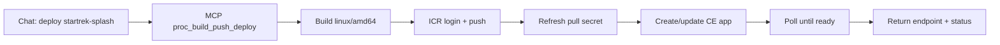

# Star Trek / LCARS Splash Application

A Star Trek LCARS-themed splash page styled with the iconic orange/black panel design. Served by nginx on port 8080 inside an Alpine Linux container — ready to deploy to IBM Code Engine.

**Live demo (us-south):** https://startrek-splash.jqu1wkh2th6.us-south.codeengine.appdomain.cloud

---

## Features

- LCARS-style CSS panels (animated pulsing effect, orange/amber color scheme)
- Static HTML — no runtime dependencies
- nginx on port 8080 (required by IBM Code Engine)
- Built for `linux/amd64` (Code Engine runtime)

---

## Run locally

```bash
# Build (podman or docker both work)
podman build --platform linux/amd64 -t startrek-splash .

# Run — map host 8080 → container 8080
podman run -d -p 8080:8080 startrek-splash

# Verify
curl -I http://localhost:8080   # expect HTTP 200
```

---

## Deploy to IBM Code Engine (MCP tools)

All steps use **Code Engine MCP tools** only — no `ibmcloud` CLI and no npm deploy scripts.

### Prerequisites

| Requirement | Value |
|---|---|
| Code Engine MCP server | Built (`npm run build`) and configured in your MCP client |
| `IBMCLOUD_API_KEY` | Must be available to the **MCP server process** (see [MCP setup](#mcp-setup-api-key) below) |
| ICR namespace | e.g. `mvk-code-engine` |
| Code Engine project | Project name or UUID (e.g. `c6fd163e-ef8c-4a30-a424-8e3d886caec6`) |
| Pull secret | `icr-pull-secret` in the project (created automatically by `proc_build_push_deploy` step 4.5) |

### 🤖 Chat command — one-shot

**Ask your assistant:**

> Using **only Code Engine MCP tools**, deploy `examples/startrek-splash` to Code Engine project `<project-id>` as app `startrek-splash`, ICR namespace `mvk-code-engine`, pull secret `icr-pull-secret`, image tag `v1.0.0-startrek`, port 8080. Show the live app URL and confirm status `ready`.

### 🤖 Chat command — step-by-step

| Step | Ask your assistant |
|------|-------------------|
| 1. Deploy | Call `proc_build_push_deploy` for `examples/startrek-splash` (see [tool arguments](#mcp-tool-proc_build_push_deploy) below) |
| 2. Confirm | Call `ce_get_application` for `startrek-splash` — status must be `ready` |
| 3. Smoke test | Curl the `endpoint` URL from the response — expect HTTP 200 |

### MCP tool: `proc_build_push_deploy`

```json
{
  "tool": "proc_build_push_deploy",
  "arguments": {
    "context_path": "examples/startrek-splash",
    "project_id_or_name": "<project-id>",
    "icr_namespace": "mvk-code-engine",
    "app_name": "startrek-splash",
    "image_tag": "v1.0.0-startrek",
    "image_secret": "icr-pull-secret",
    "port": 8080,
    "timeout_seconds": 300
  }
}
```

`proc_build_push_deploy` automatically:

1. Validates the Dockerfile (port 8080, `linux/amd64`, nginx sed patterns)
2. Resolves the project ID
3. Builds the image for `linux/amd64`
4. Logs in to ICR and pushes the image
5. Refreshes the ICR pull secret (prevents stale-credential failures)
6. Creates or updates the Code Engine app
7. Polls until the revision is `ready`
8. Returns `endpoint`, `status`, `steps`, and `poll_history`

### MCP setup: API key

The MCP server reads `IBMCLOUD_API_KEY` from its **own environment**, not from chat context.

**Cursor / VS Code** — in `.cursor/mcp.json` (or equivalent):

```json
"env": {
  "IBMCLOUD_API_KEY": "${env:IBMCLOUD_API_KEY}"
}
```

Then export the key in your shell before starting Cursor, or use `source code-engine-mcp-server/.env`.

If the in-IDE MCP connection returns `IBMCLOUD_API_KEY environment variable not set`, the key is not reaching the server process — fix MCP env and restart the `code-engine` server in the MCP panel.

### Documented example flow (verified deploy)

This is a **real** end-to-end run using MCP tool `proc_build_push_deploy` with provenance enabled (receipts are optional — see [Optional addon: Provenance](#optional-addon-provenance) at the end).



**Chat prompt used:**

> Using only Code Engine MCP tools, deploy `examples/startrek-splash` to Code Engine project — show provenance receipts and the live app URL.

> **Tip (v1.4.0):** Open the MCP Activity Dashboard with `MCP_ACTIVITY_ENABLED=true` to watch the same deploy on a live timeline. See [main README — MCP Activity Dashboard](https://github.com/markusvankempen/code-engine-mcp-server/blob/main/README.md#optional-mcp-activity-dashboard).

**MCP arguments (example):**

| Argument | Value |
|----------|-------|
| `context_path` | `examples/startrek-splash` |
| `project_id_or_name` | `c6fd163e-ef8c-4a30-a424-8e3d886caec6` |
| `app_name` | `startrek-splash` |
| `icr_namespace` | `mvk-code-engine` |
| `image_tag` | `v1.0.0-startrek-mcp` |
| `image_secret` | `icr-pull-secret` |
| `port` | `8080` |

**MCP response (excerpt):**

```json
{
  "status": "ready",
  "endpoint": "https://startrek-splash.jqu1wkh2th6.us-south.codeengine.appdomain.cloud",
  "image": "us.icr.io/mvk-code-engine/startrek-splash:v1.0.0-startrek-mcp",
  "latest_ready_revision": "startrek-splash-00001",
  "elapsed_seconds": 22,
  "provenance_receipts": [
    "provenance-addon/receipts/live/2026-07-02T15-18-40-177Z-ce_validate_dockerfile-33e7de72-b9b3-4f09-98a5-ab1be77a95e2.json",
    "provenance-addon/receipts/live/2026-07-02T15-19-12-343Z-proc_build_push_deploy-a0892d09-7de8-4ca4-bd28-77c83a4078fd.json"
  ]
}
```

**Deployment validation:**

| Check | Result |
|-------|--------|
| `status` | `ready` |
| HTTP | `curl -I` → **200** |
| Revision | `startrek-splash-00001` |
| Ready time | ~22 seconds |

**Provenance validation** (only when `PROVENANCE_ENABLED=true`):

```bash
cd provenance-addon
node verify-receipt.mjs --key-dir .keys \
  receipts/live/2026-07-02T15-18-40-177Z-ce_validate_dockerfile-*.json \
  receipts/live/2026-07-02T15-19-12-343Z-proc_build_push_deploy-*.json
```

```
✅ ce_validate_dockerfile receipt — verified
✅ proc_build_push_deploy receipt — verified
Results: 2 verified, 0 failed
```

Deploy receipt claim (excerpt): `session:cursor-local`, target `app:startrek-splash@c6fd163e-ef8c-4a30-a424-8e3d886caec6`, status `executed`.

---

## Troubleshooting

### App stuck in `no_revision_ready` with `reason: "unknown"`

This is the most common deployment failure. Two root causes produce identical symptoms:

#### Stale ICR pull secret

Code Engine can't pull the image because the registry secret's credentials have expired. Fix with:

```json
{
  "tool": "ce_refresh_icr_pull_secret",
  "arguments": {
    "project_id": "<your-project-id>",
    "secret_name": "icr-pull-secret",
    "icr_host": "us.icr.io"
  }
}
```

The tool uses the server's own `IBMCLOUD_API_KEY` — no API key input needed. Then redeploy.

> Since v1.0.8, `proc_build_push_deploy` refreshes the pull secret automatically before each deploy. Manual refresh is only needed when using `ce_create_application` or `ce_update_application` directly.

#### nginx port not rewritten (Alpine BusyBox `sed` limitation)

If your Dockerfile uses `\s*` in a `sed` pattern, the rewrite **silently fails** on Alpine because BusyBox `sed` does not support Perl regex escapes. nginx stays on port 80 while Code Engine health-checks 8080, so the revision never passes.

```dockerfile
# WRONG — \s* is Perl regex, not supported by Alpine BusyBox sed
RUN sed -i 's/listen\s*80;/listen 8080;/g' /etc/nginx/conf.d/default.conf

# CORRECT — POSIX [[:space:]]* works everywhere
RUN sed -i 's/listen[[:space:]]*80;/listen 8080;/g' /etc/nginx/conf.d/default.conf \
 && sed -i 's/listen[[:space:]]*\[::\]:80;/listen [::]:8080;/g' /etc/nginx/conf.d/default.conf
```

See [MCP Inspector Troubleshooting](https://github.com/markusvankempen/code-engine-mcp-server/blob/main/docs/MCP_INSPECTOR_TROUBLESHOOTING.md) for the full diagnosis guide.

---

## File structure

| File | Purpose |
|---|---|
| `index.html` | LCARS-themed splash page |
| `Dockerfile` | Alpine nginx container, port 8080 |
| `README.md` | This file |

## License

MIT

---

## Optional addon: Provenance

> **Not required for deployment.** Provenance is an experimental optional addon (`provenance-addon/`) that emits signed receipts for some MCP tool actions. Core Code Engine MCP works fully with provenance **off** (default).

When `PROVENANCE_ENABLED=true` in the MCP server env, `proc_build_push_deploy` also returns `provenance_receipts` — paths to signed JSON files you can verify later.

**Enable (optional):**

```bash
# code-engine-mcp-server/.env
PROVENANCE_ENABLED=true
PROVENANCE_RECEIPTS_DIR=provenance-addon/receipts/live
# ... see .env.example
```

Restart the MCP server after changing env.

**Chat prompt (deploy + receipts):**

> Using only Code Engine MCP tools, deploy `examples/startrek-splash` — provenance on. Show `provenance_receipts`, verify signatures with `verify-receipt.mjs`, and give me the live URL.

**Further reading (addon only):**

- [provenance-addon/README.md](https://github.com/markusvankempen/code-engine-mcp-server/blob/main/provenance-addon/README.md)
- [provenance-addon/PROVENANCE-CHAT-COMMANDS.md](https://github.com/markusvankempen/code-engine-mcp-server/blob/main/provenance-addon/PROVENANCE-CHAT-COMMANDS.md) — full prompt catalog
- [provenance-addon/visualizer.html](https://github.com/markusvankempen/code-engine-mcp-server/blob/main/provenance-addon/visualizer.html) — inspect receipts in a browser
