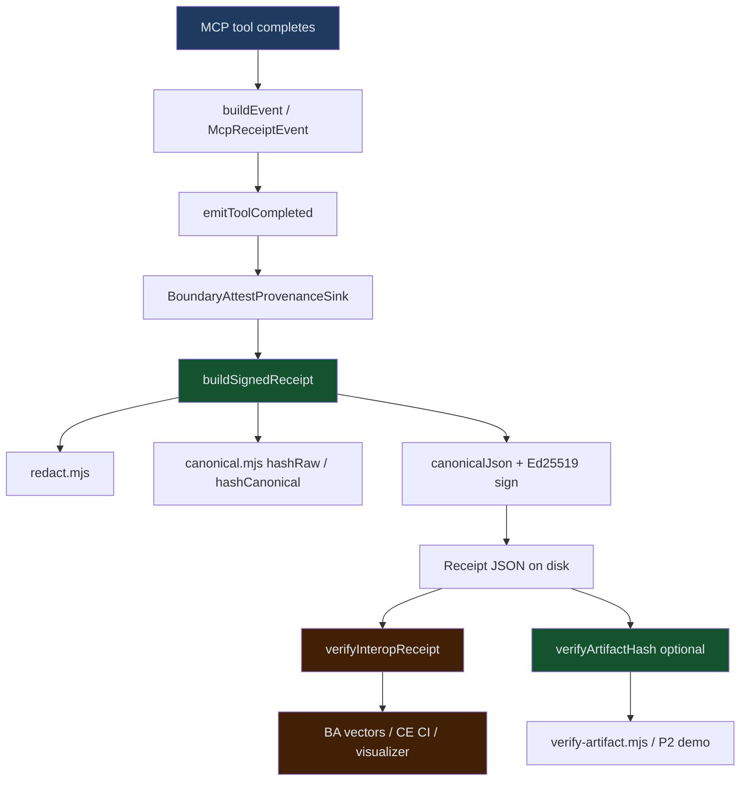
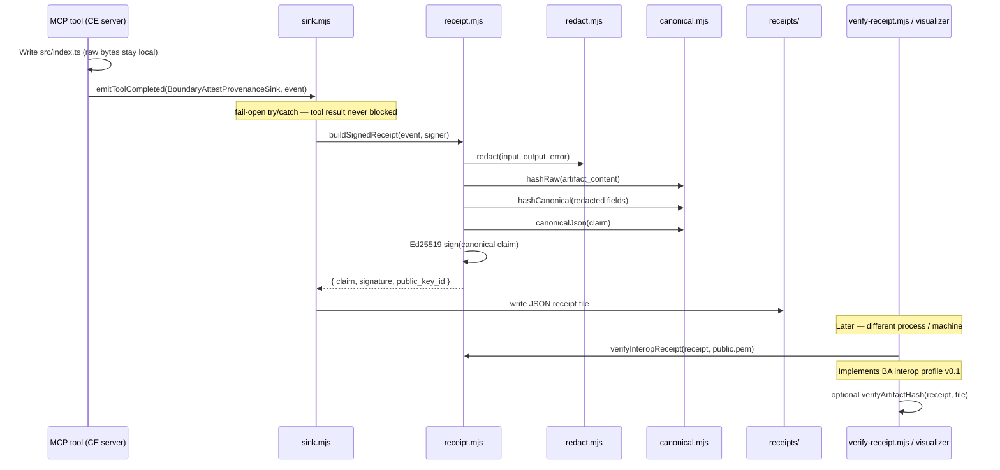
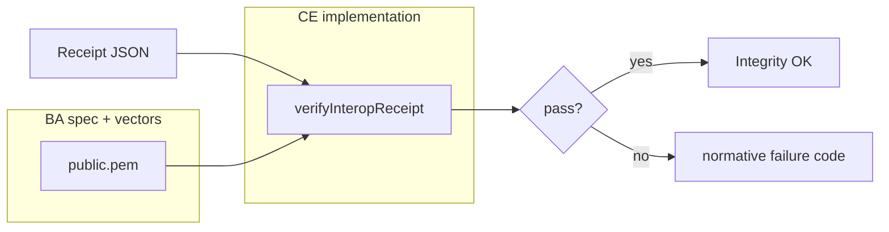

# End-to-End Provenance Flow

This document walks through one complete provenance path: an MCP tool writes a file, a signed receipt is produced, and the receipt is verified later — including which **Code Engine MCP (CE)** code runs, which **BoundaryAttest (BA)** spec/fixtures apply, and example data at each step.

**Status:** experimental v0.1 interop — see [BoundaryAttest Interop](./README.md#boundaryattest-interop-upstream) in the main README.

## 👤 Autor/Developer

Markus van Kempen  
Email: markus.van.kempen@gmail.com | mvankempen@ca.ibm.com  
Website: https://markusvankempen.github.io/  
No bug too small, no syntax too weird.

---

## Who owns what

There is **no BoundaryAttest npm dependency** in this repo. Cullen’s project defines the **portable contract**; this addon is a **dependency-free local implementation** plus CE-specific adapter fields and tooling.

| Layer | Owner | Where it lives | Role in E2E |
|-------|--------|----------------|-------------|
| Interop profile, schema, failure codes, trust limits | **BoundaryAttest (Cullen)** | [BoundaryAttest @ `1ea9864`](https://github.com/cullenmeyers/BoundaryAttest/commit/1ea9864) | Defines envelope + verify rules |
| BA interop test vectors (6 cases) | **BoundaryAttest** | `interop-v0.1/test-vectors/` (vendored) | Test CE verifier |
| CE reverse fixtures (4 receipts) | **Code Engine MCP** | `receipts/persisted-key-demo/` + `ce-reverse-fixtures/` | Tested by BA CI |
| All Node signing/verify implementation | **Code Engine MCP** | `*.mjs` in this folder | Runs at tool time + audit time |
| Artifact hash check (P2) | **Code Engine MCP** | `artifact.mjs` | Optional policy layer after signature |
| Demos, visualizer, CI | **Code Engine MCP** | `demo-*.mjs`, `visualizer.html`, `.github/workflows/` | Examples and gates |

---

## Scenario: write a file (happy path)

**Story:** An AI agent calls `workspace.write_or_modify_file`, the tool succeeds, the provenance sink emits a signed receipt, and an auditor verifies signature + file bytes later.

**Runnable reference:** `node example.mjs` (section 2 — adapter sink)

### High-level flow



### Sequence (with code touchpoints)



---

## Example data at each step

### Step 1 — Tool result (local only, not signed)

After the tool runs (`example.mjs` → `runWriteOrModifyFileTool()`):

```json
{
  "rawContent": "export function start() { return 42; }\n",
  "result": {
    "bytes_written": 39,
    "file_sha256": "sha256:deadbeef",
    "warnings": []
  }
}
```

**Code:** MCP tool handler (future: real Code Engine MCP server).  
**Not in receipt:** `rawContent` never appears in the signed claim.

---

### Step 2 — MCP event (`McpReceiptEvent`)

Built by `buildEvent()` in `example.mjs` (adapter maps tool → event):

```json
{
  "event_version": "0.1",
  "event_id": "6fd32246-e36c-457e-97aa-3c597afa55c4",
  "timestamp": "2026-06-30T14:00:00.000Z",
  "tool_name": "workspace.write_or_modify_file",
  "action_type": "write_or_modify_file",
  "status": "executed",
  "target_ref": "path:src/index.ts",
  "trace_ref": "trace:rpc-demo-001",
  "git_ref": "main@1a2b3c4",
  "lineage_ref": "ticket:ENG-417",
  "artifact_content": "export function start() { return 42; }\n",
  "input": {
    "path": "src/index.ts",
    "operation": "update",
    "raw_content": "export function start() { return 42; }\n",
    "api_key": "super-secret-value-should-never-appear"
  },
  "output": {
    "bytes_written": 39,
    "file_sha256": "sha256:deadbeef",
    "warnings": []
  }
}
```

**Code:** `example.mjs` → `buildEvent()` → passed to `emitToolCompleted()` in `sink.mjs`.

| Field | CE-only? | Notes |
|-------|----------|-------|
| `tool_name`, `session_id`, `task_id` | CE adapter | Optional; extended claim fields |
| `artifact_content` | CE input | Hashed before claim; raw bytes discarded |
| `input` / `output` | CE adapter | Redacted + hashed; raw secrets never in claim |

---

### Step 3 — Redaction (`redact.mjs`)

Sensitive keys (`api_key`, `token`, `password`, …) become `<redacted>` **before** hashing:

```json
{
  "path": "src/index.ts",
  "operation": "update",
  "raw_content": "<redacted>",
  "api_key": "<redacted>"
}
```

**Code:** `redact.mjs` ← called from `buildSignedReceipt()` in `receipt.mjs`.

---

### Step 4 — Digests (`canonical.mjs`)

| Digest | Input | Function |
|--------|--------|----------|
| `artifact_hash` | Raw file bytes (`artifact_content`) | `hashRaw()` |
| `input_hash` | Redacted input object | `hashCanonical()` |
| `output_hash` | Redacted output (success) or `null` (failure) | `hashCanonical()` |
| `error_hash` | Redacted error (failure) or `null` (success) | `hashCanonical()` |

Example:

```
artifact_hash: sha256:babb75aae2fcf37bf8cb60b6307496162d787c5fc0f96080728da790510597d9
input_hash:    sha256:47d361d4a82c9b6beb62eedb31e427dcb0efce70b2765d15081758bc5eb54bfa
output_hash:   sha256:49ca58dd30bd9dda0e77d8c7ac6d4e77cbbe560ccb42257af9cff1cef46c0c9d
```

**Code:** `canonical.mjs` ← `receipt.mjs` → `buildSignedReceipt()`.

---

### Step 5 — Signed claim (BA minimal + CE extended)

The **signed payload** is exactly the `claim` object. Required interop fields (BA profile) plus CE extensions:

```json
{
  "receipt_version": "0.1",
  "receipt_role": "client_observed",
  "event_id": "6fd32246-e36c-457e-97aa-3c597afa55c4",
  "timestamp": "2026-06-30T14:00:00.000Z",
  "tool_name": "workspace.write_or_modify_file",
  "action_type": "write_or_modify_file",
  "status": "executed",
  "target_ref": "path:src/index.ts",
  "artifact_hash": "sha256:babb75aae2fcf37bf8cb60b6307496162d787c5fc0f96080728da790510597d9",
  "input_hash": "sha256:47d361d4a82c9b6beb62eedb31e427dcb0efce70b2765d15081758bc5eb54bfa",
  "output_hash": "sha256:49ca58dd30bd9dda0e77d8c7ac6d4e77cbbe560ccb42257af9cff1cef46c0c9d",
  "error_hash": null,
  "trace_ref": "trace:rpc-demo-001",
  "git_ref": "main@1a2b3c4",
  "lineage_ref": "ticket:ENG-417",
  "previous_receipt_hash": null
}
```

**Code:** `receipt.mjs` → `buildSignedReceipt()`.

| Claim part | Profile |
|------------|---------|
| `receipt_version`, `receipt_role`, `event_id`, `timestamp`, `action_type`, `status` | **BA required** (interop v0.1) |
| `tool_name`, `session_id`, `task_id`, `*_hash`, refs | **CE extended** (signed; verifiers ignore if unknown) |

Canonicalization for signing must match BA `stableJson` rules — implemented in `canonical.mjs` → `canonicalJson()`.

---

### Step 6 — Receipt envelope (on disk)

Full receipt written by `BoundaryAttestProvenanceSink` (`sink.mjs`):

```json
{
  "claim": { "...": "see step 5" },
  "signature": "base64-ed25519-over-canonical-claim",
  "public_key_id": "sha256:4145925191b02ff60e26109854f74a558e941539a72e1f3bd086eadad1eb1995"
}
```

**Code path:**

1. `sink.mjs` → `BoundaryAttestProvenanceSink.onToolCompleted()`
2. `receipt.mjs` → `buildSignedReceipt()`
3. `sink.mjs` → `writeFileSync(outDir, …)`

**Signer:** `createLocalSigner()` (ephemeral) or `loadOrCreateSigner('.keys')` (P1 — cross-run verify).

`public_key_id` = SHA-256 of SPKI DER bytes, prefixed with `sha256:` (BA interop v0.1, agreed with Cullen).

---

## Verification paths (after the fact)

### A. Interop signature verification (BA contract, CE code)

**Question:** Was the claim tampered with after signing?

**Code:** `receipt.mjs` → `verifyInteropReceipt()` / `verifyFromPublicKey()`  
**CLI:** `verify-receipt.mjs`  
**Browser:** `visualizer.html` (Web Crypto Ed25519)

Check order (normative BA failure codes):

1. Envelope structure → `missing_top_level_field:*`, `claim_not_object`
2. Required claim fields → `missing_claim_field:*`
3. `receipt_version === "0.1"` → else `unsupported_version`
4. `receipt_role` ∈ {`client_observed`, `server_attested`} → else `unsupported_receipt_role`
5. `public_key_id` vs key file → `public_key_id_mismatch`
6. Ed25519 over `canonicalJson(claim)` → `invalid_signature` or pass

**BA test input:** `interop-v0.1/test-vectors/*.json` (6 cases)  
**Run:** `npm run interop:vectors`



---

### B. Artifact hash verification (CE P2 — policy layer)

**Question:** Does the file on disk match `claim.artifact_hash`?

**Code:** `artifact.mjs` → `verifyArtifactHash()`  
**CLI:** `verify-artifact.mjs` (optional `--key` for signature + artifact)

Example (from `receipts/artifact-demo/`):

```
claim.artifact_hash: sha256:c6143e514557093362022244c84d6b856ffa28e55d91d0bbb73d0c3aa7330879
Dockerfile on disk:  same bytes → hashRaw() matches → pass
Tampered file:       extra line appended → artifact_hash_mismatch
```

**Run:** `npm run demo:artifact-hash` or `npm run interop:ci` (includes artifact check)

This is **not** mandatory BA interop crypto — it is CE’s binding layer on top of a valid signature.

---

### C. Two-way interop (CE ↔ BA CI)

| Direction | What runs | Where |
|-----------|-----------|--------|
| BA → CE | BA vectors verified by CE `verifyInteropReceipt` | CE: `npm run interop:vectors` |
| CE → BA | CE `persisted-key-demo` receipts verified by BA | BA CI (Cullen’s repo) |

**CE fixtures for reverse interop:** `interop-v0.1/ce-reverse-fixtures/public.pem` + `receipts/persisted-key-demo/*.json`

---

## Code map: file → responsibility

| When | File | Function / class | Owner |
|------|------|------------------|-------|
| Tool completes, optional emit | `sink.mjs` | `emitToolCompleted`, `NoopProvenanceSink` | CE |
| Adapter sink | `sink.mjs` | `BoundaryAttestProvenanceSink` | CE (BA-shaped adapter name) |
| Build + sign claim | `receipt.mjs` | `buildSignedReceipt` | CE |
| Redact secrets | `redact.mjs` | `redact` | CE |
| Canonical JSON + SHA-256 | `canonical.mjs` | `canonicalJson`, `hashRaw`, `hashCanonical` | CE (BA algorithm) |
| Sign / load keys | `receipt.mjs` | `createLocalSigner`, `loadOrCreateSigner` | CE |
| Interop verify | `receipt.mjs` | `verifyInteropReceipt` | CE impl of BA profile |
| Artifact verify | `artifact.mjs` | `verifyArtifactHash` | CE |
| CLI verify | `verify-receipt.mjs`, `verify-artifact.mjs` | — | CE |
| E2E demo | `example.mjs` | — | CE |
| Timeline UI | `visualizer.html` | Web Crypto verify | CE |
| Interop tests | `interop-v0.1/run-vectors.mjs` | uses BA fixtures | BA data, CE runner |
| CI gate | `.github/workflows/provenance-interop.yml` | `npm run interop:ci` | CE |

---

## Failure path example (tool failed, receipt still valid)

When `status: "failed"`, the receipt is still signed — it proves the failure happened, not that the tool succeeded.

```json
{
  "claim": {
    "receipt_version": "0.1",
    "receipt_role": "client_observed",
    "status": "failed",
    "output_hash": null,
    "error_hash": "sha256:…"
  },
  "signature": "…",
  "public_key_id": "sha256:…"
}
```

**Demo receipts:** `receipts/persisted-key-demo/04-update-failed.json`  
**Visualization:** load `receipts/multi-session-demo/` or `ce-deployment-demo/` in `visualizer.html`

---

## Tamper path example (signature fails)

Attacker changes `target_ref` after signing:

```javascript
// Before: path:src/index.ts  →  verify: pass
// After:  path:evil.ts        →  verify: invalid_signature
```

**Demo:** `example.mjs` (tamper check), `demo-tamper-scenarios.mjs`, `visualizer.html` (TAMPERED badge)

---

## Try it yourself

| Goal | Command |
|------|---------|
| **MCP server write + receipt** | `PROVENANCE_ENABLED=true npm run test:provenance-write` (from repo root) |
| Browser test matrix | `npm run test:lab` → open test-lab.html |
| Verify manifest cases (Node) | `npm run test:lab:verify` |
| Full E2E sign + verify | `node example.mjs` |
| P1 persisted key | `npm run demo:persisted-key` |
| P2 artifact + file | `npm run demo:artifact-hash` |
| Interop + artifact CI locally | `npm run interop:ci` |
| Verify one receipt | `node verify-receipt.mjs --key-dir .keys receipts/…json` |
| Verify receipt + Dockerfile | `node verify-artifact.mjs --receipt … --file … --key …` |
| Visual timeline | Open `visualizer.html`, load `receipts/multi-session-demo/*.json` |

---

## Related docs

- [README.md](./README.md) — installation, module reference, tamper detection, P1/P2 sections
- [BoundaryAttest Interop Profile v0.1](https://github.com/cullenmeyers/BoundaryAttest/blob/1ea9864/docs/interop-profile-v0.1.md)
- [Dependency-free adapter guide](https://github.com/cullenmeyers/BoundaryAttest/blob/1ea9864/docs/interop-adapter-guide-v0.1.md)
- [Verification limits v0.1](https://github.com/cullenmeyers/BoundaryAttest/blob/1ea9864/docs/interop-verification-limits-v0.1.md)
