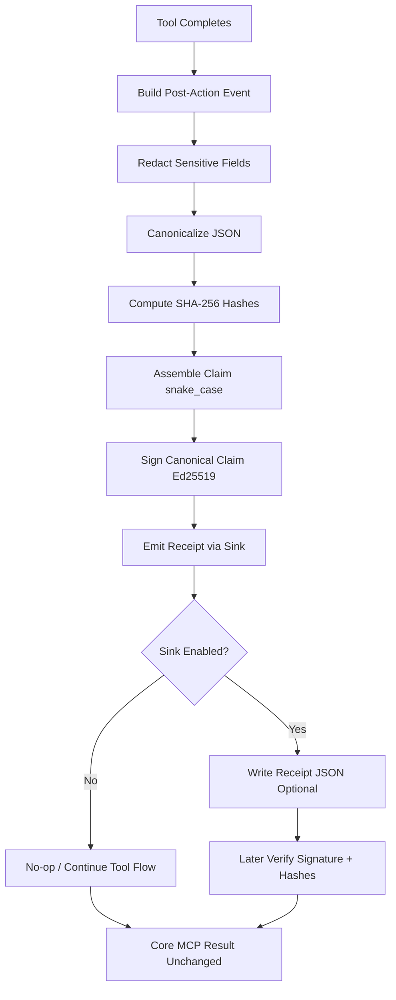
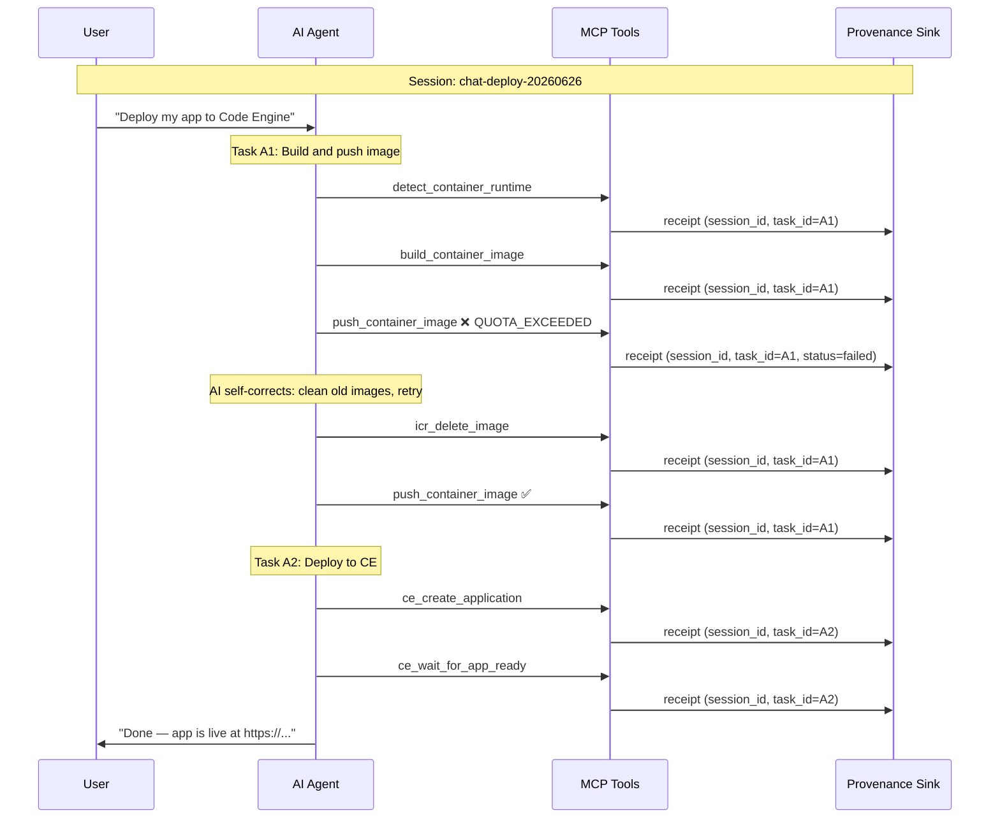
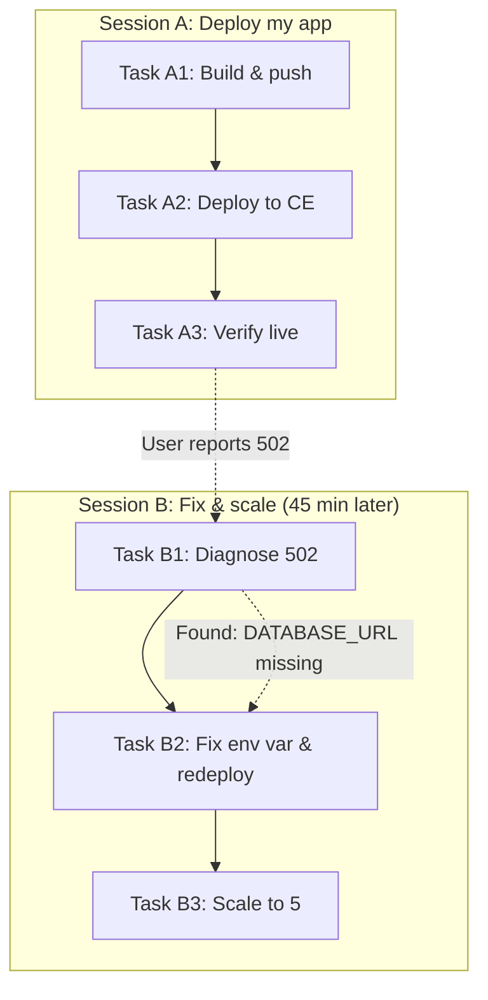

# Provenance Addon (Optional, Dependency-Free)

## What This Is (Simple Version)

This folder is a small optional addon that creates signed receipts for important tool actions.

In plain words:

- A tool does some work (for example, writes a file).
- After the tool finishes, this addon can create a receipt.
- The receipt is signed, so later you can prove the receipt was not changed.
- The receipt does **not** prove the code is correct or safe.

Think of it as a tamper-evident "what happened" proof, not a quality proof.

## Why This Exists

Normal logs and Git history are still the main source of truth.

This addon adds one extra capability:

- Portable proof that a specific signer attested to a specific claim at a specific time.

This helps when evidence must be checked outside the original runtime.

## Design Goals

- Optional: core tool behavior must work with or without this addon.
- Dependency-free: uses only built-in Node modules.
- Fail-open: if receipt creation fails, tool execution still succeeds.
- Redaction-first: sensitive data is redacted before hashing.
- Deterministic: canonical JSON is used so hashes/signatures are stable.

## BoundaryAttest Interop (upstream)

**Status:** experimental v0.1 — interop + artifact checks run in [CI](../../.github/workflows/provenance-interop.yml) on changes to `provenance-addon/`.

This addon implements [BoundaryAttest Interop Profile v0.1](https://github.com/cullenmeyers/BoundaryAttest/blob/1ea9864/docs/interop-profile-v0.1.md) locally — **no BoundaryAttest npm dependency**. Two-way interop is verified:

- CE verifies BA test vectors (`interop-v0.1/run-vectors.mjs`) — 6/6 pass
- BA verifies CE reverse fixtures (`interop-v0.1/ce-reverse-fixtures/`) — 4/4 pass

Upstream references pinned to BoundaryAttest docs slice commit [`1ea9864`](https://github.com/cullenmeyers/BoundaryAttest/commit/1ea9864):

| Document | Purpose |
|---|---|
| [Interop Profile v0.1](https://github.com/cullenmeyers/BoundaryAttest/blob/1ea9864/docs/interop-profile-v0.1.md) | Portable envelope + minimal vs extended claim |
| [Dependency-free adapter guide](https://github.com/cullenmeyers/BoundaryAttest/blob/1ea9864/docs/interop-adapter-guide-v0.1.md) | Implement profile without BA runtime import |
| [Verification limits v0.1](https://github.com/cullenmeyers/BoundaryAttest/blob/1ea9864/docs/interop-verification-limits-v0.1.md) | What verification proves and does not prove |
| [JSON Schema](https://github.com/cullenmeyers/BoundaryAttest/blob/1ea9864/docs/schemas/interop-receipt-v0.1.schema.json) | Envelope + claim shape |

Code Engine MCP adds **extended claim fields** (`tool_name`, `session_id`, `task_id`, `input_hash`, etc.) inside `claim` per the adapter guide. Verifiers ignore unknown fields after required checks pass.

For a **step-by-step end-to-end walkthrough** with example data, Mermaid diagrams, and a code map (CE vs BoundaryAttest ownership), see **[PROVENANCE-E2E-FLOW.md](./PROVENANCE-E2E-FLOW.md)**.

For **chat prompts** (optional addon only), see **[PROVENANCE-CHAT-COMMANDS.md](./PROVENANCE-CHAT-COMMANDS.md)**. Core deploy examples without provenance: [startrek-splash](../examples/startrek-splash/README.md), [starwars-splash](../examples/starwars-splash/README.md).

## What It Does and Does Not Prove

What it proves:

- A signer produced a signature over the claim payload.
- The claim payload has not been altered since signing.

What it does not prove:

- The generated code is correct.
- The generated code is secure.
- The action was authorized.
- The runtime was uncompromised.

## Folder Contents

| File / folder | Type | Purpose |
|---|---|---|
| `canonical.mjs` | Library | Canonical JSON + SHA-256 helpers |
| `redact.mjs` | Library | Recursive sensitive-field redaction |
| `receipt.mjs` | Library | Event → claim mapping, Ed25519 signing, verification |
| `sink.mjs` | Library | Optional sink layer (no-op default + adapter sink) |
| `example.mjs` | Runnable | End-to-end demo: no-op sink, adapter sink, fail-open |
| `demo-ce-deployment.mjs` | Runnable | Generates CE deployment flow receipts (with failures) |
| `demo-multi-session.mjs` | Runnable | Generates multi-session / multi-task chat flow receipts |
| `demo-tamper-scenarios.mjs` | Runnable | Generates valid + tampered receipts for integrity demo |
| `demo-persisted-key.mjs` | Runnable | P1: persisted key sign + cross-run verify demo |
| `demo-artifact-hash.mjs` | Runnable | P2: artifact hash verification (receipt + file binding) |
| `artifact.mjs` | Library | Verify `claim.artifact_hash` against file/patch bytes |
| `verify-receipt.mjs` | CLI Tool | Standalone receipt verifier (external verification path) |
| `verify-artifact.mjs` | CLI Tool | Verify artifact file bytes against `claim.artifact_hash` |
| `run-example.sh` | Script | Bash wrapper for `example.mjs` |
| `run-demo-ce-deployment.sh` | Script | Bash wrapper for `demo-ce-deployment.mjs` |
| `run-demo-multi-session.sh` | Script | Bash wrapper for `demo-multi-session.mjs` |
| `run-demo-tamper.sh` | Script | Bash wrapper for `demo-tamper-scenarios.mjs` |
| `run-demo-persisted-key.sh` | Script | Bash wrapper for `demo-persisted-key.mjs` |
| `run-demo-artifact-hash.sh` | Script | Bash wrapper for `demo-artifact-hash.mjs` |
| `run-all.sh` | Script | Runs all examples and demo generators |
| `.keys/` | Generated | Persisted Ed25519 key pair (private.pem + public.pem) |
| `package.json` | Config | ESM metadata and npm scripts (no external dependencies) |
| `PROVENANCE-E2E-FLOW.md` | Docs | End-to-end flow diagrams, example data, code map (CE vs BA) |
| `PROVENANCE-CHAT-COMMANDS.md` | Docs | Chat / prompt language for provenance (Cursor, Copilot, Claude) |
| `test-lab.html` | Tool | Browser test dashboard — interop matrix, pass/fail, demo catalog |
| `test-manifest.json` | Config | Test suite catalog for test-lab.html |
| `run-test-lab.sh` | Script | Local HTTP server for test-lab browser runner |
| `visualizer.html` | Tool | Standalone browser receipt visualizer |
| `receipts/` | Output | Demo receipt JSON output directory |
| `reference-js/` | Docs | Reference-only `.js` copies for comparison |
| `reference-ts/` | Docs | Reference-only `.ts` copies for comparison |

Reference folders are documentation aids only. The active integration path remains the `.mjs` files in this folder.

## Module Reference (`.mjs` files)

### Library modules (import only — do not run directly)

| File | What it does | Key exports |
|---|---|---|
| `canonical.mjs` | Deterministic JSON canonicalization and SHA-256 hashing for stable signatures | `canonicalize`, `canonicalJson`, `hashCanonical`, `hashRaw` |
| `redact.mjs` | Replaces sensitive keys (`api_key`, `token`, `password`, etc.) with `<redacted>` before hashing | `redact`, `DEFAULT_SENSITIVE_KEYS` |
| `receipt.mjs` | Builds signed claims from tool events; Ed25519 sign/verify; interop v0.1 verification with normative failure codes | `buildSignedReceipt`, `verifySignedReceipt`, `verifyInteropReceipt`, `verifyInteropReceiptText`, `verifyFromPublicKey`, `interopPublicKeyId`, `createLocalSigner`, `loadOrCreateSigner`, `newEventId` |
| `artifact.mjs` | Policy-layer check: `hashRaw(file bytes) === claim.artifact_hash` | `verifyArtifactHash`, `verifyReceiptAndArtifact` |
| `sink.mjs` | Fail-open emit boundary; no-op sink (default) and file-writing adapter sink | `NoopProvenanceSink`, `BoundaryAttestProvenanceSink`, `emitToolCompleted` |

Typical import chain:

```
sink.mjs → receipt.mjs → canonical.mjs + redact.mjs
```

### Runnable demos (execute with Node.js)

| File | What it does | Output |
|---|---|---|
| `example.mjs` | Simulates a file-write tool, shows no-op sink, signed receipt + verification, and fail-open behavior | `receipts/*.json` (one receipt) |
| `demo-ce-deployment.mjs` | Simulates a full Code Engine agent pipeline: validate → build → push (fail) → auth fix → deploy → scale | `receipts/ce-deployment-demo/` (~14 receipts) |
| `demo-multi-session.mjs` | Simulates two AI chat sessions with multiple tasks, self-correction, and cross-session troubleshooting | `receipts/multi-session-demo/` (~20 receipts) |
| `demo-tamper-scenarios.mjs` | Generates valid receipts then creates intentionally corrupted copies to demonstrate tamper detection | `receipts/tamper-demo/` (10 receipts + public key) |
| `demo-persisted-key.mjs` | Signs receipts with persisted key, then verifies externally (cross-run P1 demo) | `receipts/persisted-key-demo/` (4 receipts) + `.keys/` |
| `demo-artifact-hash.mjs` | Signs receipt with `artifact_hash`, verifies file match + tamper detection | `receipts/artifact-demo/` |
| `verify-receipt.mjs` | CLI verifier — interop v0.1 signature verification | stdout verification report |
| `verify-artifact.mjs` | CLI — artifact bytes vs `claim.artifact_hash` (optional `--key` for full check) | stdout verification report |

## Installation

No npm install is required — this addon uses only Node.js built-in modules.

Requirements:

- Node.js 18+ (Ed25519 signing requires Node 18+)

Check your version:

```bash
node --version
```

## Quick Start

### Option 1 — Bash scripts (recommended)

From the `provenance-addon/` folder:

```bash
cd provenance-addon

# End-to-end example (signing, verification, fail-open)
./run-example.sh

# Code Engine deployment demo receipts
./run-demo-ce-deployment.sh

# Multi-session / multi-task chat demo receipts
./run-demo-multi-session.sh

# Run everything
./run-all.sh
```

From the repository root:

```bash
bash provenance-addon/run-example.sh
bash provenance-addon/run-demo-ce-deployment.sh
bash provenance-addon/run-demo-multi-session.sh
bash provenance-addon/run-all.sh
```

### Option 2 — npm scripts

From the `provenance-addon/` folder:

```bash
cd provenance-addon

npm run example
npm run demo:ce-deployment
npm run demo:multi-session
npm run demo:all
```

### Option 3 — Node.js directly

From the repository root:

```bash
node provenance-addon/example.mjs
node provenance-addon/demo-ce-deployment.mjs
node provenance-addon/demo-multi-session.mjs
```

Or from inside `provenance-addon/`:

```bash
cd provenance-addon
node example.mjs
node demo-ce-deployment.mjs
node demo-multi-session.mjs
```

### View results in the visualizer

After running a demo generator:

1. Open `provenance-addon/visualizer.html` in a browser.
2. Click **Load Receipt JSON Files**.
3. Select one or more files from:
   - `receipts/` — single example receipt
   - `receipts/ce-deployment-demo/` — deployment flow
   - `receipts/multi-session-demo/` — session/task chat flow

### Run the test lab (browser matrix)

The **test lab** runs interop, reverse, artifact, and tamper checks in the browser (Web Crypto Ed25519 + SHA-256):

```bash
cd provenance-addon
npm run test:lab
# Open http://localhost:8765/test-lab.html → click "Run all browser tests"
```

What it covers:

| Suite | Cases | Owner |
|---|---|---|
| BA interop vectors | 6/6 | BA spec + CE verifier |
| CE reverse fixtures | 4/4 | CE receipts (BA CI verifies upstream) |
| Artifact hash (P2) | 2 | CE policy layer |
| Tamper demo | 11 | CE implementation |

Node CI equivalent: `npm run interop:ci`. Drill-down receipts: open **Visualizer** from the test lab header.

See also [PROVENANCE-E2E-FLOW.md](./PROVENANCE-E2E-FLOW.md) for step-by-step flow diagrams.

## Data Flow

1. A completed tool event is created.
2. Sensitive input/output/error fields are redacted.
3. Redacted structures are canonically hashed.
4. A claim object is assembled in snake_case wire format.
5. The canonical claim JSON is signed (Ed25519).
6. Receipt is optionally written to disk.

See **[PROVENANCE-E2E-FLOW.md](./PROVENANCE-E2E-FLOW.md)** for the full walkthrough with example JSON at each step, verification paths, and which module runs when.

## Flow Chart (Mermaid)



Click-through interactive flow is available in the VS Code extension receipt visualizer panel.

## Key Contract Rules

- Signed payload is exactly the claim object.
- Wire format is snake_case.
- receipt_role defaults to client_observed.
- Trace/git/lineage refs are optional references.
- Sink failures are swallowed (fail-open).

## Expected Demo Behavior

The example intentionally shows three scenarios:

1. No-op sink path
   - No receipt is emitted.
   - Tool result flow is unchanged.
2. Adapter sink path
   - Receipt is created and written to receipts/.
   - Claim contains hashes and references, not raw secrets.
   - Signature verification succeeds.
3. Fail-open path
   - A simulated sink error is logged.
   - Tool result flow still continues.

## Receipt Shape

Top-level fields:

- claim
- signature
- public_key_id

Common claim fields:

- receipt_version
- receipt_role
- event_id
- timestamp
- tool_name
- action_type
- status
- target_ref
- artifact_hash (optional) — sha256 of the raw file, patch, or scaffold content, computed **before** redaction; raw bytes never stored in the claim
- input_hash — sha256 of the canonical redacted input structure (operational context, no secrets)
- output_hash or error_hash — always present; null when not applicable (intentional for deterministic canonical shape)
- trace_ref (optional)
- git_ref (optional)
- lineage_ref (optional)
- previous_receipt_hash — reserved for future receipt chaining; always null in v0.1 unless the sink explicitly maintains the chain

## Redaction Policy

Default sensitive keys include values like:

- api_key
- token
- password
- private_key
- raw_content
- sensitive_context

Sensitive values are replaced with:

- <redacted>

Only the redacted structure is hashed for the claim.

## Canonicalization Policy

For stable hashing/signing:

- Object keys are sorted recursively.
- Undefined values are removed.
- Array order is preserved.
- JSON is compact.
- Hash output format is sha256:<hex>.

## Programmatic Usage (Minimal)

```js
import { BoundaryAttestProvenanceSink, emitToolCompleted } from './sink.mjs';
import { createLocalSigner, newEventId } from './receipt.mjs';

const signer = createLocalSigner();
const sink = new BoundaryAttestProvenanceSink({
  enabled: true,
  signer,
  receiptRole: 'client_observed',
  outDir: './receipts',
});

const event = {
  event_version: '0.1',
  event_id: newEventId(),
  timestamp: new Date().toISOString(),
  tool_name: 'workspace.write_or_modify_file',
  action_type: 'write_or_modify_file',
  status: 'executed',
  target_ref: 'path:src/index.ts',
  // artifact_content is hashed into artifact_hash before redaction; raw bytes never stored.
  artifact_content: 'export function start() { return 42; }\n',
  input: { path: 'src/index.ts', raw_content: '...', api_key: 'secret' },
  output: { bytes_written: 10 },
};

const result = await emitToolCompleted(sink, event);
console.log(result.receiptId, result.receiptPath);
```

## Integration Pattern (Recommended)

Use this addon only at post-tool completion boundaries for selected actions.

### MCP server integration (Code Engine)

The MCP server includes `write_or_modify_file` with optional provenance when enabled.

**Chat prompts:** see **[PROVENANCE-CHAT-COMMANDS.md](./PROVENANCE-CHAT-COMMANDS.md)** for what to say in Cursor/Copilot/Claude to enable provenance, label sessions, deploy with validation gates, and verify receipts.

```bash
export PROVENANCE_ENABLED=true
export PROVENANCE_WORKSPACE_ROOT=/path/to/your/project
npm run build && node build/index.js
```

Environment variables:

| Variable | Default | Purpose |
|----------|---------|---------|
| `PROVENANCE_ENABLED` | `false` | Turn on signed receipts |
| `PROVENANCE_KEY_DIR` | `provenance-addon/.keys` | Persisted Ed25519 key pair |
| `PROVENANCE_RECEIPTS_DIR` | `provenance-addon/receipts/live` | Receipt output directory |
| `PROVENANCE_WORKSPACE_ROOT` | `process.cwd()` | Allowed write root for `write_or_modify_file` |
| `PROVENANCE_SESSION_ID` | `session:mcp-<pid>` | Chat/session correlation |
| `PROVENANCE_TASK_ID` | — | Optional sub-task id |
| `PROVENANCE_GIT_REF` | — | Optional git ref in claim |
| `PROVENANCE_LINEAGE_REF` | — | Optional ticket/lineage ref |

Verify a live receipt:

```bash
node verify-receipt.mjs --key-dir .keys receipts/live/*.json
```

Recommended first actions:

- write_or_modify_file
- generate_patch_or_scaffold

Recommended integration behavior:

- Keep MCP logs/traces as operational source of truth.
- Add receipt as supplemental provenance evidence.
- Attach receipt to artifact, patch, PR, or trace context.

## Security and Operations Notes

- `createLocalSigner()` generates a new **ephemeral** Ed25519 key pair on every call. Receipts signed in one process run cannot be verified in a different process run — the private key is gone when the process exits. For cross-run verifiability, use a persisted key file or a KMS/HSM-backed signer.
- Production key custody should use managed keys/HSM-backed flows.
- Do not persist raw secrets in receipts.
- Rotate signing keys based on your org policy.
- Store public keys/fingerprints in verifier-trusted config.

## Optional VS Code Visualizer

If you use the **IBM Code Engine MCP** VS Code extension, an optional receipt visualizer is available.

Open via:

- IBM Code Engine sidebar → **Setup** tab → **Resources & Docs** → **Receipt Visualizer (Optional)**
- Command Palette → **IBM Code Engine MCP: Open Optional Receipt Visualizer**

When opened from the extension, it loads receipts from `provenance-addon/receipts/live/` once on open. **Live refresh** is optional (off by default):

- Toggle **Live refresh** in the panel header, or set VS Code setting `codeEngineMcp.provenanceLiveRefresh`
- When on, the extension watches `receipts/live/` for new or changed `*.json` files
- **↻ Reload** always fetches the latest receipts manually

**Browser visualizer** (`visualizer.html`):

- **file://** — manual **📂 Load receipts** only; live refresh needs a local server (below)
- **Local server** — `cd provenance-addon && npm run serve:visualizer`, open `http://localhost:8766/visualizer.html`, enable **Live refresh** to poll `/api/receipts/live` every 3s

Preference is saved in browser `localStorage` (`provenance-viz-live-refresh`).

## Optional Standalone Visualizer (In This Folder)

You can also use the standalone browser visualizer in this folder:

- `provenance-addon/visualizer.html`

What it supports:

- Load multiple receipt JSON files
- Select and inspect older receipts
- Color-coded flow steps (success/error)
- Inline claim/signature/verification snippets for review

How to use:

1. Open `provenance-addon/visualizer.html` in a browser.
2. Click **Load Receipt JSON Files** and select one or more files from `provenance-addon/receipts/`.
3. Use the receipt selector to switch across historical traces.

## Tamper Detection

### What tamper detection is

The primary value of signing receipts: **detect post-signing alterations**.

If a receipt JSON file is modified after the original signer signed the canonical claim, Ed25519 verification will fail. This proves the receipt was tampered with — regardless of whether the tool originally succeeded or failed.

### Three states a receipt can be in

| State | Badge | Meaning |
|---|---|---|
| **Verified** | `✓ sig` (green) | Signature matches canonical claim — integrity confirmed |
| **Tampered** | `⚠️ TAMPERED` (orange) | Signature does NOT match — receipt was altered after signing |
| **No key** | *(no badge)* | No public key available to verify — status unknown |

### Tamper demo: `demo-tamper-scenarios.mjs`

Generates valid receipts and intentionally corrupted copies demonstrating 5 tamper scenarios:

| Scenario | What was tampered | What verification detects |
|---|---|---|
| `target_ref` changed | Attacker hides which resource was targeted | Signature mismatch |
| `status` flipped (`failed` → `executed`) | Attacker hides a failure | Signature mismatch |
| `timestamp` backdated | Attacker changes when it happened | Signature mismatch |
| `artifact_hash` removed | Attacker breaks content binding | Signature mismatch |
| Signature replaced with random data | Attacker attempts to re-sign without key | Verification fails |
| `tool_name` changed | Attacker disguises which tool ran | Signature mismatch |

Run it:

```bash
./run-demo-tamper.sh
# or
npm run demo:tamper
# or
node demo-tamper-scenarios.mjs
```

### How the visualizer verifies

When you load receipts that include a `_public_key.json` file (generated by the tamper demo), the visualizer:

1. Imports the Ed25519 public key using the Web Crypto API
2. For each receipt, computes the canonical JSON of the claim
3. Verifies the Ed25519 signature against the canonical payload
4. Marks each receipt as **verified**, **tampered**, or **no_key**

The tamper demo automatically generates the public key file. Other demos use ephemeral keys — their receipts will show "no key" status (which is expected for dev/PoC flows).

### How to see it

1. Run `./run-demo-tamper.sh`
2. Open `visualizer.html` in a browser
3. Click **Load receipts** → select **all** files from `receipts/tamper-demo/` (including `_public_key.json`)
4. Valid receipts show green `✓ sig` badges
5. Tampered receipts show orange `⚠️ TAMPERED` badges with full drilldown

### What tamper detection does NOT cover

| Scenario | Detected by verification? | Why not? |
|---|---|---|
| Tool failed normally | No — that's a valid signed receipt with `status: "failed"` | Working as designed |
| Request tampered **before** tool ran | No — signer signs what it observed | Needs caller-signed request intent (future) |
| Attacker has the private key | No — they can sign anything | Key custody problem, not receipt format problem |
| Receipt file deleted entirely | No — nothing to verify | Needs receipt chaining or transparency log |

## Persisted Key + External Verification (P1)

### Problem

`createLocalSigner()` generates an ephemeral key pair that lives only in process memory. When the process exits, the private key is gone — and so is the ability to verify any receipt it signed.

### Solution

`loadOrCreateSigner(keyDir)` persists the Ed25519 key pair as standard PEM files:

```
.keys/
├── private.pem   # PKCS8 — keep secret (mode 0600)
└── public.pem    # SPKI — distribute to verifiers
```

On first call the key pair is generated and written. On subsequent calls the existing keys are loaded — same `publicKeyId` every time.

### Cross-run verification workflow

```
┌─────────────────────────┐      ┌───────────────────────────────┐
│  Run 1: Signing          │      │  Run 2 (or CI): Verification  │
│                           │      │                               │
│  loadOrCreateSigner()    │      │  verifyFromPublicKey(receipt,  │
│    → .keys/private.pem   │──────│    ".keys/public.pem")        │
│    → .keys/public.pem    │      │                               │
│  buildSignedReceipt(ev)  │      │  Returns { ok: true/false }   │
│    → receipt.json        │      │                               │
└─────────────────────────┘      └───────────────────────────────┘
```

### API

```javascript
import { loadOrCreateSigner, buildSignedReceipt, verifyFromPublicKey } from './receipt.mjs';

// Signing side (process A)
const signer = loadOrCreateSigner('.keys');
const receipt = buildSignedReceipt(event, signer);

// Verification side (process B, CI, auditor)
const result = verifyFromPublicKey(receipt, '.keys/public.pem');
// → { ok: true } or { ok: false, reason: '...' }
```

### Standalone CLI verifier

```bash
# Verify specific receipts
node verify-receipt.mjs --key .keys/public.pem receipts/persisted-key-demo/*.json

# Verify using key directory
node verify-receipt.mjs --key-dir .keys receipts/persisted-key-demo/01-write_or_modify_file-executed.json
```

Exit codes: `0` = all verified, `1` = one or more failed, `2` = usage error.

### Run the demo

```bash
# Bash script
./run-demo-persisted-key.sh

# npm script
npm run demo:persisted-key

# Direct
node demo-persisted-key.mjs
```

The demo:
1. Creates/loads a persisted key pair in `.keys/`
2. Signs 4 receipts (file writes + CE deployment, including a failure)
3. Verifies all receipts using only the public key (simulating a separate process)
4. Tampers one receipt and shows detection

### Security notes

- **Private key custody:** `.keys/private.pem` must be protected (0600 permissions). Anyone with this file can forge valid-looking receipts.
- **Key rotation:** Not yet implemented. For production, rotate keys periodically and record the `publicKeyId` in each receipt for key-to-receipt binding.
- **KMS/HSM:** `loadOrCreateSigner()` is for dev/PoC. Production deployments should use a KMS or HSM-backed signer with the same interface.
- **Distribution:** Share `public.pem` with verifiers. The `publicKeyId` (SHA-256 of the DER encoding) acts as a stable fingerprint.

### .gitignore

The `.keys/` directory should typically be in `.gitignore` (private keys should not be committed):

```
.keys/
```

For demos, the generated keys are dev-only and safe to regenerate.

## Artifact Hash Verification (P2)

### What it adds

Interop verification proves the **signed claim** was not altered. Artifact hash verification adds a second check: the **file on disk** matches the `artifact_hash` bound in that claim at signing time.

```
Signing:  artifact_content → hashRaw() → claim.artifact_hash  (raw bytes never in claim)
Verify:   hashRaw(file bytes) === claim.artifact_hash
```

This is a **policy-layer check** (not mandatory interop crypto). BA verification limits explicitly keep artifact availability outside mandatory v0.1 verification — but for Code Engine MCP file/patch/scaffold actions, this binding is high value.

### Failure codes

| Code | Meaning |
|---|---|
| `artifact_hash_missing` | Claim has no `artifact_hash` to compare |
| `artifact_hash_mismatch` | File bytes do not match the signed hash |
| `artifact_file_not_found` | Path does not exist |

### API

```javascript
import { verifyArtifactHash, verifyReceiptAndArtifact } from './artifact.mjs';
import { verifyInteropReceipt } from './receipt.mjs';

// Artifact only (auditor has receipt + file)
verifyArtifactHash(receipt, './Dockerfile');

// Signature + artifact (auditor has receipt + file + public key)
verifyReceiptAndArtifact(receipt, publicPem, './Dockerfile', verifyInteropReceipt);
```

### CLI

```bash
# Artifact hash only
node verify-artifact.mjs --receipt receipts/artifact-demo/write-dockerfile.json --file receipts/artifact-demo/Dockerfile

# Signature + artifact
node verify-artifact.mjs --receipt receipts/artifact-demo/write-dockerfile.json \
  --file receipts/artifact-demo/Dockerfile --key receipts/artifact-demo/public.pem
```

### Demo

```bash
./run-demo-artifact-hash.sh
# or: npm run demo:artifact-hash
```

## Failure Model

There are two distinct types of failure. Understanding which one you're looking at is critical for debugging.

### Type 1 — Tool failed, receipt created successfully

The receipt `status` field is `"failed"` and `error_hash` contains a digest of the redacted error. The receipt itself was signed and written normally. This is the intended behavior — the receipt proves: *"at this timestamp, this tool was attempted, and this is what failed."*

How to debug:
- Read the `error_hash` field to verify the error is consistent.
- Check the MCP server logs for the full unredacted error using the `trace_ref`.
- The visualizer error drilldown shows a diagnosed label and suggested fix per error code.

How to fix: address the tool failure (refresh token, fix pull secret, correct the image name, etc.), not the receipt system. A failed receipt is working as designed.

### Type 2 — Receipt creation itself fails (sink error)

The `emitToolCompleted()` wrapper catches the error and returns a null result with a `sinkError` context object. The MCP tool result is never affected.

Common causes:

| Phase | Cause | Symptom |
|---|---|---|
| `file_write` | No write permission, EROFS, path too long | Receipt not written to disk |
| `directory_create` | Disk full (ENOSPC), path doesn't exist | `mkdirSync` throws |
| `signing` | Node.js < 18 (no ed25519 support), corrupted key | Signature step throws |
| `canonicalization` | Circular reference in event input/output | `JSON.stringify` throws |
| `adapter_logic` | Bug in sink implementation | Any other error |

How to debug:
- The `sinkError` context returned by `emitToolCompleted()` contains:
  - Full stack trace (`errorStack`)
  - Which phase failed (`phase`: file_write, signing, canonicalization, directory_create, adapter_logic)
  - Event context (`eventId`, `toolName`, `targetRef`, `traceRef`)
  - Timestamp of the failure
- Pass a custom `logError` function for structured logging or telemetry forwarding.
- The default logger writes full trace to stderr.

How to fix:

| Phase | Fix |
|---|---|
| `file_write` | Check folder permissions: `ls -la provenance-addon/receipts/` |
| `directory_create` | Check disk space: `df -h`; verify `outDir` path is valid |
| `signing` | Verify Node.js 18+: `node --version`; verify signer is initialized |
| `canonicalization` | Ensure event `input`/`output` objects have no circular references |
| `adapter_logic` | Debug the sink implementation using the stack trace |

### Network dependency model

The current v0.1 PoC is **fully offline** — no network calls anywhere. The failure model changes as the key custody model evolves:

| Stage | Key location | Network needed to sign? | Failure mode if unreachable |
|---|---|---|---|
| **v0.1 PoC** | Ephemeral (in-memory) | No | Cannot fail — key is always available |
| **Persisted local key** | PEM file on disk | No | Cannot fail (unless disk unreadable) |
| **KMS/HSM-backed** | Cloud KMS (IBM, AWS, Azure) | Yes — HTTPS to KMS API | Signing fails; receipt not created; fail-open |
| **Centralised receipt store** | Remote API | Yes — HTTPS to receipt service | Writing fails; receipt lost; fail-open |

For KMS or centralised store deployments: ensure the fail-open boundary in `emitToolCompleted()` is never removed. The tool must always succeed regardless of receipt infrastructure availability.

## Troubleshooting

No receipt file generated:

- Check `sinkError` in the return value of `emitToolCompleted()`.
- Confirm the sink is enabled (`enabled: true`).
- Confirm `outDir` is set and writable.
- Check stderr for `[provenance]` log lines with full error context.

Verification fails unexpectedly:

- Ensure the same signer/public key is used for verification.
- Ensure claim content was not mutated after signing.
- Ensure canonical claim is what is signed (`canonicalJson(receipt.claim)`).
- Note: `createLocalSigner()` generates a new key per process run — receipts from a previous run cannot be verified.

Node errors:

- Check Node version is 18+ (`node --version`).
- On Node 12–16, `generateKeyPairSync('ed25519')` may not be available.

## FAQ

### ATTEST/Provenance is not a public root authority (like Google/VeriSign). Why trust it?

This addon is not designed to be a global internet identity authority.

What it provides is cryptographic integrity and tamper evidence:

- A specific key signed a specific claim.
- The claim has not been altered since signing.

Trust comes from your organization's key governance, not from a public CA brand:

- trusted key registry
- KMS/HSM-backed key custody
- key rotation/revocation policy
- verifier trust configuration

So the model is:

- not universal authority trust
- organization-scoped cryptographic evidence

What this proves:

- claim integrity
- signer-key linkage (for trusted keys)

What this does not prove:

- generated code correctness
- authorization/business approval by itself
- runtime compromise absence

If stronger trust is required, anchor receipt hashes in an immutable transparency system and enforce strict trusted-key policy in verifiers.

## Session, Task, and Trace Correlation

### Concept: How Receipts Map to AI Conversations

When an AI chat assistant uses MCP tools, the interaction has a natural hierarchy:

```
Session (chat thread)
 └─ Task (one user prompt / AI goal)
     └─ Step (one MCP tool call → one receipt)
```

The provenance system captures this hierarchy with three fields:

| Field | Scope | Example |
|---|---|---|
| `session_id` | One complete AI conversation thread | `session:chat-deploy-20260626-2030` |
| `task_id` | One user prompt or AI sub-goal within the session | `A1-build-push` |
| `trace_ref` | MCP-level operational correlation (often same as session_id) | `session:chat-deploy-20260626-2030` |

### Why This Matters

Without these fields, a flat list of receipts gives no indication of:
- Which user question caused which tool calls
- Where the AI made a decision between sub-goals
- What sequence of reasoning led to a failure
- Whether two failures are causally related or independent

With session/task IDs, the visualizer can group receipts into a **conversation timeline** and show task boundaries, making root-cause analysis dramatically faster.

### Flow: Multi-Task Session



### Flow: Multi-Session Causality



### Scenarios and Use Cases

#### Scenario 1: Simple deployment (single task, no errors)

| Session | Task | Steps | Outcome |
|---|---|---|---|
| session:chat-quick-deploy | deploy-simple | 4 | All OK |

Flow: validate → build → push → deploy. No failures. Single task_id because the AI treats it as one atomic goal.

#### Scenario 2: Multi-task deployment with self-correction

| Session | Task | Steps | Failures | Recovery |
|---|---|---|---|---|
| session:chat-deploy-2030 | A1-build-push | 7 | 1 (ICR quota) | AI deletes old images, retries push |
| session:chat-deploy-2030 | A2-deploy | 4 | 0 | — |
| session:chat-deploy-2030 | A3-verify | 1 | 0 | — |

Why task boundaries matter: The AI decided to split "deploy my app" into 3 sub-goals. Seeing that push failed in A1 but the AI recovered (without user intervention) tells an auditor the system is self-correcting.

#### Scenario 3: Cross-session troubleshooting

| Session | Task | Steps | Failures | Recovery |
|---|---|---|---|---|
| session:chat-fix-2115 | B1-diagnose | 3 | 0 | Identified missing env var from logs |
| session:chat-fix-2115 | B2-fix-redeploy | 4 | 1 (quota hit) | AI removes unused var, retries |
| session:chat-fix-2115 | B3-scale | 2 | 0 | — |

Why cross-session tracking matters: The user opened a new chat 45 minutes after Session A. The receipt trail shows that Session B's diagnostic task **read the same app** that Session A deployed, establishing a causal link between the two sessions.

#### Scenario 4: Concurrent tasks (parallel tool calls)

Some AI agents call multiple tools in parallel. In this case, receipts share the same `task_id` but timestamps overlap:

```
task_id=parallel-setup, timestamps:
  12:05:03 → ce_create_secret (completed 12:05:04)
  12:05:03 → ce_create_configmap (completed 12:05:04)
  12:05:03 → ce_create_binding (failed 12:05:05, recoverable)
```

The shared task_id groups them. The visualizer shows overlapping steps in the timeline strip.

### Error Scenarios and Root Causes

#### Error Category: Infrastructure Failures

| Error | Example | Root Cause | Impact on Receipts | Fix |
|---|---|---|---|---|
| ICR quota exceeded | `QUOTA_EXCEEDED` | Registry namespace storage limit hit | Receipt captures the failure; AI self-corrects by cleaning old images | Increase quota or remove unused images |
| IAM token expired | `UNAUTHORIZED` / 401 | Token TTL exceeded mid-deployment | Receipt shows failed push; next receipt shows token refresh | Implement token refresh before expiry; reduce deployment time |
| Image pull backoff | `ImagePullBackOff` | Pull secret expired or wrong registry | Receipt shows deploy stuck; AI refreshes pull secret | Rotate pull secrets proactively; use secret auto-renewal |
| Env var quota | `QUOTA_ENV_VARS` | Max environment variables per app reached | Receipt records API 422; AI removes unused vars | Consolidate env vars; use configmaps for bulk config |

#### Error Category: Network/Timeout Failures

| Error | Example | Root Cause | Impact on Receipts | Fix |
|---|---|---|---|---|
| Build timeout | `BuildTimeout` | Complex Dockerfile, slow network, large context | Receipt shows build step failed after N seconds | Optimize Dockerfile layers; use multi-stage builds; reduce context |
| DNS resolution | `ENOTFOUND` | Cluster DNS misconfiguration | Receipt shows connection failed to registry | Check DNS config; verify network policies |
| TLS handshake | `CERT_EXPIRED` / `UNABLE_TO_VERIFY` | Certificate expired or chain incomplete | Receipt shows push/pull failure | Renew certs; update CA bundles |

#### Error Category: Logical/Configuration Errors

| Error | Example | Root Cause | Impact on Receipts | Fix |
|---|---|---|---|---|
| Port mismatch | App expects 3000, CE configured 8080 | `EXPOSE` and app port don't match | App deploys but returns 502; receipt shows deploy "succeeded" | Align Dockerfile EXPOSE and app listen port |
| Missing health endpoint | No `/health` route | CE health check fails, app killed | Instance shows `CrashLoopBackOff` | Add health endpoint; configure correct health path |
| Wrong image architecture | Built for arm64, runs on amd64 | Multi-arch mismatch | `exec format error` in container | Build with `--platform linux/amd64` |

#### Error Category: AI Agent Decision Errors

| Error | Example | Root Cause | Impact on Receipts | Fix |
|---|---|---|---|---|
| Wrong project selected | Deployed to staging instead of prod | AI selected first project in list | Receipts show `target_ref` pointing to wrong project | Teach AI to confirm project ID with user |
| Secret in plain text | API key passed as env var value | AI didn't use a CE secret reference | Receipt `input` shows redacted field, but risk exists before redaction | Use `ce_create_secret` then reference `secret:name` |
| Scale-to-zero in prod | Set `min_instances: 0` | AI chose default cold-start behavior | Receipt shows scale config; app has cold-start latency | Enforce min_instances >= 1 for production |

### Debugging with Session/Task IDs

```bash
# Find all receipts from a specific chat session
ls receipts/multi-session-demo/ | head -20

# Find failures in a specific task
grep -l '"status":"failed"' receipts/multi-session-demo/*.json

# Extract session/task from a receipt
node -e "
  const r = JSON.parse(require('fs').readFileSync(process.argv[1]));
  console.log('session:', r.claim.session_id);
  console.log('task:', r.claim.task_id);
  console.log('tool:', r.claim.tool_name);
  console.log('status:', r.claim.status);
" receipts/multi-session-demo/<file>.json
```

### Visualizer: Session/Task Drilldown

The `visualizer.html` provides:

1. **Session grouping** — right panel shows chat sessions as cards with task counts
2. **Task pills** — in the trace context section, clickable task badges show step counts and failure indicators
3. **Conversation flow** — task-grouped step list with color-coded borders (green = ok, red = failed, blue = selected)
4. **Causality analysis** — for failures, shows what happened before (probable cause) and what the AI did next (recovery attempt)
5. **Cross-session links** — when multiple sessions reference the same `target_ref`, the visualizer notes the relationship

## Versioning

Current contract target:

- v0.1

Planned future work may include:

- Production key custody model
- Optional receipt chaining strategy for concurrent paths
- Optional schema validation in CI
- Session/task_id auto-extraction from MCP transport headers

## License

Same repository license applies unless specified otherwise.

## Collaborator (Addon Context)

For this addon direction and review context, Cullen Meyers (BoundaryAttest) is acknowledged as a collaborator/reviewer on the provenance approach.

BoundaryAttest reference:

- https://github.com/cullenmeyers/BoundaryAttest

## 👤 Autor/Developer

Markus van Kempen  
Email: `markus.van.kempen@gmail.com` | `mvankempen@ca.ibm.com`  
Website: [markusvankempen.github.io](https://markusvankempen.github.io/)
*No bug too small, no syntax too weird.*
