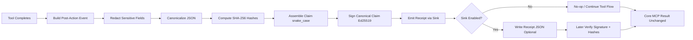

# Provenance Addon (Optional, Dependency-Free)

## What This Is (Simple Version)

This folder is a small optional addon that creates signed receipts for important tool actions.

In plain words:

- A tool does some work (for example, writes a file).
- After the tool finishes, this addon can create a receipt.
- The receipt is signed, so later you can prove the receipt was not changed.
- The receipt does **not** prove the code is correct or safe.

Think of it as a tamper-evident "what happened" proof, not a quality proof.

## Why This Exists

Normal logs and Git history are still the main source of truth.

This addon adds one extra capability:

- Portable proof that a specific signer attested to a specific claim at a specific time.

This helps when evidence must be checked outside the original runtime.

## Design Goals

- Optional: core tool behavior must work with or without this addon.
- Dependency-free: uses only built-in Node modules.
- Fail-open: if receipt creation fails, tool execution still succeeds.
- Redaction-first: sensitive data is redacted before hashing.
- Deterministic: canonical JSON is used so hashes/signatures are stable.

## What It Does and Does Not Prove

What it proves:

- A signer produced a signature over the claim payload.
- The claim payload has not been altered since signing.

What it does not prove:

- The generated code is correct.
- The generated code is secure.
- The action was authorized.
- The runtime was uncompromised.

## Folder Contents

- canonical.mjs
  - Canonical JSON + SHA-256 helpers.
- redact.mjs
  - Recursive sensitive-field redaction helper.
- receipt.mjs
  - Event-to-claim mapping, signing, verification.
- sink.mjs
  - Optional sink layer (no-op default + adapter sink).
- example.mjs
  - End-to-end demo with verification and tamper check.
- package.json
  - ESM and scripts, no external dependencies.
- visualizer.html
  - Standalone interactive receipt flow visualizer (browser-based, no dependencies).
- receipts/
  - Demo output location for generated receipt JSON files.
- reference-js/
  - Reference-only `.js` copies for side-by-side comparison.
- reference-ts/
  - Reference-only `.ts` copies for side-by-side comparison.

Reference folders are documentation aids only. The active integration path remains the `.mjs` files in this folder.

## Data Flow

1. A completed tool event is created.
2. Sensitive input/output/error fields are redacted.
3. Redacted structures are canonically hashed.
4. A claim object is assembled in snake_case wire format.
5. The canonical claim JSON is signed (Ed25519).
6. Receipt is optionally written to disk.

## Flow Chart (Mermaid)



Click-through interactive flow is available in the VS Code extension receipt visualizer panel.

## Key Contract Rules

- Signed payload is exactly the claim object.
- Wire format is snake_case.
- receipt_role defaults to client_observed.
- Trace/git/lineage refs are optional references.
- Sink failures are swallowed (fail-open).

## Installation

No installation is required beyond Node.js.

Requirements:

- Node.js 18+

## Quick Start

From repository root:

```bash
node provenance-addon/example.mjs
```

Or from this folder:

```bash
npm run example
```

## Expected Demo Behavior

The example intentionally shows three scenarios:

1. No-op sink path
   - No receipt is emitted.
   - Tool result flow is unchanged.
2. Adapter sink path
   - Receipt is created and written to receipts/.
   - Claim contains hashes and references, not raw secrets.
   - Signature verification succeeds.
3. Fail-open path
   - A simulated sink error is logged.
   - Tool result flow still continues.

## Receipt Shape

Top-level fields:

- claim
- signature
- public_key_id

Common claim fields:

- receipt_version
- receipt_role
- event_id
- timestamp
- tool_name
- action_type
- status
- target_ref
- artifact_hash (optional) — sha256 of the raw file, patch, or scaffold content, computed **before** redaction; raw bytes never stored in the claim
- input_hash — sha256 of the canonical redacted input structure (operational context, no secrets)
- output_hash or error_hash — always present; null when not applicable (intentional for deterministic canonical shape)
- trace_ref (optional)
- git_ref (optional)
- lineage_ref (optional)
- previous_receipt_hash — reserved for future receipt chaining; always null in v0.1 unless the sink explicitly maintains the chain

## Redaction Policy

Default sensitive keys include values like:

- api_key
- token
- password
- private_key
- raw_content
- sensitive_context

Sensitive values are replaced with:

- <redacted>

Only the redacted structure is hashed for the claim.

## Canonicalization Policy

For stable hashing/signing:

- Object keys are sorted recursively.
- Undefined values are removed.
- Array order is preserved.
- JSON is compact.
- Hash output format is sha256:<hex>.

## Programmatic Usage (Minimal)

```js
import { BoundaryAttestProvenanceSink, emitToolCompleted } from './sink.mjs';
import { createLocalSigner, newEventId } from './receipt.mjs';

const signer = createLocalSigner();
const sink = new BoundaryAttestProvenanceSink({
  enabled: true,
  signer,
  receiptRole: 'client_observed',
  outDir: './receipts',
});

const event = {
  event_version: '0.1',
  event_id: newEventId(),
  timestamp: new Date().toISOString(),
  tool_name: 'workspace.write_or_modify_file',
  action_type: 'write_or_modify_file',
  status: 'executed',
  target_ref: 'path:src/index.ts',
  // artifact_content is hashed into artifact_hash before redaction; raw bytes never stored.
  artifact_content: 'export function start() { return 42; }\n',
  input: { path: 'src/index.ts', raw_content: '...', api_key: 'secret' },
  output: { bytes_written: 10 },
};

const result = await emitToolCompleted(sink, event);
console.log(result.receiptId, result.receiptPath);
```

## Integration Pattern (Recommended)

Use this addon only at post-tool completion boundaries for selected actions.

Recommended first actions:

- write_or_modify_file
- generate_patch_or_scaffold

Recommended integration behavior:

- Keep MCP logs/traces as operational source of truth.
- Add receipt as supplemental provenance evidence.
- Attach receipt to artifact, patch, PR, or trace context.

## Security and Operations Notes

- `createLocalSigner()` generates a new **ephemeral** Ed25519 key pair on every call. Receipts signed in one process run cannot be verified in a different process run — the private key is gone when the process exits. For cross-run verifiability, use a persisted key file or a KMS/HSM-backed signer.
- Production key custody should use managed keys/HSM-backed flows.
- Do not persist raw secrets in receipts.
- Rotate signing keys based on your org policy.
- Store public keys/fingerprints in verifier-trusted config.

## Optional VS Code Visualizer

If you use the included VS Code extension, there is an optional read-only receipt visualizer.

Open via:

- IBM Code Engine sidebar -> Resources & Docs -> Receipt Visualizer (Optional)
- Command Palette -> IBM Code Engine MCP: Open Optional Receipt Visualizer

The visualizer reads receipt JSON files from:

- provenance-addon/receipts/

## Optional Standalone Visualizer (In This Folder)

You can also use the standalone browser visualizer in this folder:

- `provenance-addon/visualizer.html`

What it supports:

- Load multiple receipt JSON files
- Select and inspect older receipts
- Color-coded flow steps (success/error)
- Inline claim/signature/verification snippets for review

How to use:

1. Open `provenance-addon/visualizer.html` in a browser.
2. Click **Load Receipt JSON Files** and select one or more files from `provenance-addon/receipts/`.
3. Use the receipt selector to switch across historical traces.

## Troubleshooting

No receipt file generated:

- Confirm the sink is enabled.
- Confirm outDir is set.
- Confirm write permissions for the target folder.

Verification fails unexpectedly:

- Ensure the same signer/public key is used for verification.
- Ensure claim content was not mutated after signing.
- Ensure canonical claim is what is signed.

Node errors:

- Check Node version is 18+.

## FAQ

### ATTEST/Provenance is not a public root authority (like Google/VeriSign). Why trust it?

This addon is not designed to be a global internet identity authority.

What it provides is cryptographic integrity and tamper evidence:

- A specific key signed a specific claim.
- The claim has not been altered since signing.

Trust comes from your organization's key governance, not from a public CA brand:

- trusted key registry
- KMS/HSM-backed key custody
- key rotation/revocation policy
- verifier trust configuration

So the model is:

- not universal authority trust
- organization-scoped cryptographic evidence

What this proves:

- claim integrity
- signer-key linkage (for trusted keys)

What this does not prove:

- generated code correctness
- authorization/business approval by itself
- runtime compromise absence

If stronger trust is required, anchor receipt hashes in an immutable transparency system and enforce strict trusted-key policy in verifiers.

## Versioning

Current contract target:

- v0.1

Planned future work may include:

- Production key custody model
- Optional receipt chaining strategy for concurrent paths
- Optional schema validation in CI

## License

Same repository license applies unless specified otherwise.

## Collaborator (Addon Context)

For this addon direction and review context, Cullen Meyers (BoundaryAttest) is acknowledged as a collaborator/reviewer on the provenance approach.

BoundaryAttest reference:

- https://github.com/cullenmeyers/BoundaryAttest

## 👤 Autor/Developer

Markus van Kempen  
Email: `markus.van.kempen@gmail.com` | `mvankempen@ca.ibm.com`  
Website: [markusvankempen.github.io](https://markusvankempen.github.io/)
*No bug too small, no syntax too weird.*
