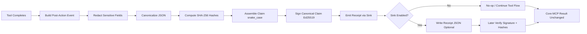
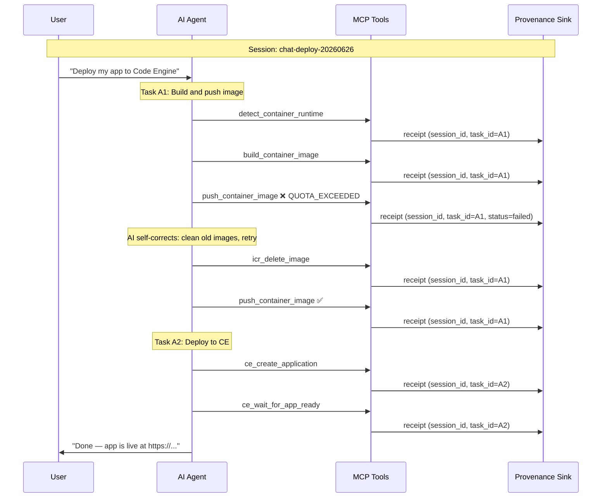
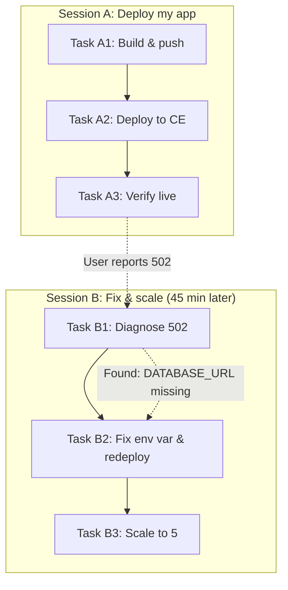

# Provenance Addon (Optional, Dependency-Free)

## What This Is (Simple Version)

This folder is a small optional addon that creates signed receipts for important tool actions.

In plain words:

- A tool does some work (for example, writes a file).
- After the tool finishes, this addon can create a receipt.
- The receipt is signed, so later you can prove the receipt was not changed.
- The receipt does **not** prove the code is correct or safe.

Think of it as a tamper-evident "what happened" proof, not a quality proof.

## Why This Exists

Normal logs and Git history are still the main source of truth.

This addon adds one extra capability:

- Portable proof that a specific signer attested to a specific claim at a specific time.

This helps when evidence must be checked outside the original runtime.

## Design Goals

- Optional: core tool behavior must work with or without this addon.
- Dependency-free: uses only built-in Node modules.
- Fail-open: if receipt creation fails, tool execution still succeeds.
- Redaction-first: sensitive data is redacted before hashing.
- Deterministic: canonical JSON is used so hashes/signatures are stable.

## What It Does and Does Not Prove

What it proves:

- A signer produced a signature over the claim payload.
- The claim payload has not been altered since signing.

What it does not prove:

- The generated code is correct.
- The generated code is secure.
- The action was authorized.
- The runtime was uncompromised.

## Folder Contents

- canonical.mjs
  - Canonical JSON + SHA-256 helpers.
- redact.mjs
  - Recursive sensitive-field redaction helper.
- receipt.mjs
  - Event-to-claim mapping, signing, verification.
- sink.mjs
  - Optional sink layer (no-op default + adapter sink).
- example.mjs
  - End-to-end demo with verification and tamper check.
- package.json
  - ESM and scripts, no external dependencies.
- visualizer.html
  - Standalone interactive receipt flow visualizer (browser-based, no dependencies).
- receipts/
  - Demo output location for generated receipt JSON files.
- reference-js/
  - Reference-only `.js` copies for side-by-side comparison.
- reference-ts/
  - Reference-only `.ts` copies for side-by-side comparison.

Reference folders are documentation aids only. The active integration path remains the `.mjs` files in this folder.

## Data Flow

1. A completed tool event is created.
2. Sensitive input/output/error fields are redacted.
3. Redacted structures are canonically hashed.
4. A claim object is assembled in snake_case wire format.
5. The canonical claim JSON is signed (Ed25519).
6. Receipt is optionally written to disk.

## Flow Chart (Mermaid)



Click-through interactive flow is available in the VS Code extension receipt visualizer panel.

## Key Contract Rules

- Signed payload is exactly the claim object.
- Wire format is snake_case.
- receipt_role defaults to client_observed.
- Trace/git/lineage refs are optional references.
- Sink failures are swallowed (fail-open).

## Installation

No installation is required beyond Node.js.

Requirements:

- Node.js 18+

## Quick Start

From repository root:

```bash
node provenance-addon/example.mjs
```

Or from this folder:

```bash
npm run example
```

## Expected Demo Behavior

The example intentionally shows three scenarios:

1. No-op sink path
   - No receipt is emitted.
   - Tool result flow is unchanged.
2. Adapter sink path
   - Receipt is created and written to receipts/.
   - Claim contains hashes and references, not raw secrets.
   - Signature verification succeeds.
3. Fail-open path
   - A simulated sink error is logged.
   - Tool result flow still continues.

## Receipt Shape

Top-level fields:

- claim
- signature
- public_key_id

Common claim fields:

- receipt_version
- receipt_role
- event_id
- timestamp
- tool_name
- action_type
- status
- target_ref
- artifact_hash (optional) — sha256 of the raw file, patch, or scaffold content, computed **before** redaction; raw bytes never stored in the claim
- input_hash — sha256 of the canonical redacted input structure (operational context, no secrets)
- output_hash or error_hash — always present; null when not applicable (intentional for deterministic canonical shape)
- trace_ref (optional)
- git_ref (optional)
- lineage_ref (optional)
- previous_receipt_hash — reserved for future receipt chaining; always null in v0.1 unless the sink explicitly maintains the chain

## Redaction Policy

Default sensitive keys include values like:

- api_key
- token
- password
- private_key
- raw_content
- sensitive_context

Sensitive values are replaced with:

- <redacted>

Only the redacted structure is hashed for the claim.

## Canonicalization Policy

For stable hashing/signing:

- Object keys are sorted recursively.
- Undefined values are removed.
- Array order is preserved.
- JSON is compact.
- Hash output format is sha256:<hex>.

## Programmatic Usage (Minimal)

```js
import { BoundaryAttestProvenanceSink, emitToolCompleted } from './sink.mjs';
import { createLocalSigner, newEventId } from './receipt.mjs';

const signer = createLocalSigner();
const sink = new BoundaryAttestProvenanceSink({
  enabled: true,
  signer,
  receiptRole: 'client_observed',
  outDir: './receipts',
});

const event = {
  event_version: '0.1',
  event_id: newEventId(),
  timestamp: new Date().toISOString(),
  tool_name: 'workspace.write_or_modify_file',
  action_type: 'write_or_modify_file',
  status: 'executed',
  target_ref: 'path:src/index.ts',
  // artifact_content is hashed into artifact_hash before redaction; raw bytes never stored.
  artifact_content: 'export function start() { return 42; }\n',
  input: { path: 'src/index.ts', raw_content: '...', api_key: 'secret' },
  output: { bytes_written: 10 },
};

const result = await emitToolCompleted(sink, event);
console.log(result.receiptId, result.receiptPath);
```

## Integration Pattern (Recommended)

Use this addon only at post-tool completion boundaries for selected actions.

Recommended first actions:

- write_or_modify_file
- generate_patch_or_scaffold

Recommended integration behavior:

- Keep MCP logs/traces as operational source of truth.
- Add receipt as supplemental provenance evidence.
- Attach receipt to artifact, patch, PR, or trace context.

## Security and Operations Notes

- `createLocalSigner()` generates a new **ephemeral** Ed25519 key pair on every call. Receipts signed in one process run cannot be verified in a different process run — the private key is gone when the process exits. For cross-run verifiability, use a persisted key file or a KMS/HSM-backed signer.
- Production key custody should use managed keys/HSM-backed flows.
- Do not persist raw secrets in receipts.
- Rotate signing keys based on your org policy.
- Store public keys/fingerprints in verifier-trusted config.

## Optional VS Code Visualizer

If you use the included VS Code extension, there is an optional read-only receipt visualizer.

Open via:

- IBM Code Engine sidebar -> Resources & Docs -> Receipt Visualizer (Optional)
- Command Palette -> IBM Code Engine MCP: Open Optional Receipt Visualizer

The visualizer reads receipt JSON files from:

- provenance-addon/receipts/

## Optional Standalone Visualizer (In This Folder)

You can also use the standalone browser visualizer in this folder:

- `provenance-addon/visualizer.html`

What it supports:

- Load multiple receipt JSON files
- Select and inspect older receipts
- Color-coded flow steps (success/error)
- Inline claim/signature/verification snippets for review

How to use:

1. Open `provenance-addon/visualizer.html` in a browser.
2. Click **Load Receipt JSON Files** and select one or more files from `provenance-addon/receipts/`.
3. Use the receipt selector to switch across historical traces.

## Failure Model

There are two distinct types of failure. Understanding which one you're looking at is critical for debugging.

### Type 1 — Tool failed, receipt created successfully

The receipt `status` field is `"failed"` and `error_hash` contains a digest of the redacted error. The receipt itself was signed and written normally. This is the intended behavior — the receipt proves: *"at this timestamp, this tool was attempted, and this is what failed."*

How to debug:
- Read the `error_hash` field to verify the error is consistent.
- Check the MCP server logs for the full unredacted error using the `trace_ref`.
- The visualizer error drilldown shows a diagnosed label and suggested fix per error code.

How to fix: address the tool failure (refresh token, fix pull secret, correct the image name, etc.), not the receipt system. A failed receipt is working as designed.

### Type 2 — Receipt creation itself fails (sink error)

The `emitToolCompleted()` wrapper catches the error and returns a null result with a `sinkError` context object. The MCP tool result is never affected.

Common causes:

| Phase | Cause | Symptom |
|---|---|---|
| `file_write` | No write permission, EROFS, path too long | Receipt not written to disk |
| `directory_create` | Disk full (ENOSPC), path doesn't exist | `mkdirSync` throws |
| `signing` | Node.js < 18 (no ed25519 support), corrupted key | Signature step throws |
| `canonicalization` | Circular reference in event input/output | `JSON.stringify` throws |
| `adapter_logic` | Bug in sink implementation | Any other error |

How to debug:
- The `sinkError` context returned by `emitToolCompleted()` contains:
  - Full stack trace (`errorStack`)
  - Which phase failed (`phase`: file_write, signing, canonicalization, directory_create, adapter_logic)
  - Event context (`eventId`, `toolName`, `targetRef`, `traceRef`)
  - Timestamp of the failure
- Pass a custom `logError` function for structured logging or telemetry forwarding.
- The default logger writes full trace to stderr.

How to fix:

| Phase | Fix |
|---|---|
| `file_write` | Check folder permissions: `ls -la provenance-addon/receipts/` |
| `directory_create` | Check disk space: `df -h`; verify `outDir` path is valid |
| `signing` | Verify Node.js 18+: `node --version`; verify signer is initialized |
| `canonicalization` | Ensure event `input`/`output` objects have no circular references |
| `adapter_logic` | Debug the sink implementation using the stack trace |

### Network dependency model

The current v0.1 PoC is **fully offline** — no network calls anywhere. The failure model changes as the key custody model evolves:

| Stage | Key location | Network needed to sign? | Failure mode if unreachable |
|---|---|---|---|
| **v0.1 PoC** | Ephemeral (in-memory) | No | Cannot fail — key is always available |
| **Persisted local key** | PEM file on disk | No | Cannot fail (unless disk unreadable) |
| **KMS/HSM-backed** | Cloud KMS (IBM, AWS, Azure) | Yes — HTTPS to KMS API | Signing fails; receipt not created; fail-open |
| **Centralised receipt store** | Remote API | Yes — HTTPS to receipt service | Writing fails; receipt lost; fail-open |

For KMS or centralised store deployments: ensure the fail-open boundary in `emitToolCompleted()` is never removed. The tool must always succeed regardless of receipt infrastructure availability.

## Troubleshooting

No receipt file generated:

- Check `sinkError` in the return value of `emitToolCompleted()`.
- Confirm the sink is enabled (`enabled: true`).
- Confirm `outDir` is set and writable.
- Check stderr for `[provenance]` log lines with full error context.

Verification fails unexpectedly:

- Ensure the same signer/public key is used for verification.
- Ensure claim content was not mutated after signing.
- Ensure canonical claim is what is signed (`canonicalJson(receipt.claim)`).
- Note: `createLocalSigner()` generates a new key per process run — receipts from a previous run cannot be verified.

Node errors:

- Check Node version is 18+ (`node --version`).
- On Node 12–16, `generateKeyPairSync('ed25519')` may not be available.

## FAQ

### ATTEST/Provenance is not a public root authority (like Google/VeriSign). Why trust it?

This addon is not designed to be a global internet identity authority.

What it provides is cryptographic integrity and tamper evidence:

- A specific key signed a specific claim.
- The claim has not been altered since signing.

Trust comes from your organization's key governance, not from a public CA brand:

- trusted key registry
- KMS/HSM-backed key custody
- key rotation/revocation policy
- verifier trust configuration

So the model is:

- not universal authority trust
- organization-scoped cryptographic evidence

What this proves:

- claim integrity
- signer-key linkage (for trusted keys)

What this does not prove:

- generated code correctness
- authorization/business approval by itself
- runtime compromise absence

If stronger trust is required, anchor receipt hashes in an immutable transparency system and enforce strict trusted-key policy in verifiers.

## Session, Task, and Trace Correlation

### Concept: How Receipts Map to AI Conversations

When an AI chat assistant uses MCP tools, the interaction has a natural hierarchy:

```
Session (chat thread)
 └─ Task (one user prompt / AI goal)
     └─ Step (one MCP tool call → one receipt)
```

The provenance system captures this hierarchy with three fields:

| Field | Scope | Example |
|---|---|---|
| `session_id` | One complete AI conversation thread | `session:chat-deploy-20260626-2030` |
| `task_id` | One user prompt or AI sub-goal within the session | `A1-build-push` |
| `trace_ref` | MCP-level operational correlation (often same as session_id) | `session:chat-deploy-20260626-2030` |

### Why This Matters

Without these fields, a flat list of receipts gives no indication of:
- Which user question caused which tool calls
- Where the AI made a decision between sub-goals
- What sequence of reasoning led to a failure
- Whether two failures are causally related or independent

With session/task IDs, the visualizer can group receipts into a **conversation timeline** and show task boundaries, making root-cause analysis dramatically faster.

### Flow: Multi-Task Session



### Flow: Multi-Session Causality



### Scenarios and Use Cases

#### Scenario 1: Simple deployment (single task, no errors)

| Session | Task | Steps | Outcome |
|---|---|---|---|
| session:chat-quick-deploy | deploy-simple | 4 | All OK |

Flow: validate → build → push → deploy. No failures. Single task_id because the AI treats it as one atomic goal.

#### Scenario 2: Multi-task deployment with self-correction

| Session | Task | Steps | Failures | Recovery |
|---|---|---|---|---|
| session:chat-deploy-2030 | A1-build-push | 7 | 1 (ICR quota) | AI deletes old images, retries push |
| session:chat-deploy-2030 | A2-deploy | 4 | 0 | — |
| session:chat-deploy-2030 | A3-verify | 1 | 0 | — |

Why task boundaries matter: The AI decided to split "deploy my app" into 3 sub-goals. Seeing that push failed in A1 but the AI recovered (without user intervention) tells an auditor the system is self-correcting.

#### Scenario 3: Cross-session troubleshooting

| Session | Task | Steps | Failures | Recovery |
|---|---|---|---|---|
| session:chat-fix-2115 | B1-diagnose | 3 | 0 | Identified missing env var from logs |
| session:chat-fix-2115 | B2-fix-redeploy | 4 | 1 (quota hit) | AI removes unused var, retries |
| session:chat-fix-2115 | B3-scale | 2 | 0 | — |

Why cross-session tracking matters: The user opened a new chat 45 minutes after Session A. The receipt trail shows that Session B's diagnostic task **read the same app** that Session A deployed, establishing a causal link between the two sessions.

#### Scenario 4: Concurrent tasks (parallel tool calls)

Some AI agents call multiple tools in parallel. In this case, receipts share the same `task_id` but timestamps overlap:

```
task_id=parallel-setup, timestamps:
  12:05:03 → ce_create_secret (completed 12:05:04)
  12:05:03 → ce_create_configmap (completed 12:05:04)
  12:05:03 → ce_create_binding (failed 12:05:05, recoverable)
```

The shared task_id groups them. The visualizer shows overlapping steps in the timeline strip.

### Error Scenarios and Root Causes

#### Error Category: Infrastructure Failures

| Error | Example | Root Cause | Impact on Receipts | Fix |
|---|---|---|---|---|
| ICR quota exceeded | `QUOTA_EXCEEDED` | Registry namespace storage limit hit | Receipt captures the failure; AI self-corrects by cleaning old images | Increase quota or remove unused images |
| IAM token expired | `UNAUTHORIZED` / 401 | Token TTL exceeded mid-deployment | Receipt shows failed push; next receipt shows token refresh | Implement token refresh before expiry; reduce deployment time |
| Image pull backoff | `ImagePullBackOff` | Pull secret expired or wrong registry | Receipt shows deploy stuck; AI refreshes pull secret | Rotate pull secrets proactively; use secret auto-renewal |
| Env var quota | `QUOTA_ENV_VARS` | Max environment variables per app reached | Receipt records API 422; AI removes unused vars | Consolidate env vars; use configmaps for bulk config |

#### Error Category: Network/Timeout Failures

| Error | Example | Root Cause | Impact on Receipts | Fix |
|---|---|---|---|---|
| Build timeout | `BuildTimeout` | Complex Dockerfile, slow network, large context | Receipt shows build step failed after N seconds | Optimize Dockerfile layers; use multi-stage builds; reduce context |
| DNS resolution | `ENOTFOUND` | Cluster DNS misconfiguration | Receipt shows connection failed to registry | Check DNS config; verify network policies |
| TLS handshake | `CERT_EXPIRED` / `UNABLE_TO_VERIFY` | Certificate expired or chain incomplete | Receipt shows push/pull failure | Renew certs; update CA bundles |

#### Error Category: Logical/Configuration Errors

| Error | Example | Root Cause | Impact on Receipts | Fix |
|---|---|---|---|---|
| Port mismatch | App expects 3000, CE configured 8080 | `EXPOSE` and app port don't match | App deploys but returns 502; receipt shows deploy "succeeded" | Align Dockerfile EXPOSE and app listen port |
| Missing health endpoint | No `/health` route | CE health check fails, app killed | Instance shows `CrashLoopBackOff` | Add health endpoint; configure correct health path |
| Wrong image architecture | Built for arm64, runs on amd64 | Multi-arch mismatch | `exec format error` in container | Build with `--platform linux/amd64` |

#### Error Category: AI Agent Decision Errors

| Error | Example | Root Cause | Impact on Receipts | Fix |
|---|---|---|---|---|
| Wrong project selected | Deployed to staging instead of prod | AI selected first project in list | Receipts show `target_ref` pointing to wrong project | Teach AI to confirm project ID with user |
| Secret in plain text | API key passed as env var value | AI didn't use a CE secret reference | Receipt `input` shows redacted field, but risk exists before redaction | Use `ce_create_secret` then reference `secret:name` |
| Scale-to-zero in prod | Set `min_instances: 0` | AI chose default cold-start behavior | Receipt shows scale config; app has cold-start latency | Enforce min_instances >= 1 for production |

### Debugging with Session/Task IDs

```bash
# Find all receipts from a specific chat session
ls receipts/multi-session-demo/ | head -20

# Find failures in a specific task
grep -l '"status":"failed"' receipts/multi-session-demo/*.json

# Extract session/task from a receipt
node -e "
  const r = JSON.parse(require('fs').readFileSync(process.argv[1]));
  console.log('session:', r.claim.session_id);
  console.log('task:', r.claim.task_id);
  console.log('tool:', r.claim.tool_name);
  console.log('status:', r.claim.status);
" receipts/multi-session-demo/<file>.json
```

### Visualizer: Session/Task Drilldown

The `visualizer.html` provides:

1. **Session grouping** — right panel shows chat sessions as cards with task counts
2. **Task pills** — in the trace context section, clickable task badges show step counts and failure indicators
3. **Conversation flow** — task-grouped step list with color-coded borders (green = ok, red = failed, blue = selected)
4. **Causality analysis** — for failures, shows what happened before (probable cause) and what the AI did next (recovery attempt)
5. **Cross-session links** — when multiple sessions reference the same `target_ref`, the visualizer notes the relationship

## Versioning

Current contract target:

- v0.1

Planned future work may include:

- Production key custody model
- Optional receipt chaining strategy for concurrent paths
- Optional schema validation in CI
- Session/task_id auto-extraction from MCP transport headers

## License

Same repository license applies unless specified otherwise.

## Collaborator (Addon Context)

For this addon direction and review context, Cullen Meyers (BoundaryAttest) is acknowledged as a collaborator/reviewer on the provenance approach.

BoundaryAttest reference:

- https://github.com/cullenmeyers/BoundaryAttest

## 👤 Autor/Developer

Markus van Kempen  
Email: `markus.van.kempen@gmail.com` | `mvankempen@ca.ibm.com`  
Website: [markusvankempen.github.io](https://markusvankempen.github.io/)
*No bug too small, no syntax too weird.*
